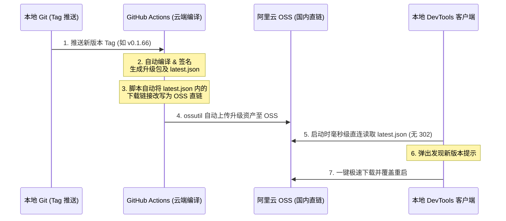

# 需求文档 (PRD): 阿里云 OSS 自动更新分发重构

## 1. 背景与目标
在目前使用 GitHub Actions 自动打包发布至 GitHub Releases 的自动更新方案中，由于国内网络对 GitHub 静态资源服务器（`*githubusercontent.com`）的间歇性阻断，以及 GitHub Releases 强加的 302 重定向机制，导致本地 Tauri 客户端在发起更新检测与下载升级包时经常静默失败。

本重构方案旨在将自动更新资产的托管与分发迁移至**阿里云对象存储 OSS**，实现“GitHub Actions 云端编译 ➔ 自动上传 OSS ➔ 客户端国内直连秒级更新”的稳定架构。

---

## 2. 核心功能与架构设计

### 2.1 自动构建与上传流

### 2.2 变动细节
1. **GitHub 工作流 (`release.yml`)**：
   * 在 Tauri 构建成功后，运行一段 Node.js 脚本，动态读取 `latest.json`，并将其中的 `platforms` 下载链接改写为阿里云 OSS 的直连 URL。
   * 引入 `manyuanrong/setup-oss` 动作，配置 `ossutil`。
   * 使用 `ossutil` 命令将编译出的 `.app.tar.gz`、`.sig` 签名文件和更新后的 `latest.json` 自动推送到指定的阿里云 OSS Bucket 根目录。
2. **Tauri 配置文件 (`tauri.conf.json`)**：
   * 将 `plugins.updater.endpoints` 数组中的 URL 指向阿里云 OSS 上的静态 `latest.json` 文件路径。
3. **安全配置**：
   * 阿里云的 `AccessKey ID` 和 `AccessKey Secret` 必须以 Secrets 形式存放在 GitHub 仓库中，变量名分别为 `ALIYUN_ACCESS_KEY_ID` 和 `ALIYUN_ACCESS_KEY_SECRET`。

---

## 3. 待澄清的外部上下文
为确保本方案中所有的路径及域名配置精确无误，需要用户配合提供以下信息：
* **阿里云 OSS 存储空间名称 (Bucket Name)**：例如 `devtools-bin`
* **存储空间所在的地域节点 (Region)**：例如 `oss-cn-hangzhou`

---

## 4. 验证与回归测试
1. **Actions 编译上传测试**：
   * 推送新 tag（例如 `v0.1.66`）后，确认 GitHub Actions 执行成功，并且 OSS 存储桶中已正确新增 `latest.json` 及对应的 `.sig`、`.tar.gz` 资源。
2. **直连测试**：
   * 使用 `curl` 命令直连访问 OSS 地址，确保 `latest.json` 能够成功返回 `200 OK`，且文件内容中的下载地址指向正确的 OSS 直链。
3. **软件客户端实测**：
   * 启动已安装完备的种子版本，确认启动 5 秒后能瞬间弹出发现新版本的更新弹窗，且点击一键更新后能在 1~2 秒内极速下载覆盖重启。
