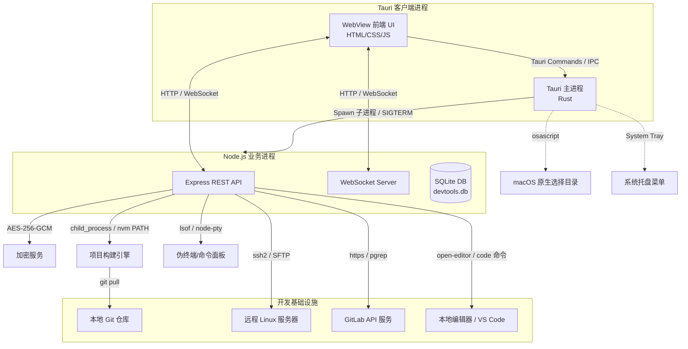

# DevTools Desktop 项目架构与逻辑梳理报告

> 本文档由全栈首席架构师系统梳理，详细剖析了 `DevTools Desktop` 桌面端工具的设计模式、技术栈、核心模块及其底层逻辑实现。

---

## 一、 项目概述

`DevTools Desktop` 是一款轻量级 Mac 桌面开发辅助工具集。它整合了**前端多模块打包构建**、**SFTP 自动上传部署**、**本地运行监控与端口占用诊断**、**GitLab 周报自动生成**、**待办看板**、**日常工时记录**、**IP 纯净度检测**以及**富文本知识库**等一系列极客研发工具。

其核心目标是**替代终端繁琐的手动命令操作，打通代码仓库到远程服务器的最后一公里，并实现开发者日常工作流程的一站式管理**。

---

## 二、 系统架构设计

应用采用了 **Tauri 2.x + Node.js Sidecar** 的双进程混合架构，以兼顾前端零门槛渲染、Node.js 丰富的生态库（SSH、加密、数据库）以及 Tauri 底层系统级能力。



### 1. 双进程生命周期管理
*   **启动阶段**：Tauri 主进程在 `.setup()` 阶段被拉起，同时检索本地可用的 Node.js 路径，通过原生 `Command` spawn 起 Node.js Sidecar 子进程（指向 `sidecar/index.js`），并劫持其 `stdout`。Sidecar 启动并自动寻找到可用空闲端口后，在 stdout 打印出 `__PORT__:<port>`，Tauri 实时读取并存储在全局 State 中，随后将该端口回传给前端，前端据此建立 Web 连结。
*   **保活机制**：Sidecar 内部设置了 parent-process guard 定时器。每 1.2 秒检测一次 `process.ppid`。如果 Tauri 主进程闪退，Sidecar 父进程 ID 会被操作系统接管变成 1（launchd 领养）。一旦检测到 `ppid === 1`，Sidecar 将自动执行应急清理并安全退出，杜绝子进程常驻内存成为僵尸。
*   **退出阶段**：在 Tauri 捕获到退出事件（`RunEvent::Exit`）时，会调用 `cleanup_sidecar` 向 Sidecar 进程发送 `SIGTERM` 信号。若 600ms 后 Sidecar 仍未退出，则强行调用 `child.kill()`。此外，Sidecar 每次启动前都会执行一次“自我净化”，执行 `pgrep -f "sidecar/index.js"`，将系统上之前崩溃残留的所有其他 Sidecar 进程用 `SIGKILL` 彻底肃清，解决端口占用和缓存问题。

---

## 三、 核心代码目录结构

```
devtools-desktop/
├── src/                          # 前端 UI 层 (零框架依赖)
│   ├── index.html                # 单页面应用主骨架
│   ├── css/                      # 页面样式 (style.css, xterm.css)
│   └── js/
│       ├── app.js                # 前端核心 Controller (状态管理、事件流、WebSocket 消费)
│       ├── api.js                # Fetch API 请求拦截与封装
│       └── websocket.js          # WebSocket 心跳保活与事件总线客户端
├── sidecar/                      # Node.js 业务引擎层 (运行于 Sidecar 模式)
│   ├── index.js                  # 后端服务器入口 (Http Server + WebSocket)
│   ├── package.json              # 后端依赖配置 (better-sqlite3, ssh2, node-pty, glob等)
│   ├── routes/                   # 控制器与路由层
│   │   ├── projects.js           # 项目扫描与增删改查
│   │   ├── servers.js            # 服务器资产管理
│   │   ├── deploy.js             # 调度构建与部署任务
│   │   ├── run.js                # 本地运行服务启停控制
│   │   └── report.js             # Git 周报生成接口
│   └── services/                 # 核心服务层
│       ├── database.js           # better-sqlite3 初始化、建表与 WAL 模式优化
│       ├── scanner.js            # 前端项目类型探测、排除规则与 NVM Node 版本检索
│       ├── builder.js            # 流式日志处理器、Git Pull 与 PATH 替换构建引擎
│       ├── deployer.js           # ssh2/SFTP 逐文件快速上传与链接复用引擎
│       ├── crypto.js             # AES-256-GCM 密码安全密文加解密
│       └── gitlab.js             # GitLab Commit 分页拉取与周报 Markdown 渲染器
└── src-tauri/                    # Rust 主进程包装层
    ├── src/
    │   ├── main.rs               # Rust 入口
    │   └── lib.rs                # Tauri 核心逻辑 (系统托盘动态更新、Native目录选择、子进程保活)
    └── tauri.conf.json           # Tauri 打包配置文件
```

---

## 四、 核心功能逻辑与关键实现

### 1. 项目扫描与多模块探测 (`scanner.js`)
*   **工具识别**：通过判断项目下是否存在 `vite.config.js`/`vue.config.js`/`webpack.config.js` 等或读取 `devDependencies` 自动识别构建工具类型（Vite / Vue CLI / Webpack）。
*   **多模块探测**：通过 `globSync('src/*/main.js')` 检测项目是否包含多个模块目录（如 `src/home/main.js` 和 `src/moduleA/main.js`）。如果 main.js 数量大于 1，则识别为 `multi-module`（多模块）项目。
*   **排除策略**：扫描 `config/index.js` 里的 `excludeModules` 配置（兼容拼写错误 `exludeModules`），在最终展示列表中进行过滤，并给不同模块分配专属的上传策略（`home` 模块默认使用 `root` 根路径，其他模块采用 `folder` 目录模式）。

### 2. 无交互式 Node 版本动态切换 (`builder.js`)
*   **NVM 版本搜索**：扫描系统 `~/.nvm/versions/node/` 目录，动态读取本机所有已安装 of Node.js 版本，以降序版本号展现给前端进行选择。
*   **环境变量劫持**：在拉起构建命令的子进程前，如果指定了 `nodeVersion`，系统会拼接出对应版本的二进制 bin 目录（如 `/Users/ldy/.nvm/versions/node/v18.20.4/bin`）。构建引擎直接复制当前环境变量 `process.env`，并将该 bin 目录**拼接到 PATH 的最前端**：
    ```javascript
    env.PATH = `${nvmNodeBin}:${env.PATH}`;
    ```
    子进程（如 `npm run build`）拉起时，搜索 `node` 命令会优先命中该 bin 目录下的二进制。这在非交互式命令行里极其巧妙、优雅地实现了针对项目个性化定制的 Node 版本切换。

### 3. 流式日志抗乱码与 IDE 跳转 (`builder.js`, `app.js`)
*   **字符流抗碎裂**：在 `stdout`/`stderr` 的字节流读取中，由于中文字符可能被 TCP 报文切断而产生乱码，且日志输出可能存在行撕裂。`builder.js` 引入了 `StringDecoder('utf8')` 并包装为 `createLineProcessor`。缓冲未输出的残缺行，只有在遇到 `\n` 时才回调前端输出，保证了终端日志的完整性和美观。
*   **代码一键跳转 IDE**：前端的 `appendLog` 渲染控制台日志时，利用正则表达式匹配代码堆栈路径及行号（例如 `src/App.vue:42:15`），通过 `colorizeAndLinkLog` 自动将其转变为带下划线的超链接。用户点击链接，触发 `/api/run/open-editor` 接口，后端在宿主主机上执行 `code -g filepath:line` 等编辑器跳转命令，实现控制台错误到 IDE 对应行数的一键穿透。

### 4. SFTP 部署优化与连接复用 (`deployer.js`)
*   **建立与复用连接**：上传前在“预检”（preflight）阶段进行服务器 SSH 连接测试。如果通过，保留这个现成的客户端连接句柄 `existingConn` 传给上传模块，直接复用以省去部署时重新进行握手、密钥交换以及身份认证的时间。
*   **递归与 fastPut**：
    *   `ensureRemoteDir`：在上传前，会根据目标路径逐层切分通过 `sftp.stat` 判断是否存在，若不存在则调用 `sftp.mkdir` 递归创建。
    *   `sftp.fastPut`：利用 ssh2 的 `fastPut` 流上传本地文件，比普通的 WriteStream 性能大幅度提升。

### 5. 交互式终端与会话路径监测 (`index.js`)
*   **全功能 PTY 终端**：Sidecar 内部集成了 `node-pty` 库，用来拉起系统原生的 shell（如 `zsh`/`bash`），实现颜色、命令提示等完全等价的原生终端功能，并在 WebSocket 消息 `terminal-resize` 触发时自适应调整终端行列大小。如果编译缺少二进制依赖，系统会自动降级为 child_process 的 pipe 管道读写模式。
*   **工作路径追踪**：用户在 PTY 终端操作时，为了防止页面刷新、重连后终端丢掉当前工作路径（cwd），后端通过拦截回车命令，在 400ms 延时后通过执行 `lsof -p <pty_pid> -a -d cwd -Fn` 提取出该 Shell 当前真实的 POSIX 路径，并更新写入 SQLite 数据库的 `terminal-sessions` 表，保证会话恢复时能够 `cd` 回最新路径。

---

## 五、 数据库实体关系 (Schema)

项目采用轻量级 SQLite 数据库（基于 WAL 模式以支持高并发读写）来持久化配置与运行日志。

```
+---------------------------------------------------------------------------------+
|                                    sqlite                                       |
+---------------------------------------------------------------------------------+
                                       |
     +-----------------+               |               +-----------------+
     |    projects     |               |               |     servers     |
     +-----------------+               |               +-----------------+
     | name (PK)       |               |               | id (PK)         |
     | path            |               |               | name            |
     | type            |               |               | host            |
     | displayName     |               |               | port            |
     | defaultNodeVer  |               |               | username        |
     | defaultServerIds|               |               | authType        |
     | runCommand      |               |               | password        |
     | sortOrder       |               |               | defaultRemotePat|
     | groupName       |               |               | deployPaths     |
     +-----------------+               |               +-----------------+
              |                        |                        |
              |                        |                        |
              |                        |                        |
              v                        |                        v
     +-------------------------------------------------------------------+
     |                             history                               |
     +-------------------------------------------------------------------+
     | id (PK)                                                           |
     | projectName (FK -> projects.name)                                 |
     | type ('build' | 'deploy')                                         |
     | status ('success' | 'fail')                                       |
     | modules                                                           |
     | serverName (FK -> servers.name)                                   |
     | nodeVersion                                                       |
     | duration                                                          |
     | logs                                                              |
     +-------------------------------------------------------------------+
```

*   **`projects` 表**：维护扫描得到或手动添加的项目资产。包含多模块运行策略，以及用户设置的 Node.js 默认构建版本等。
*   **`servers` 表**：存储远程 Linux 服务器的主机、用户名、部署路径等配置。其中的 `password` 被 AES-256-GCM 高强度加密，密文被分解为 `iv`, `authTag`, `encrypted` 保存在表内。
*   **`history` 表**：存储过去部署及构建的任务流。除了用于“部署历史”页面展示外，在前端页面发生强刷时，前端可以基于此表的状态数据快速恢复之前的运行日志和进度。
*   **其他业务表**：包含待办任务看板的 `todos` 表、日志记录的 `notes` 表、个人知识库的 `notebook_notes` 表、自定义 Shell 的 `commands` 表以及终端历史会话 `terminal_sessions` 表。

---

## 六、 总结与工程闪光点

1.  **架构自闭环与健壮性**：Sidecar 子进程具备心跳超时强杀、父进程闪退守护（ppid==1）、启动自我净化（pgrep）机制，最大化避免了本地守护进程失控或端口冲突问题。
2.  **人性化的极客体验**：
    *   通过 `env.PATH` 替换实现了 Node 版本的动态切换。
    *   通过编译错误防抖和 `lsof` 端口占用深度诊断，能一眼看出是哪个 PID 霸占了本地服务端口。
    *   通过控制台日志文件超链接和一键拉起 IDE 穿透定位代码，极大地提升了日常排障的效率。
3.  **极简的原生渲染**：前端没有堆叠沉重臃肿的前端框架（React/Vue），而是纯靠 Vanilla JS 结合数据渲染，极大地缩减了内存开销，使得空闲内存维持在仅 ~160MB 的极佳水平，启动时间小于 2 秒。
