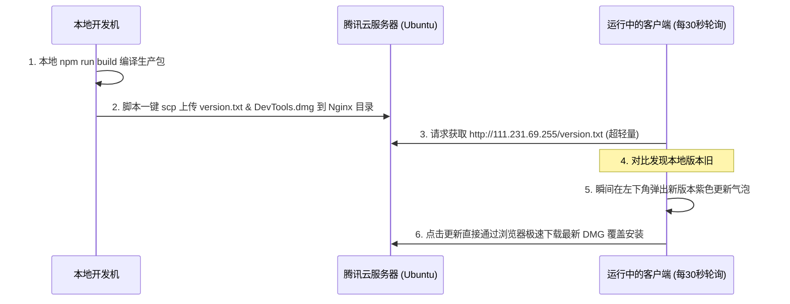

# 需求文档 (PRD): 基于腾讯云轻量服务器的极简实时更新提示与分发

## 1. 背景与目标
为了彻底避开 Tauri 官方自动更新（Updater）复杂的签名证书校验、GitHub 的 302 重定向以及各种网络阻断，本方案旨在利用用户现有的**腾讯云轻量服务器 (`Ubuntu-v1xr`)** 构建一套极简、轻量、高实时的更新检测与分发通道。

本方案的核心是不依赖 Tauri 官方 Updater，而是采用前端轻量级轮询 + Nginx 静态文件托管，实现“本地一键打包上传 ➔ 客户端高频实时检测 ➔ 一键跳转下载”的极致体验。

---

## 2. 系统设计

### 2.1 架构图

### 2.2 部署与分发机制
1. **服务端（腾讯云 `111.231.69.255`）**：
   * 在 Nginx 中配置一个静态目录（例如 `/var/www/devtools-upgrade`），将端口 `80` 的某个路径（如 `/upgrade`）映射到此文件夹。
   * 文件夹内存放两个静态文件：
     * `version.txt`：纯文本，仅包含最新的版本号（例如 `0.1.66`）。
     * `DevTools_latest.dmg`：最新的 macOS 安装包。
2. **客户端端（Tauri 前端）**：
   * 前端配置一个 `setInterval` 定时器，每隔 **30 秒** 发起一次 `fetch('http://111.231.69.255/upgrade/version.txt')`。
   * 由于 `version.txt` 文件只有几个字节，30秒一次的高频轮询对客户端和服务器来说**完全是零压力**。
   * 一旦读取到的版本号大于本地硬编码的 `APP_VERSION`，左下角立刻显示闪烁的紫色更新气泡。
   * 用户点击气泡时，弹窗提示并提供“立即下载”按钮，点击后直接调用系统默认浏览器打开 `http://111.231.69.255/upgrade/DevTools_latest.dmg` 进行极速下载。

---

## 3. 本地一键打包上传脚本 (`deploy.js`)
我们将提供一个 Node.js 脚本，您在本地运行 `npm run release` 时，脚本会自动：
1. 编译最新的 Tauri 应用。
2. 将编译出来的 `.dmg` 重新命名为 `DevTools_latest.dmg`。
3. 创建包含最新版本号的 `version.txt`。
4. 自动通过 SSH / SCP 协议，将这两个文件上传到您的腾讯云服务器 `/var/www/devtools-upgrade` 目录下。

---

## 4. 验证与回归测试
1. **网络穿透测试**：确保通过公网 IP `111.231.69.255` 能够无阻碍下载放置的文件。
2. **提示实时性测试**：修改服务器上的 `version.txt` 里的版本号，确认客户端在 30 秒内必定会亮起紫色更新气泡。
