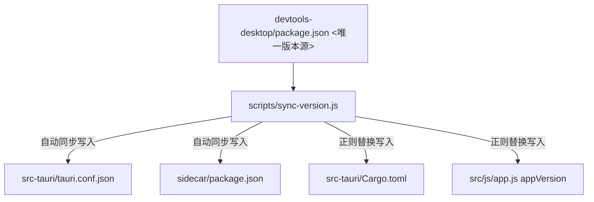

# 版本号一键同步设计说明书 (PRD)

## 1. 背景与目标
在多层架构（Tauri + Rust + Node.js Sidecar + 前端 Vanilla JS）的项目中，版本号通常分布在多个配置文件中：
- 根目录 `package.json`（NPM 项目元信息）
- `src-tauri/tauri.conf.json`（Tauri 编译与打包配置）
- `src-tauri/Cargo.toml`（Rust 编译配置）
- `sidecar/package.json`（Node.js Sidecar 的配置）
- `src/js/app.js`（前端展示的全局版本变量 `APP_VERSION`）

由于版本号分散在五处，人工修改极易造成漏改、版本号不一致导致升级时检测失败或界面显示错乱。本设计的核心目标是**确立唯一版本号源，并实现自动化一键同步。**

## 2. 架构设计与数据流向

以根目录的 `devtools-desktop/package.json` 作为唯一版本号源。

## 3. 自动化触发机制

1. **自动集成到编译流程**：
   在根目录 `package.json` 的 `build` 脚本中增加前置执行命令：
   `"build": "node scripts/sync-version.js && tauri build"`
   无论是在终端里手动输入 `npm run build`，还是用户在软件设置界面点击“立即更新”（后台触发 Sidecar 执行 `npm run build`），都会在编译前首先执行版本号自动同步。

2. **支持手动触发**：
   配置 `npm run sync-version` 指令，供开发者在需要时手动同步。

## 4. 文件修改定义

### 4.1 新增版本同步脚本
新建 [sync-version.js](file:///Users/ldy/personalTools/devtools-desktop/scripts/sync-version.js)，使用正则匹配和文件读写覆盖所有需要同步的文件。

### 4.2 配置 package.json 构建命令
修改 [package.json](file:///Users/ldy/personalTools/devtools-desktop/package.json) 挂载命令。
