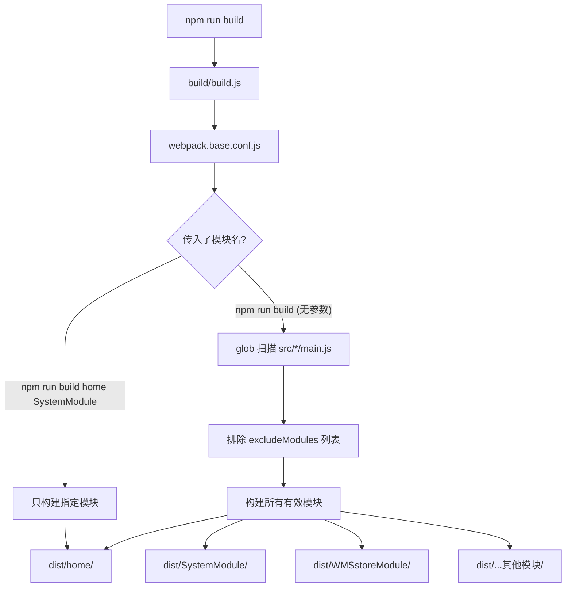
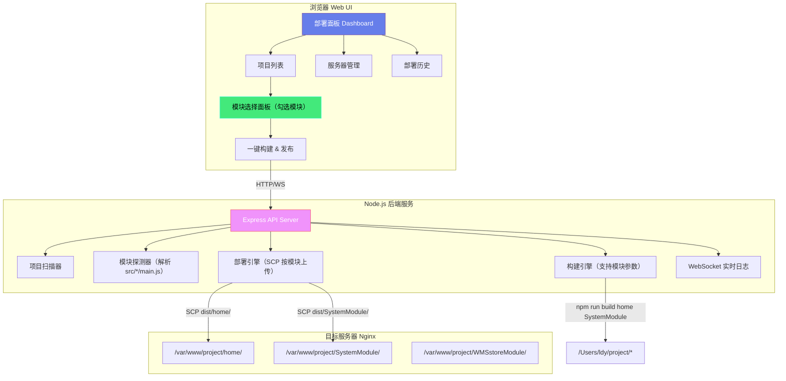
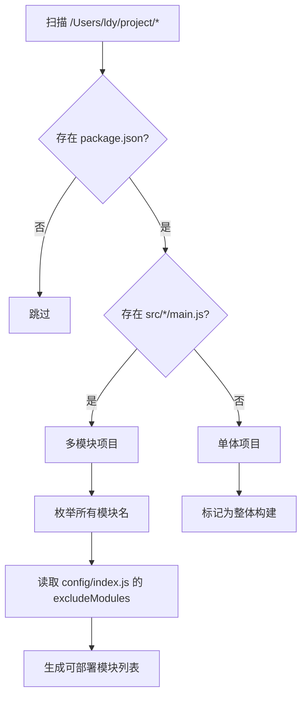

# 🚀 轻量级前端项目部署面板 — 技术方案（v2）

> **目标**: 替代 `npm run build` + FileZilla 手动上传的低效流程，提供一个 **Web UI 部署面板**，支持 **分模块构建 + 分模块发布**。

---

## 1. 现状分析

### 当前痛点

| 痛点 | 描述 |
|------|------|
| 流程繁琐 | 每次发布需要 4 步：拉代码 → build → 打开 FileZilla → 手动上传 |
| 易出错 | 上传错目录、遗漏文件、覆盖错环境等人为失误 |
| 无发布记录 | 谁在什么时间发布了什么版本，完全无法追溯 |
| 效率低下 | 单次发布耗时 10-30 分钟，且需要全程人工盯守 |
| **分模块构建繁琐** | 需要手动输入 `npm run build home SystemModule` 等命令，模块名容易记错 |

### 项目现状

- **项目数量**: 40+ 前端项目，集中在 `/Users/ldy/project/` 下

- **关键发现：大量项目采用多模块架构**

> [!IMPORTANT]
> 通过代码分析发现，`kangzhan-cloud`、`inz-pc`、`jms-pc`、`ss-pc` 等核心项目采用 **parallel-webpack 多入口架构**，每个 `src/` 下的子目录是一个独立模块，可以单独构建和发布。

#### 多模块项目构建机制



#### 已识别的多模块项目

| 项目 | 模块数 | 典型模块 | 构建命令 |
|------|--------|----------|----------|
| **kangzhan-cloud** | 26 个 | home, OMSorderManage, transportAdmin, trainingManage 等 | `npm run build [模块名...]` |
| **inz-pc** | 17 个 | home, TMStransportModule, WMSstoreModule, SystemModule 等 | `npm run build [模块名...]` |
| **jms-pc** | 16 个 | home, Distribution, BMScostModule 等 | `npm run build [模块名...]` |
| **ss-pc** | 类似结构 | 同上 | `npm run build [模块名...]` |

#### 单体项目（无模块概念）

| 项目 | 构建工具 | 构建命令 |
|------|----------|----------|
| **netaxfront** | Vite | `npm run build` |
| **emergency-web** | Vue CLI | `npm run build:prod` |
| 其他小项目 | 各种 | `npm run build` |

---

## 2. 方案对比（简述）

| 特性 | Jenkins | Drone CI | **本方案** |
|------|---------|----------|-----------|
| 安装复杂度 | ⭐⭐⭐⭐⭐ | ⭐⭐⭐ | ⭐ |
| 资源占用 | 500MB+ | 200MB+ | 小于 50MB |
| 分模块构建支持 | 需写 Pipeline | 需写 yaml | **原生支持** |
| 学习成本 | 高 | 中 | **零** |
| 适合场景 | 大团队 CI/CD | 中等团队 | **小团队多项目** |

> [!IMPORTANT]
> **推荐自建轻量部署面板**：原生支持你的多模块架构，无需额外基础设施。

---

## 3. 架构设计

### 3.1 整体架构



### 3.2 技术选型

| 层 | 技术 | 理由 |
|----|------|------|
| 前端 UI | **原生 HTML + CSS + JS** | 零依赖，打开即用 |
| 后端 API | **Node.js + Express** | 已有 Node 环境 |
| 实时日志 | **WebSocket (ws)** | 构建过程实时输出 |
| SSH 传输 | **ssh2 (npm)** | 纯 JS 的 SSH2/SCP |
| 数据存储 | **JSON 文件** | 轻量，无需数据库 |

### 3.3 目录结构

```
deploy-panel/
├── server/
│   ├── app.js                 # Express 主入口 + WebSocket
│   ├── routes/
│   │   ├── projects.js        # 项目扫描 & 模块探测 API
│   │   ├── servers.js         # 服务器配置 CRUD API
│   │   ├── deploy.js          # 构建 & 部署 API
│   │   └── history.js         # 部署历史 API
│   ├── services/
│   │   ├── scanner.js         # 项目扫描 + 模块探测引擎
│   │   ├── builder.js         # 构建引擎（支持模块参数）
│   │   ├── deployer.js        # 部署引擎（按模块 SCP）
│   │   └── logger.js          # WebSocket 日志推送
│   └── data/
│       ├── servers.json       # 服务器配置（加密存储）
│       ├── projects.json      # 项目 + 模块配置
│       └── history.json       # 部署历史记录
├── public/
│   ├── index.html             # 主页面（SPA）
│   ├── css/
│   │   └── style.css
│   └── js/
│       ├── app.js             # 前端主逻辑
│       ├── api.js             # API 调用封装
│       └── websocket.js       # WebSocket 日志
├── package.json
└── README.md
```

---

## 4. 核心功能模块

### 4.1 智能项目扫描 + 模块探测



**模块探测逻辑**（核心代码思路）：
```javascript
// 扫描 src/*/main.js 获取所有模块
const modules = glob.sync(`${projectPath}/src/*/main.js`)
  .map(f => path.basename(path.dirname(f)));

// 读取 excludeModules（如有）
const excludes = require(`${projectPath}/config`).exludeModules || [];

// 过滤出可构建模块
const buildableModules = modules.filter(m => !excludes.includes(m));
```

### 4.2 分模块构建 & 部署（⭐ 核心差异点）

#### UI 交互流程

```
用户点击 "kangzhan-cloud" 项目卡片
    ↓
弹出模块选择面板：
┌─────────────────────────────────────────────┐
│  📦 kangzhan-cloud — 选择要部署的模块        │
│                                             │
│  🔍 搜索模块...                              │
│                                             │
│  ☑ 全选 / ☐ 全不选                           │
│                                             │
│  ☑ home              ☐ Authentication       │
│  ☑ OMSorderManage    ☐ BMScostModule        │
│  ☐ transportAdmin    ☐ trainingManage       │
│  ☐ transControl      ☐ mainDataManage       │
│  ☐ workFlow          ☐ qualityPlatform      │
│  ☐ portalManage      ☐ examSystem           │
│  ... 更多模块                                │
│                                             │
│  目标服务器: [生产-茅台物流 ▼]                 │
│  远程路径:   /var/www/kangzhan-cloud/         │
│                                             │
│  [🔨 仅构建]   [🚀 构建并部署]                │
└─────────────────────────────────────────────┘
```

#### 构建 & 部署流程

```mermaid
sequenceDiagram
    participant U as 用户浏览器
    participant S as 部署面板后端
    participant P as 项目目录
    participant R as 远程服务器

    U->>S: 选择模块 home + OMSorderManage，点击"构建并部署"
    S->>S: 记录任务开始

    rect rgb(40, 40, 80)
        Note over S,P: Phase 1: 分模块构建
        S->>P: 执行 npm run build home OMSorderManage
        S-->>U: WebSocket 推送构建日志
        P-->>S: 产物 dist/home/ 和 dist/OMSorderManage/
    end

    rect rgb(40, 80, 40)
        Note over S,R: Phase 2: 分模块上传
        S->>S: tar -czf home.tar.gz dist/home/
        S->>R: SCP 上传 home.tar.gz
        S-->>U: WebSocket 模块 home 上传 100%
        S->>R: SSH 解压到 /var/www/kangzhan-cloud/home/
        S->>R: 备份旧版本 home.bak
        S-->>U: WebSocket 模块 home 部署完成

        S->>S: tar -czf OMSorderManage.tar.gz dist/OMSorderManage/
        S->>R: SCP 上传 OMSorderManage.tar.gz
        S-->>U: WebSocket 模块 OMSorderManage 上传 100%
        S->>R: SSH 解压到 /var/www/kangzhan-cloud/OMSorderManage/
        S-->>U: WebSocket 模块 OMSorderManage 部署完成
    end

    S->>S: 记录部署历史（含模块明细）
    S-->>U: WebSocket 全部完成
```



#### 部署历史记录（含模块信息）

| 时间 | 项目 | 模块 | 服务器 | 状态 | 耗时 |
|------|------|------|--------|------|------|
| 05-09 11:20 | kangzhan-cloud | home, OMSorderManage | 生产-茅台物流 | ✅ 成功 | 2m 30s |
| 05-09 10:15 | inz-pc | SystemModule | 生产-师帅 | ✅ 成功 | 1m 45s |
| 05-08 16:00 | netaxfront | (整体) | 测试服务器 | ❌ 失败 | 0m 30s |

### 4.3 项目类型自动识别

面板会自动识别两种项目类型并提供不同的 UI：

| 项目类型 | 识别标准 | UI 表现 |
|----------|----------|---------|
| **多模块项目** | `src/*/main.js` 存在多个 | 显示模块勾选面板，可选择部分模块构建 |
| **单体项目** | 无多入口或只有一个入口 | 直接显示"构建并部署"按钮，无需选模块 |

### 4.4 服务器管理

| 字段 | 说明 | 示例 |
|------|------|------|
| 名称 | 服务器别名 | `生产-茅台物流` |
| Host | 服务器 IP | `192.168.1.100` |
| Port | SSH 端口 | `22` |
| 用户名 | SSH 用户 | `root` |
| 认证方式 | 密码 / 密钥文件 | 支持两种 |
| 默认部署根路径 | Nginx 静态目录 | `/var/www/` |

### 4.5 项目-服务器关联配置

每个项目可以预设默认的部署目标，避免每次手动选择：

```json
{
  "kangzhan-cloud": {
    "type": "multi-module",
    "modules": ["home", "OMSorderManage", "transportAdmin", "..."],
    "excludeModules": ["common", "tmp", "structure"],
    "buildCommand": "npm run build",
    "distDir": "dist",
    "defaultServer": "server-prod-01",
    "remotePath": "/var/www/kangzhan-cloud/"
  },
  "netaxfront": {
    "type": "single",
    "buildCommand": "npm run build",
    "distDir": "dist",
    "defaultServer": "server-test-01",
    "remotePath": "/var/www/netaxfront/"
  }
}
```

---

## 5. Web UI 设计

### 页面规划

| 页面 | 功能 |
|------|------|
| **Dashboard** | 项目卡片总览，快速区分多模块/单体项目 |
| **部署面板** | 模块勾选 + 服务器选择 + 实时日志 |
| **服务器管理** | 增删改查服务器连接信息 |
| **部署历史** | 所有部署记录（含模块明细）+ 回滚 |

### Dashboard 项目卡片设计

```
┌──────────────────────┐  ┌──────────────────────┐  ┌──────────────────────┐
│ 📦 kangzhan-cloud    │  │ 📦 inz-pc            │  │ 📄 netaxfront        │
│ ┈┈┈┈┈┈┈┈┈┈┈┈┈┈┈┈┈┈  │  │ ┈┈┈┈┈┈┈┈┈┈┈┈┈┈┈┈┈┈  │  │ ┈┈┈┈┈┈┈┈┈┈┈┈┈┈┈┈┈┈  │
│ 🧩 多模块 · 26个模块  │  │ 🧩 多模块 · 17个模块  │  │ 📄 单体项目 · Vite   │
│ 最近: home +2 模块   │  │ 最近: SystemModule   │  │ 最近: 2小时前        │
│ ● 已配置             │  │ ● 已配置             │  │ ○ 未配置             │
│                      │  │                      │  │                      │
│    [🚀 部署]         │  │    [🚀 部署]         │  │    [🚀 部署]         │
└──────────────────────┘  └──────────────────────┘  └──────────────────────┘
```

---

## 6. 安全设计

> [!WARNING]
> 部署工具涉及服务器凭据，安全措施必须到位。

| 措施 | 说明 |
|------|------|
| **登录认证** | 面板设置访问密码 |
| **凭据加密** | 服务器密码 AES-256 加密存储 |
| **仅本地访问** | 默认绑定 `127.0.0.1` |
| **操作日志** | 所有操作全程记录 |
| **备份机制** | 每次部署前自动备份旧版本 |

---

## 7. 使用方式预览

### 启动

```bash
cd deploy-panel
npm install
npm start
```

浏览器打开 `http://localhost:3456`

### 典型操作场景

#### 场景 1: 发布 kangzhan-cloud 的 2 个模块

1. 打开面板 → 找到 `kangzhan-cloud` 卡片 → 点击"部署"
2. 勾选 `home` 和 `OMSorderManage`
3. 选择服务器 `生产-茅台物流`
4. 点击 "构建并部署"
5. 看实时日志 → 构建完成 → 自动上传 → 完成 ✅

#### 场景 2: 发布 netaxfront（单体项目）

1. 打开面板 → 找到 `netaxfront` 卡片 → 点击"部署"
2. 选择服务器
3. 点击 "构建并部署"
4. 等待完成 ✅

#### 场景 3: 只构建不发布

1. 选好项目和模块
2. 点击 "仅构建" → 只执行 build，不上传

---

## 8. 实施计划

| 阶段 | 内容 | 预估时间 |
|------|------|----------|
| **Phase 1** | 后端核心：项目扫描 + 模块探测 + 构建引擎 | 1.5h |
| **Phase 2** | 后端核心：SCP 部署引擎（按模块上传） | 1h |
| **Phase 3** | Web UI：Dashboard + 模块勾选面板 + 实时日志 | 2h |
| **Phase 4** | 服务器管理 + 部署历史 + 安全认证 | 1h |
| **Phase 5** | 联调测试 + 细节打磨 | 0.5h |
| **总计** | | **约 6h** |

---

## 9. 未来扩展方向（可选）

- [ ] **Git 集成**：部署前自动 `git pull`
- [ ] **多环境支持**：开发 / 测试 / 生产环境切换
- [ ] **模块组预设**：保存常用的模块组合（如 "核心模块" = home + SystemModule）
- [ ] **钉钉/飞书通知**：部署完成后推送
- [ ] **依赖检测**：构建前自动检测 node_modules 是否需要更新
- [ ] **并行上传**：多模块同时上传加速

---

> [!TIP]
> v2 方案的核心升级：**原生支持 parallel-webpack 多模块架构**，UI 上提供模块勾选面板，底层通过 `npm run build [模块名...]` 实现按需构建，再按模块粒度 SCP 上传到服务器对应目录。
