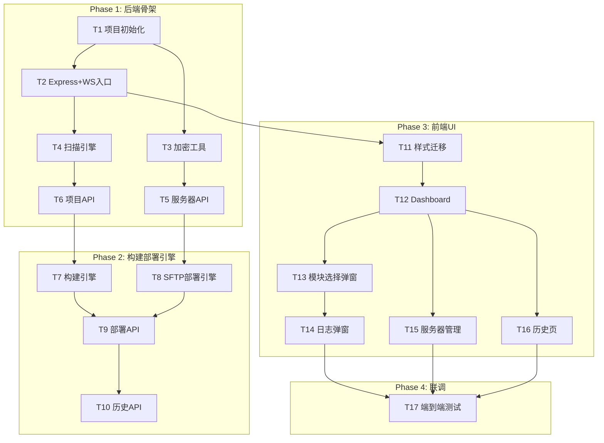

# 🚀 Deploy Panel — 实施计划

> **日期**: 2026-05-09  
> **基于**: deploy-panel-prd.md + deploy-panel-proposal.md

---

## 总体架构



---

## Phase 1: 后端骨架（预估 1.5h）

### T1 — 项目初始化

| 项 | 内容 |
|---|------|
| 目标 | 创建 package.json，安装依赖，建立目录骨架 |
| 产出文件 | `package.json`, `server/data/*.json` |

**依赖**: express, ws, ssh2, glob, uuid

**验证**: `npm install` 无报错

---

### T2 — Express + WebSocket 主入口

| 项 | 内容 |
|---|------|
| 产出文件 | `server/app.js` |
| 关键点 | 绑定 `127.0.0.1:3456`；WS 路径 `/ws`；挂载 `public/` 静态目录 |

**核心**: Express 实例 → JSON 中间件 → 路由挂载 → HTTP server 附加 ws.Server → 广播工具函数

**验证**: `npm start` 启动无报错

---

### T3 — 密码加密工具

| 项 | 内容 |
|---|------|
| 产出文件 | `server/services/crypto.js` |
| API | `encrypt(plaintext)` → 密文对象, `decrypt(cipherObj)` → 原文 |

**关键点**: AES-256-GCM, 密钥从 `.secret` 文件读取或自动生成

---

### T4 — 项目扫描引擎

| 项 | 内容 |
|---|------|
| 产出文件 | `server/services/scanner.js` |

**扫描流程**:
1. 遍历 `/Users/ldy/project/*`
2. 检测 `package.json` → 否则跳过
3. `glob('src/*/main.js')` 探测模块 → 多个则 multi-module
4. 读取 `config/index.js` 的 `exludeModules`（注意原项目拼写）
5. 推断构建命令和构建工具

---

### T5 — 服务器配置 API

| 项 | 内容 |
|---|------|
| 产出文件 | `server/routes/servers.js` |

**端点**: GET/POST/PUT/DELETE `/api/servers` + POST `/api/servers/:id/test`

---

### T6 — 项目配置 API

| 项 | 内容 |
|---|------|
| 产出文件 | `server/routes/projects.js` |

**端点**: GET `/api/projects`, GET `/api/projects/:name`, POST `/api/projects/scan`, PUT `/api/projects/:name`

---

## Phase 2: 构建 & 部署引擎（预估 1.5h）

### T7 — 构建引擎

| 项 | 内容 |
|---|------|
| 产出文件 | `server/services/builder.js` |

**核心**: `child_process.spawn('npm', ['run','build',...modules])`, stdout/stderr 通过 WebSocket 实时推送

---

### T8 — SFTP 部署引擎

| 项 | 内容 |
|---|------|
| 产出文件 | `server/services/deployer.js` |

> [!IMPORTANT]
> SFTP 逐文件上传（禁止 tar.gz），两种策略:
> - `folder`: dist/模块名/ → remotePath/模块名/
> - `root`: dist/home/* → remotePath/（内容散开）

**核心**: ssh2 连接 → SFTP 会话 → 递归上传（mkdir + fastPut）→ 每文件推送进度

---

### T9 — 部署 API

| 项 | 内容 |
|---|------|
| 产出文件 | `server/routes/deploy.js` |

**端点**: POST `/api/deploy/build`（仅构建）, POST `/api/deploy/start`（构建并部署）

**流程**: 校验 → builder.build() → deployer.deploy() → 写入 history

---

### T10 — 部署历史 API

| 项 | 内容 |
|---|------|
| 产出文件 | `server/routes/history.js` |

**端点**: GET `/api/history`, GET `/api/history/:id`

---

## Phase 3: 前端 UI（预估 2h）

### T11 — 样式迁移 + 基础框架

| 项 | 内容 |
|---|------|
| 产出文件 | `public/index.html`, `public/css/style.css`, `public/js/app.js`, `public/js/api.js`, `public/js/websocket.js` |

从 mockup 迁移 CSS, 封装 api.js (fetch) 和 websocket.js (连接管理+自动重连)

---

### T12 — Dashboard 页面

调用 `GET /api/projects` 渲染项目卡片，搜索筛选 + 类型过滤

### T13 — 模块选择弹窗

多模块: 3列模块网格 + 搜索/全选; 单体: 整体构建提示; 服务器下拉 + 远程路径

### T14 — 部署日志弹窗

WebSocket 实时日志 + 进度条 + 分阶段状态 (构建→上传→完成)

### T15 — 服务器管理页

服务器列表 + 添加/编辑弹窗 + 测试连接 + 删除确认

### T16 — 部署历史页

表格展示 + 点击查看详细日志

---

## Phase 4: 联调测试（预估 0.5h）

### T17 — 端到端验证

| # | 场景 | 预期 |
|---|------|------|
| 1 | Dashboard 加载 | 显示扫描到的项目卡片 |
| 2 | 多模块项目 → 勾选模块 → 仅构建 | 构建成功，日志流正常 |
| 3 | 构建并部署到测试服务器 | SFTP 上传成功 |
| 4 | home 模块 root 策略 | 文件散开到远程根路径 |
| 5 | 服务器 CRUD + 测试连接 | 全流程正常 |
| 6 | 部署历史查看 | 记录完整 |
| 7 | 异常：构建失败 | 错误日志 + 失败状态 |
| 8 | 异常：SSH 连接失败 | 友好提示 |

---

## 文件产出清单

```
deploy-panel/
├── package.json                          # T1
├── server/
│   ├── app.js                            # T2
│   ├── routes/
│   │   ├── projects.js                   # T6
│   │   ├── servers.js                    # T5
│   │   ├── deploy.js                     # T9
│   │   └── history.js                    # T10
│   ├── services/
│   │   ├── scanner.js                    # T4
│   │   ├── builder.js                    # T7
│   │   ├── deployer.js                   # T8
│   │   └── crypto.js                     # T3
│   └── data/
│       ├── servers.json                  # T1
│       ├── projects.json                 # T1
│       └── history.json                  # T1
├── public/
│   ├── index.html                        # T11
│   ├── css/style.css                     # T11
│   └── js/
│       ├── app.js                        # T12-T16
│       ├── api.js                        # T11
│       └── websocket.js                  # T11
└── deploy-panel-mockup/                  # 保留参考
```

## 实施顺序

```
T1 → T2+T3 → T4 → T5+T6 → T7+T8 → T9 → T10 → T11 → T12 → T13 → T14 → T15+T16 → T17
```

**总预估**: ~5.5h
