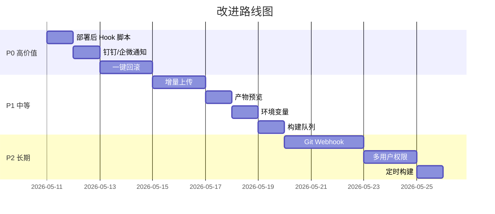

# Deploy Panel 改进路线图 — 对标 Jenkins/GitLab CI

## 📊 当前能力评估

| 维度 | Deploy Panel (当前) | Jenkins/专业 CI | 差距 |
|------|-------------------|----------------|------|
| 构建执行 | ✅ npm build + Node 版本切换 | Pipeline 脚本、多阶段 | ⭐⭐ |
| 部署上传 | ✅ SFTP 逐文件上传 | SSH + Docker + K8s | ⭐⭐⭐ |
| 部署历史 | ✅ JSON 记录 | 持久化 + 可检索 + 趋势 | ⭐⭐ |
| 实时日志 | ✅ WebSocket 推送 | WebSocket + ANSI 颜色 | ⭐ |
| 安全 | ✅ AES 加密密码 | RBAC + Token + 审计 | ⭐⭐⭐ |
| 触发机制 | ❌ 手动 | Webhook + 定时 + 手动 | ⭐⭐⭐ |
| 回滚能力 | ❌ 无 | 一键回滚 | ⭐⭐⭐ |
| 通知 | ❌ 无 | 邮件/钉钉/企微 | ⭐⭐ |

---

## 🎯 优先级分级改进方案

### 🔴 P0 — 高价值 · 低成本（建议立即做）

#### 1. 部署前后 Hook 脚本
> **痛点**：部署后经常需要手动重启 nginx、清缓存、执行 docker 命令等

- 在服务器或项目配置中增加 `preDeployScript` / `postDeployScript` 字段
- 部署完成后自动通过 SSH exec 执行（如 `docker restart nginx`、`nginx -s reload`）
- UI 上在服务器编辑弹窗增加"部署后执行"文本框

```
改动范围：
├── server/routes/servers.js     — POST/PUT 增加 postDeployScript 字段
├── server/services/deployer.js  — 上传完成后 conn.exec(postDeployScript)
└── public/index.html            — 服务器表单增加脚本输入
```

#### 2. 部署结果通知（钉钉/企微 Webhook）
> **痛点**：部署完成后需要盯着页面等结果

- 在"系统设置"中配置 Webhook URL
- 部署完成后 POST 通知，包含项目名、状态、耗时、操作人
- 支持钉钉机器人 / 企业微信机器人

```
改动范围：
├── server/data/settings.json     — 新增 webhook 配置
├── server/services/notifier.js   — 新增通知发送模块
└── server/routes/deploy.js       — appendHistory 后调用 notifier
```

#### 3. 一键回滚
> **痛点**：线上出问题时无法快速恢复

**方案 A — 备份式回滚（推荐，简单可靠）**：
- 每次部署前，将远程目录的当前文件打包为 `backup-{timestamp}.tar.gz` 存到服务器指定目录
- 历史记录中增加"回滚"按钮，一键将备份解压回原目录
- 限制保留最近 N 次备份（如 5 次）

```
改动范围：
├── server/services/deployer.js  — 上传前 exec('tar -czf backup-xxx.tar.gz ...')
├── server/routes/deploy.js      — 新增 POST /api/deploy/rollback 接口
└── public/js/app.js             — 历史记录添加回滚按钮
```

---

### 🟡 P1 — 中等价值 · 中等成本（建议近期做）

#### 4. 构建缓存与增量上传
> **痛点**：每次全量上传所有文件，大项目耗时久

- 上传前比对本地文件 MD5 与远程文件 MD5
- 仅上传变更的文件（增量部署）
- 可显著减少上传时间（通常 80%+ 的文件未变化）

```
思路：
1. 本地生成文件 manifest (path -> md5)
2. 服务器上保存上次部署的 manifest
3. diff 两份 manifest，只上传新增/变更的文件
```

#### 5. 构建产物预览 / Diff 查看
> **痛点**：构建完不知道产物是什么，不确定是否正确就上传了

- 构建完成后展示产物文件列表和大小
- 与上一次构建对比，高亮新增/删除/变大的文件
- 增加"确认部署"二次确认步骤

#### 6. 环境变量管理
> **痛点**：不同环境（测试/生产）需要不同的构建参数

- 项目配置增加 `envVars` 对象，支持设置环境变量
- 构建时自动注入（如 `VUE_APP_BASE_URL`、`NODE_ENV`）
- 部署弹窗可切换环境（测试环境/生产环境预设）

#### 7. 并发构建队列
> **痛点**：同时构建多个项目可能相互影响（共享 node_modules）

- 增加构建队列，同一时间只允许一个构建任务
- 后续任务排队等待，前端显示队列状态
- 可选：同项目互斥，不同项目可并行

---

### 🟢 P2 — 长期优化（有余力时做）

#### 8. Git 集成 + Webhook 自动触发
> 对标 Jenkins 的核心差异之一

- 支持配置 Git 仓库地址
- 提供 Webhook 接口，push 到指定分支自动触发构建
- 构建前自动 `git pull`，日志中显示本次提交信息

#### 9. 多用户 / 权限控制
> 当前任何人打开页面都能操作

- 增加简单登录（用户名/密码或 Token）
- 操作日志记录"谁在什么时候部署了什么"
- 可选：区分 admin / operator 角色

#### 10. 定时构建
> 如每天凌晨自动构建测试环境

- 使用 `node-cron` 实现定时任务
- 项目配置中增加 cron 表达式
- 定时触发构建 + 部署

#### 11. Dashboard 数据看板
> 当前首页比较简单

- 部署成功率趋势图
- 各项目平均构建耗时
- 最近 7 天部署频次
- 服务器状态监控（CPU/内存/磁盘）

#### 12. Docker 部署支持
> 部分项目可能需要构建 Docker 镜像

- 支持 Dockerfile 构建
- 推送到私有镜像仓库
- 远程 docker-compose up -d 更新

---

## 📋 推荐实施顺序



## 💡 总结

你的 Deploy Panel 定位是**轻量级前端部署工具**，不需要也不应该做成 Jenkins 那种重量级平台。最大的竞争优势就是**简单、快、无需学习成本**。

建议重点做好 3 件事：
1. **部署后 Hook** — 让部署真正"一键完成"，不用再手动 SSH 执行命令
2. **一键回滚** — 给线上部署加一层安全网
3. **通知** — 部署完成后自动推送，不用盯着页面

这三个做完，就能覆盖日常前端部署 95% 的场景，不输 Jenkins 的核心体验。
