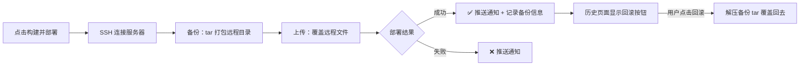
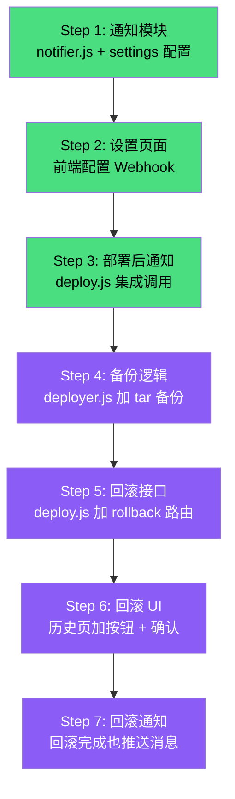

# 一键回滚 + 部署通知 — 实施计划

## 一、功能概述



---

## 二、Feature 1：一键回滚

### 2.1 核心逻辑

```
部署流程变化（deployer.js）：

原来：连接 → 上传文件 → 完成
改后：连接 → 【备份远程目录】→ 上传文件 → 完成 → 【记录备份路径】
```

### 2.2 备份策略

| 项 | 方案 |
|----|------|
| 备份方式 | SSH exec 执行 `tar -czf` 打包远程目标目录 |
| 备份位置 | 远程服务器 `/tmp/deploy-backups/{项目名}/` |
| 命名规则 | `backup-{timestamp}.tar.gz`（如 `backup-1778430000.tar.gz`） |
| 保留策略 | 最多保留最近 **5** 次备份，超出自动删除最旧的 |
| 跳过条件 | 远程目录为空（首次部署）时不备份 |

### 2.3 数据结构变更

**history.json 每条记录新增字段：**

```json
{
  "id": "deploy-1778429536624",
  "projectName": "tongrentang",
  "status": "success",
  "type": "deploy",
  "backup": {
    "remotePath": "/tmp/deploy-backups/tongrentang/backup-1778429536.tar.gz",
    "targetDir": "/docker/nginx/www/tongrentang/",
    "serverId": "server-ec3f6506",
    "timestamp": "2026-05-10T15:00:00Z"
  }
}
```

> 仅 `type: "deploy"` 且成功时才有 `backup` 字段；`type: "build-only"` 不涉及备份。

### 2.4 回滚接口设计

```
POST /api/deploy/rollback
Body: { historyId: "deploy-1778429536624" }

流程：
1. 从 history.json 查找该记录，获取 backup 信息
2. 通过 backup.serverId 获取服务器连接配置
3. SSH 连接服务器
4. exec: rm -rf {targetDir}/*
5. exec: tar -xzf {backupPath} -C {targetDir}
6. 返回结果，推送 WebSocket 日志
7. 写入一条新的 history 记录（type: "rollback"）
```

### 2.5 前端交互

**历史记录页面改动：**

```
当前：每条记录只显示 项目名、状态、耗时、时间
改后：deploy 类型且有 backup 的记录，右侧增加 [🔄 回滚] 按钮

点击后：
1. 二次确认弹窗："确定要回滚到此版本？当前线上文件将被覆盖"
2. 打开日志弹窗，实时显示回滚过程
3. 完成后推送通知（复用通知模块）
```

### 2.6 文件改动清单

| 文件 | 改动 | 工作量 |
|------|------|--------|
| `server/services/deployer.js` | 上传前加备份逻辑（SSH exec tar）、清理旧备份 | 中 |
| `server/routes/deploy.js` | history 记录加 backup 字段、新增 rollback 路由 | 中 |
| `public/js/app.js` | 历史页渲染加回滚按钮、确认弹窗、调用回滚 API | 小 |
| `public/index.html` | 回滚确认弹窗 HTML（可复用日志弹窗） | 小 |

---

## 三、Feature 2：部署结果通知

### 3.1 支持的通知渠道

| 渠道 | Webhook 格式 | 优先实现 |
|------|-------------|---------|
| **钉钉机器人** | POST + JSON（msgtype: markdown） | ✅ |
| **企业微信机器人** | POST + JSON（msgtype: markdown） | ✅ |
| 飞书机器人 | POST + JSON | 可选 |

> 两者 Webhook 调用方式几乎一致，只是 JSON 结构略有不同，可统一封装。

### 3.2 通知内容模板

```markdown
## 🚀 部署通知

- **项目**：tongrentang
- **模块**：operatingOAS, transportModule
- **服务器**：同仁堂测试 (192.168.1.18)
- **发布目录**：/docker/nginx/www/tongrentang/
- **状态**：✅ 成功
- **耗时**：34s
- **时间**：2026-05-10 23:00:00
```

失败时额外显示：
```markdown
- **状态**：❌ 失败
- **错误**：构建退出码 1
```

### 3.3 配置方案

**新增全局配置文件 `server/data/settings.json`：**

```json
{
  "notification": {
    "enabled": true,
    "type": "dingtalk",
    "webhookUrl": "https://oapi.dingtalk.com/robot/send?access_token=xxx",
    "notifyOn": ["success", "fail"]
  }
}
```

| 字段 | 说明 |
|------|------|
| `enabled` | 是否启用通知 |
| `type` | `dingtalk` / `wecom` / `feishu` |
| `webhookUrl` | Webhook 完整地址 |
| `notifyOn` | 触发条件：成功时通知、失败时通知、或都通知 |

### 3.4 前端配置入口

**方案：导航栏新增「系统设置」页面**

```
导航：Dashboard | 服务器管理 | 部署历史 | ⚙ 设置

设置页内容：
┌─────────────────────────────────┐
│ 部署通知                         │
│ ┌─ 启用通知 [开关]              │
│ ├─ 通知渠道 [钉钉▾]             │
│ ├─ Webhook URL [____________]    │
│ ├─ 通知时机 [☑成功 ☑失败]       │
│ └─ [发送测试通知]               │
└─────────────────────────────────┘
```

### 3.5 文件改动清单

| 文件 | 改动 | 工作量 |
|------|------|--------|
| `server/data/settings.json` | 新建，存储通知配置 | 新文件 |
| `server/services/notifier.js` | 新建，封装钉钉/企微 Webhook 调用 | 新文件，小 |
| `server/routes/settings.js` | 新建，GET/PUT 配置 + POST 测试通知 | 新文件，小 |
| `server/routes/deploy.js` | 部署/回滚完成后调用 notifier | 小 |
| `server/app.js` | 注册 settings 路由 | 1 行 |
| `public/index.html` | 新增设置页 HTML | 中 |
| `public/js/app.js` | 设置页交互逻辑 | 小 |

---

## 四、实施顺序



| 阶段 | 步骤 | 预计时间 |
|------|------|----------|
| **通知功能** | Step 1-3 | ~30 分钟 |
| **回滚功能** | Step 4-7 | ~1 小时 |
| **总计** | | ~1.5 小时 |

> 建议先做通知（简单、独立），再做回滚（回滚完成时复用通知模块）。

---

## 五、风险与注意事项

> [!WARNING]
> **回滚的 `rm -rf` 操作有风险**，必须做以下防护：
> - 路径校验：禁止 remotePath 为 `/`、`/etc`、`/usr` 等危险目录
> - 二次确认：前端必须弹窗确认
> - 限定范围：只删除 targetDir 下的内容，不删目录本身

> [!NOTE]
> **备份空间**：一个前端项目 dist 通常 5-30MB，压缩后 1-5MB，保留 5 次约 5-25MB，对服务器无压力。

> [!TIP]
> **通知安全**：Webhook URL 含 access_token，应在后端存储和调用，前端只负责配置输入，不暴露到浏览器网络请求中。
