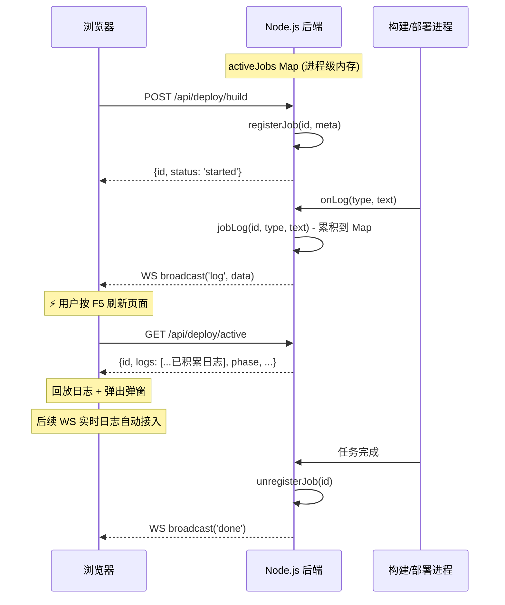

# 任务恢复架构 — 页面刷新/断线后无缝恢复活跃任务

## 背景问题

| 场景 | 原来的行为 | 影响 |
|------|----------|------|
| 页面刷新 (F5) | 所有前端状态 (日志/进度) 清空 | 任务继续运行但用户完全不可见 |
| WebSocket 断线 | 漏掉中间日志 | 重连后日志不完整 |
| 超大日志输出 | DOM 无限增长 | 页面卡顿/崩溃 |
| 弹窗关闭 | 无法恢复日志 | 上次对话已修复 (最小化机制) |

## 架构设计

## 后端改动 — `server/routes/deploy.js`

### 1. 活跃任务注册表 (activeJobs)
- `Map<deployId, { id, projectName, type, phase, startTime, logs[], modules, serverName }>`
- 任务启动时 `registerJob()`，完成时 `unregisterJob()`
- 每条日志同时写入 `jobLog()`，阶段变更调用 `jobPhase()`
- 内存保护：单个任务日志上限 **5000 条**，超限滑动裁剪

### 2. 新增 API
- `GET /api/deploy/active` → 返回当前活跃任务的完整状态 + 日志

## 前端改动

### 1. `public/js/app.js`
- **`checkActiveJob()`**：页面初始化时调用，查询 `/api/deploy/active`
  - 恢复 `currentDeployId`、`activeTask`、`busyProjects` 状态
  - 初始化日志弹窗、恢复步骤指示器
  - 使用 `DocumentFragment` 批量回放日志（无重排性能损耗）
  - 弹出弹窗 + Toast 通知
- **`appendLog()` 优化**：DOM 节点上限 **3000 行**，超限自动移除最早日志

### 2. `public/js/websocket.js`
- `onopen` 中调用 `checkActiveJob()`：断线重连后自动恢复

## 性能保护

| 保护层 | 机制 | 阈值 |
|--------|------|------|
| 后端内存 | `jobLog()` 滑动窗口 | 5000 条/任务 |
| 前端 DOM | `appendLog()` 移除旧节点 | 3000 个 DOM 节点 |
| 回放性能 | `DocumentFragment` 批量插入 | 一次性插入不触发重排 |

## 限制说明

- **服务进程重启**：`activeJobs` 存在于 Node.js 进程内存中，如果 `node server/app.js` 进程本身被 kill/重启，注册表会清空。但此时构建进程也会被终止，属于一致行为。
- **单任务模式**：`/api/deploy/active` 当前返回第一个活跃任务，符合现有的 `busyProjects` 单任务锁设计。
