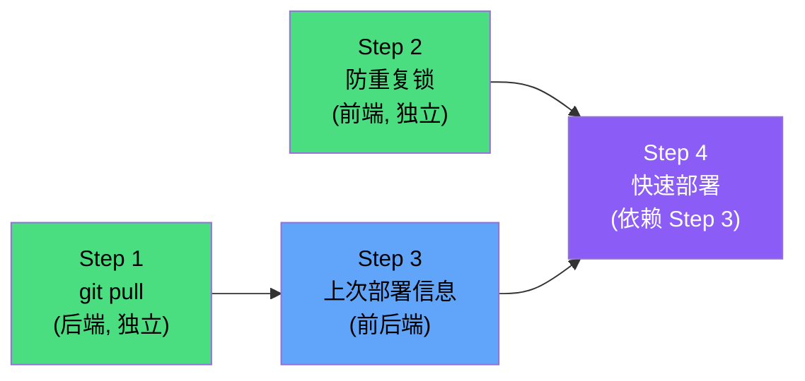

# 4 项流程优化 — 实施计划

## 📋 改进总览

| # | 功能 | 效果 | 复杂度 |
|---|------|------|--------|
| 1 | 项目卡片显示上次部署信息 | 首页一眼看到部署状态 | ⭐ |
| 2 | 一键重复上次部署 | 6 步操作缩减为 2 步 | ⭐⭐ |
| 3 | 构建前自动 git pull | 不用手动去终端拉代码 | ⭐ |
| 4 | 防重复部署锁 | 避免误触重复构建 | ⭐ |

---

## Feature 1：项目卡片显示上次部署信息

### 1.1 目标效果

项目卡片底部增加一行部署状态信息：

```
┌─────────────────────────────────────────────┐
│ 📦 tongrentang                      [多模块] │
│ webpack · v12.22.12 · 14个模块               │
│ operatingOAS | cospa | directConnectSystem...│
│ ● 已配置服务器                                │
│                                              │
│ ✅ 10分钟前 · 同仁堂测试 · operatingOAS · 34s │  ← 新增
│                                              │
│ [🔨 构建]  [🚀 部署]  [🗑]                    │
└─────────────────────────────────────────────┘
```

失败时：`❌ 2小时前 · 同仁堂测试 · 构建失败`
未部署过：`○ 暂无部署记录`

### 1.2 实现方案

**后端**：新增 API `GET /api/deploy/last/:projectName`
- 从 `history.json` 中找到该项目最近一次记录
- 返回 `{ status, timestamp, serverName, modules, duration, type }`
- 只返回摘要信息，不返回 logs（体积太大）

**前端**：`renderProjects()` 渲染时异步请求每个项目的最后部署信息

### 1.3 文件改动

| 文件 | 改动 |
|------|------|
| `server/routes/deploy.js` | 新增 `GET /last/:projectName` 路由 |
| `public/js/app.js` | `renderProjects` 中增加部署状态行 + 异步填充 |
| `public/css/style.css` | 部署状态行样式（小字、颜色区分成功/失败） |

---

## Feature 2：一键重复上次部署

### 2.1 目标效果

项目卡片新增「⚡ 快速部署」按钮：
```
[🔨 构建]  [🚀 部署]  [⚡ 快速部署]  [🗑]
```

点击后：
1. 自动读取该项目的上一次**成功**部署记录
2. 弹出确认框显示摘要：`即将使用上次配置部署：模块[operatingOAS] → 同仁堂测试 /docker/nginx/www/jlp/`
3. 用户确认后，**跳过所有选择步骤**，直接开始构建+部署
4. 如果没有历史记录，提示「暂无部署记录，请先使用完整部署」

### 2.2 操作流程对比

```
原来：打开面板 → 选项目 → 选模块 → 选服务器 → 选路径 → 点击部署  (6步)
改后：打开面板 → 点「⚡ 快速部署」→ 确认                          (2步)
```

### 2.3 实现方案

**后端**：复用 Feature 1 的 `GET /api/deploy/last/:projectName` 接口
- 额外筛选条件：`type === 'deploy'` 且 `status === 'success'`

**前端**：
```javascript
async function quickDeploy(projectName) {
  // 1. 获取上次成功的部署记录
  const last = await API.get(`/api/deploy/last/${projectName}?type=deploy&status=success`);
  if (!last) return alert('暂无成功的部署记录，请先使用完整部署');
  
  // 2. 确认弹窗
  const modules = last.modules.join(', ');
  const ok = confirm(`即将使用上次配置部署：\n模块：${modules}\n服务器：${last.serverName}\n路径：${last.remotePath}\n\n确认部署？`);
  if (!ok) return;
  
  // 3. 直接调用部署 API
  showLogModal(false);
  const data = await API.post('/api/deploy/start', {
    projectName,
    modules: last.modules,
    serverId: last.serverId,
    remotePath: last.remotePath,
    nodeVersion: ''  // 使用项目已记住的版本
  });
  currentDeployId = data.id;
}
```

### 2.4 文件改动

| 文件 | 改动 |
|------|------|
| `server/routes/deploy.js` | Feature 1 的接口增加 query 参数过滤 |
| `public/js/app.js` | 新增 `quickDeploy()` 函数 |
| `public/js/app.js` | `renderProjects` 中有历史记录时显示快速部署按钮 |

---

## Feature 3：构建前自动 git pull

### 3.1 目标效果

构建开始时日志自动出现：
```
$ git pull
Already up to date.            ← 或显示拉取到的新提交
$ npm run build operatingOAS
...
```

### 3.2 实现方案

在 `builder.js` 的 `build()` 函数中，构建命令执行前先执行 `git pull`：

```javascript
// builder.js - build() 函数开头新增
async function gitPull(projectPath, onLog) {
  return new Promise((resolve) => {
    onLog('cmd', '$ git pull');
    const child = spawn('git', ['pull'], { cwd: projectPath, shell: true });
    child.stdout.on('data', d => d.toString().split('\n').filter(l=>l.trim()).forEach(l => onLog('info', l)));
    child.stderr.on('data', d => d.toString().split('\n').filter(l=>l.trim()).forEach(l => onLog('warn', l)));
    child.on('close', (code) => {
      if (code !== 0) onLog('warn', '⚠ git pull 非零退出，继续构建');
      resolve(code === 0);
    });
    child.on('error', () => { onLog('warn', '⚠ git pull 失败，继续构建'); resolve(false); });
  });
}
```

> [!IMPORTANT]
> **git pull 失败不阻断构建**——可能当前在未跟踪分支或离线环境，只是 warn 提示。

### 3.3 可选增强：显示最新提交信息

git pull 后追加 `git log -1 --oneline`，让用户知道当前构建的是哪个版本：

```
$ git pull
Already up to date.
📌 当前版本: a3f2b1c 修复物流监控数据展示问题
$ npm run build operatingOAS
```

### 3.4 文件改动

| 文件 | 改动 |
|------|------|
| `server/services/builder.js` | 新增 `gitPull()` 函数，`build()` 开头调用 |

> 只改 1 个文件，前端不需要改动。

---

## Feature 4：防重复部署锁

### 4.1 目标效果

- 构建进行中时，该项目的所有按钮（构建/部署/快速部署）变为 disabled 状态
- 按钮文字变为 `⏳ 构建中...`
- 其他项目不受影响
- 构建完成后自动恢复

### 4.2 实现方案

**前端状态管理**（无需后端改动）：

```javascript
// 当前正在构建/部署的项目集合
let busyProjects = new Set();

function setBusy(projectName) {
  busyProjects.add(projectName);
  renderProjects();  // 重新渲染，按钮变灰
}

function clearBusy(projectName) {
  busyProjects.delete(projectName);
  renderProjects();
}
```

**渲染时判断**：
```javascript
const isBusy = busyProjects.has(p.name);
// 按钮根据 isBusy 添加 disabled 属性和样式
```

**触发时机**：
- `startBuildOnly()` / `startDeploy()` / `quickDeploy()` 开始时 → `setBusy()`
- WebSocket 收到 `status.phase === 'done'` 时 → `clearBusy()`

### 4.3 文件改动

| 文件 | 改动 |
|------|------|
| `public/js/app.js` | 新增 `busyProjects` 状态管理 + 渲染判断 + 事件触发 |
| `public/css/style.css` | `.btn-deploy-card:disabled` 样式（灰色+光标禁止） |

> 纯前端改动，无需后端。

---

## 📅 实施顺序



| 步骤 | 功能 | 原因 | 预计时间 |
|------|------|------|----------|
| **Step 1** | git pull（Feature 3） | 独立，只改 1 个文件 | ~10 分钟 |
| **Step 2** | 防重复锁（Feature 4） | 独立，纯前端 | ~15 分钟 |
| **Step 3** | 上次部署信息（Feature 1） | 为快速部署提供数据基础 | ~20 分钟 |
| **Step 4** | 快速部署（Feature 2） | 依赖 Step 3 的 API | ~20 分钟 |
| **总计** | | | **~1 小时** |

---

## 📋 文件改动汇总

| 文件 | 涉及功能 | 改动类型 |
|------|---------|---------|
| `server/services/builder.js` | Feature 3 | 新增 gitPull + git log |
| `server/routes/deploy.js` | Feature 1, 2 | 新增 GET /last/:projectName |
| `public/js/app.js` | Feature 1, 2, 4 | 卡片渲染 + quickDeploy + busyProjects |
| `public/css/style.css` | Feature 1, 4 | 部署状态行样式 + disabled 样式 |

> [!NOTE]
> 4 个功能总共只涉及 **4 个文件**，没有新建文件，没有新增依赖。
