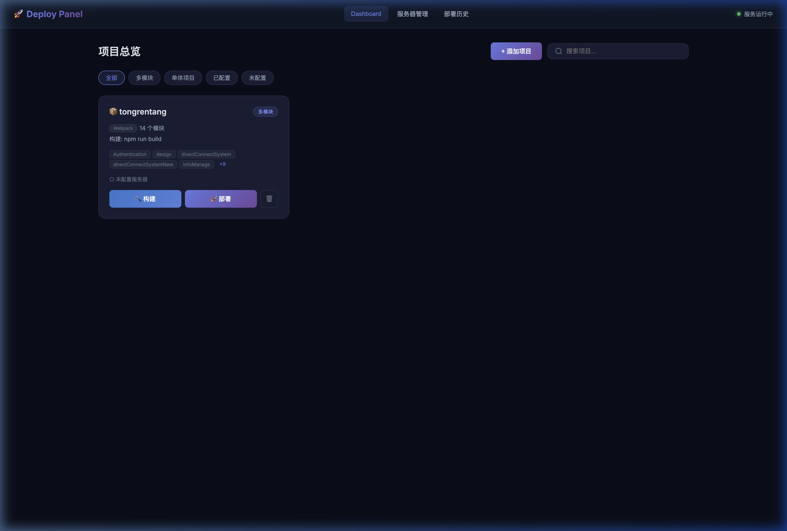

# Deploy Panel

> 轻量级前端项目构建 & 部署面板，替代「npm run build + FileZilla 手动上传」的传统前端部署流程。



## ✨ 功能特性

- **项目自动扫描** — 自动检测项目类型（webpack / vite / parallel-webpack），识别多模块结构
- **多模块选择性构建** — 支持 parallel-webpack 等多模块项目，可选择性构建指定模块
- **Node 版本切换** — 集成 NVM，按项目记忆 Node 版本，构建时自动切换
- **SFTP 一键部署** — 构建产物自动上传到远程服务器，支持 folder / root 两种上传策略
- **实时构建日志** — 基于 WebSocket 推送，构建和上传过程实时可见
- **远程目录浏览** — 内置远程文件浏览器，可视化查看服务器文件结构
- **部署历史记录** — 完整记录每次构建/部署的状态、耗时、日志
- **服务器管理** — 支持多服务器管理，多发布路径配置，支持 FileZilla 站点导入
- **安全加密** — 服务器密码 AES-256 加密存储，密钥本地生成不上传

## 🛠 技术栈

| 层 | 技术 |
|------|------|
| 后端 | Node.js + Express |
| 前端 | 原生 HTML/CSS/JS（零框架依赖） |
| 实时通信 | WebSocket (ws) |
| 远程连接 | ssh2（SFTP 上传 + SSH 连接测试） |
| 加密 | Node.js crypto（AES-256-CBC） |
| 数据存储 | 本地 JSON 文件（零数据库依赖） |

## 📦 安装 & 启动

```bash
# 克隆项目
git clone https://gitee.com/ldy1103/deploy-panel.git
cd deploy-panel

# 安装依赖
npm install

# 启动服务
npm start
```

启动后访问 `http://localhost:3456`

## 📁 项目结构

```
deploy-panel/
├── public/                  # 前端静态资源
│   ├── index.html           # 单页面应用
│   ├── css/style.css        # 全局样式
│   └── js/
│       ├── app.js           # 核心业务逻辑
│       ├── api.js           # HTTP 请求封装
│       └── websocket.js     # WebSocket 客户端
├── server/
│   ├── app.js               # Express 入口 + WebSocket 服务
│   ├── routes/
│   │   ├── projects.js      # 项目管理 API
│   │   ├── servers.js       # 服务器管理 API
│   │   ├── deploy.js        # 构建 & 部署 API
│   │   └── history.js       # 部署历史 API
│   ├── services/
│   │   ├── scanner.js       # 项目扫描 & 分析引擎
│   │   ├── builder.js       # 构建引擎（支持 NVM 切换）
│   │   ├── deployer.js      # SFTP 部署引擎
│   │   └── crypto.js        # AES 加密/解密
│   └── data/                # 运行时数据（已 gitignore）
│       ├── projects.json    # 项目配置
│       ├── servers.json     # 服务器配置
│       └── history.json     # 部署历史
└── PRD/                     # 产品需求文档
```

## 🔧 使用说明

### 1. 添加项目

点击「+ 添加项目」，面板会自动扫描工作目录下的前端项目，勾选需要管理的项目即可。

### 2. 配置服务器

进入「服务器管理」页面，添加远程服务器信息：
- 支持密码认证
- 支持配置默认打开目录和多个发布目录
- 支持从 FileZilla 导入已有站点配置

### 3. 构建 & 部署

- **仅构建**：点击项目卡片的「🔨 构建」按钮，选择模块后执行构建
- **构建并部署**：点击「🚀 部署」按钮，选择模块、目标服务器和发布路径后一键完成

### 4. Node 版本管理

- 首次选择 Node 版本后，面板会自动记住该项目的偏好版本
- 下次构建/部署时自动选中，无需重复选择
- 需要本机已通过 NVM 安装对应版本

## ⚠️ 注意事项

- 本工具定位为**个人/小团队开发工具**，建议在内网或本机使用
- 服务器密码经 AES-256 加密后存储在本地 `servers.json` 中，加密密钥保存在 `.secret` 文件（已 gitignore）
- 首次启动会自动生成加密密钥，请勿删除 `.secret` 文件

## 📄 License

MIT
