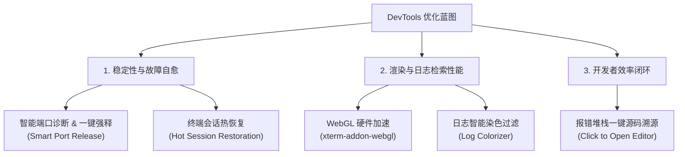
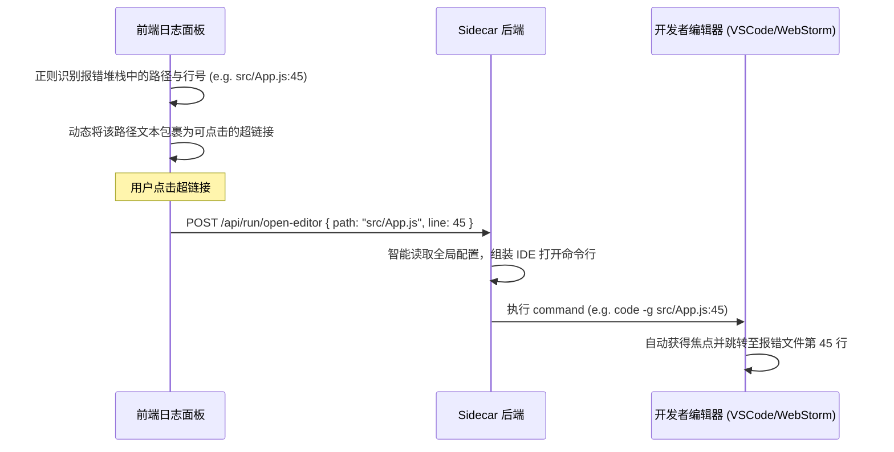

# DevTools Desktop 全景优化技术蓝图与实施路线图

本规划书旨在针对 DevTools Desktop 的**系统稳定性、渲染性能、以及开发者交互体验**三个维度，对前一阶段盘点出的 5 个核心优化点进行具体的系统架构、数据流向及实现方案设计，作为后续阶段迭代开发的唯一权威技术指南。

---

## 1. 优化全景矩阵与架构设计



---

## 2. 优化项详细技术实现方案

### 2.1 智能端口冲突诊断与一键强制释放 (Smart Port Release)
当本地运行项目卡片启动并由于端口冲突发生 `EADDRINUSE` 错误时，系统应当能够定位占用源头并提供自愈能力。

#### 技术实现方案：
1. **占用源探测 (Sidecar)**：
   在 `sidecar/routes/run.js` 中新增 `/port-owner/:port` 路由，执行系统命令获取占用详情：
   ```bash
   lsof -i tcp:PORT -sTCP:LISTEN -Fpcu
   ```
   解析输出结果：获取进程的 `PID (p)`、`进程名 (c)`、`运行用户 (u)`。
2. **诊断气泡与决策 (前端)**：
   当服务启动检测到 `addressInUsePort` 时，卡片由普通的“启动失败”状态变更为“端口占用冲突”诊断警告：
   * 浮现文字：“端口 8080 正被进程 `nginx` (PID: 12894) 占用。”
   * 提供“**强制一键释放并运行**”动作按钮。
3. **强制自愈 (Sidecar)**：
   用户确认释放后，向后端发起 `/api/run/force-release` 请求。Sidecar 执行同步强杀进程组：
   ```javascript
   process.kill(-targetPid, 'SIGKILL');
   ```
   杀灭成功后直接无缝重试 `spawnRunProcess`，实现故障的即时自我修复。

---

### 2.2 终端会话热恢复与断点续传 (Hot Session Restoration)
避免由于软件热更新、托盘退出、意外闪退等事件造成用户当前打开的多个终端 Tab 及执行状态全部被清空。

#### 数据架构设计 (SQLite)：
在本地 SQLite 数据库中新增 `terminal_sessions` 关系表：
```sql
CREATE TABLE IF NOT EXISTS terminal_sessions (
    id TEXT PRIMARY KEY,
    name TEXT NOT NULL,
    cwd TEXT NOT NULL,
    node_version TEXT,
    created_at INTEGER NOT NULL,
    sort_order INTEGER NOT NULL
);
```

#### 技术实现方案：
1. **状态持久化 (前端 JS)**：
   在 `terminal.js` 中，当执行 `createNewTerminalTab`、关闭标签、或是切换工作路径 (Cwd) 时，发起持久化请求，将当前的 Tab 列表结构同步存入 SQLite。
2. **终端断点还原 (启动阶段)**：
   当客户端初始化完毕并建立 WebSocket 时，首先向后端请求上一次持久化的终端会话列表：
   * 前端根据配置重新创建对应的多标签 DOM。
   * Rust 侧在拉起 Node 实例时，直接将对应的初始 `cwd` 指向持久化记录中的路径，使终端在软件开启的一瞬间即处于上一次退出的工作路径，恢复历史上下文。

---

### 2.3 WebGL 硬件加速渲染 (WebGL Acceleration)
提升大日志吞吐量场景下的性能体验，防范大范围搜索时的卡顿。

#### 技术实现方案：
1. **依赖预载**：
   下载官方 `xterm-addon-webgl.js`，以离线资产的形式放入项目 `src/js/` 下并在 `index.html` 中引入。
2. **自适应启用**：
   在 `terminal.js` 初始化 `new Terminal` 结束后，检测系统的 WebGL 支持能力。若支持，直接加载该插件以接管 Canvas 渲染渲染流：
   ```javascript
   const webgl = new WebglAddon.WebglAddon();
   term.loadAddon(webgl);
   ```
3. **大日志异步分片搜索**：
   重构全屏搜索时触发的 `performTerminalSearch`。针对超过 1000 行的日志流，为输入框的 `oninput` 绑定 `300ms` 的防抖处理器，避免高频触发重绘，并分块检索，保障滚动丝滑。

---

### 2.4 错误日志一键染色染色引擎 (Log Colorizer)
使用户能在成千上万行开发编译日志中，一眼捕捉到关键的故障与警告。

#### 技术实现方案：
1. **日志微过滤器 (WS 管道)**：
   在 WebSocket 接收日志的 `run-log` 处理端及终端文本渲染端，建立管道拦截过滤器。
2. **正则分级染色规则**：
   定义高效正则表达式，对流入的日志文本行执行多色分级匹配：
   * **Error级**（整行微红底色）：`/ERROR|Exception|Failed|TypeError|ReferenceError/i`
   * **Warn级**（整行微黄底色）：`/WARN|Warning|Deprecated|Deprecation/i`
   * **Success级**（整行微绿底色）：`/SUCCESS|Compiled successfully|Listening at/i`
   通过注入带样式的 CSS 标签将染色后的日志写回终端或控制台日志面板。

---

### 2.5 报错堆栈一键源码溯源 (Click to Open Editor)
消除在开发服务控制台看到报错后，需要手动找文件、找行号的低效重复行为。

#### 数据流向设计：



#### 技术实现方案：
1. **日志链转化 (前端)**：
   在日志流入终端或日志盒子时，利用匹配规则：`/((?:\.\/|[a-zA-Z]:\/|[\w-]+\/)+[\w-]+\.[\w]+):(\d+)(?::(\d+))?/g`。
   将符合条件的文件路径转化为 `<a href="#" class="error-source-link" data-path="$1" data-line="$2">...</a>` 的超链接节点。
2. **溯源动作指令 (Sidecar)**：
   Sidecar 接收请求后，检测系统中安装的编辑器软件：
   * **VS Code**：执行 `code -g <path>:<line>`。
   * **通用命令行**：直接通过系统调用，无缝在后台打开编辑器并直接把光标停在出错的代码行上。

---

## 3. 实施路线图与迭代安排

优化将按照**“稳定性优先 -> 交互性能提升 -> 开发效率闭环”**的节奏分为三个里程碑阶段实施：

| 阶段 | 里程碑目标 | 包含模块 | 预计工期 |
| :--- | :--- | :--- | :--- |
| **Phase 1** | **核心稳定性与故障自愈** | 智能端口强释、终端会话热恢复 | 4 工作日 |
| **Phase 2** | **日志过滤与流畅检索性能** | WebGL硬件加速、日志智能染色过滤 | 3 工作日 |
| **Phase 3** | **开发效率闭环** | 日志堆栈一键溯源打开编辑器 | 3 工作日 |
