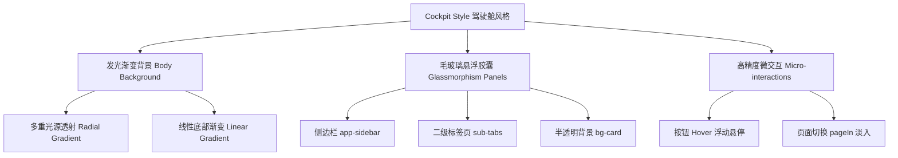

# DevTools Desktop 项目设计风格与样式审计报告

本报告旨在对 `DevTools Desktop` 项目的整体样式效果、技术底座、色彩规范以及组件微交互进行系统的审计与梳理，以便于后续在统一的设计语言下进行功能拓展和界面调优。

---

## 1. 样式与技术底座 (Tech Stack & Architecture)

- **开发范式**：基于 **Tauri (v2)** 框架构建的桌面应用。主进程采用 Rust 进行系统交互，渲染进程采用**纯原生前端技术栈 (Vanilla JS + HTML5 + CSS3)**，未依赖任何现代化重型框架（如 React, Vue）或编译型 CSS 框架（如 TailwindCSS）。
- **页面路由**：采用单页面应用 (SPA) 架构。主体区域通过 `.page` 类和 `.page.active` 切换，并配合 `pageIn` 动画（平滑的透明度淡入及向上微移 `4px`），实现流畅的无刷新转场。
- **窗口特性**：通过 CSS 的 `-webkit-app-region: drag` 和 `no-drag` 提供了 Mac 原生窗口的拖拽支持与交互避让。

---

## 2. 核心设计风格 (Design Aesthetics)

项目整体采用 **Cockpit Style (驾驶舱风格)**。该风格强调高信息密度、精致的层次感与未来感。



- **发光渐变背景**：
  在 `body` 底部使用多层重叠的 CSS 渐变，营造出屏幕边缘带有蓝、青双色光源透射的现代感：
  ```css
  body {
    background:
      radial-gradient(circle at 12% 10%, rgba(29, 78, 216, 0.12), transparent 45%),
      radial-gradient(circle at 90% 5%, rgba(14, 165, 165, 0.12), transparent 40%),
      linear-gradient(180deg, #f8f7f4 0%, #eef1f6 100%);
  }
  ```
- **毛玻璃拟态 (Glassmorphism)**：
  侧边栏和二级控制面板（例如 Tab 栏）采用半透明背景色结合高斯模糊滤镜，呈现高档的毛玻璃效果：
  ```css
  background: var(--bg-card); /* rgba(255, 255, 255, 0.75) */
  backdrop-filter: blur(20px);
  -webkit-backdrop-filter: blur(20px);
  border: 1px solid var(--border);
  ```

---

## 3. 设计色彩规范 (Theme & Palette)

项目建立了完善的 CSS 变量系统，原生支持 **Light (浅色) / Dark (深色)** 主题切换。

### 3.1 主题变量对照表

| CSS 变量名 | 浅色模式 (Light) | 深色模式 (Dark) | 作用/释义 |
| :--- | :--- | :--- | :--- |
| `--bg-base` | `#f6f5f2` (极淡暖灰) | 适度暗化渐变底色 | 窗口主底色 |
| `--bg-elevated` | `#ffffff` | 纯暗灰或纯黑 | 弹出层/模态框底色 |
| `--bg-card` | `rgba(255, 255, 255, 0.75)` | `rgba(15, 23, 42, 0.4)` | 磨砂卡片层级 |
| `--text-primary` | `#0f172a` (深蓝灰) | `#e2e8f0` (亮灰白) | 主要文本 |
| `--text-secondary`| `#475569` (中蓝灰) | `#94a3b8` | 次要/描述文本 |
| `--border` | `rgba(15, 23, 42, 0.1)` | `rgba(255, 255, 255, 0.08)` | 常规细分割线 |

### 3.2 语义化功能色

- **主色 (Primary)**: `#1d4ed8` (科技宝蓝)，常搭配变体 `--primary-light` (带 12% 不透明度的宝蓝背景色作为激活状态)。
- **点缀色 (Accent)**: `#0ea5a5` (青碧色)，常用于辅助状态、搜索输入焦点框等。
- **双色渐变**: `linear-gradient(135deg, var(--primary), var(--accent))` 用于主行动点按钮（Primary Buttons）。
- **状态提示**: 成功 `Success` (`#22c55e`)、警告 `Warning` (`#f59e0b`)、危险 `Danger` (`#ef4444`)。

---

## 4. 核心 UI 组件与微交互说明

### 4.1 胶囊式悬浮侧边栏 (`.app-sidebar`)
- **形态特征**：并非传统的左侧通顶贴边栏，而是**绝对定位悬浮**于屏幕左侧中部的胶囊。
- **微动画**：采用 `slideInLeft` 自定义贝塞尔曲线缓动（`cubic-bezier(0.16, 1, 0.3, 1)`），载入时带有细腻的侧滑物理感。
- **宽度响应**：支持折叠态与展开态。折叠时隐藏文本，仅展示 SVG 图标；可通过 JS 读取 `sessionStorage` 状态实现跨页面持久化。

### 4.2 卡片组件 (`.card` & `.stat-card`)
- **视觉层级**：卡片拥有微弱的灰色描边，悬浮时边框加深，并带有非常轻量的阴影反馈：
  ```css
  .card {
    transition: border-color 0.15s, box-shadow 0.15s;
  }
  .card:hover {
    border-color: var(--border-strong);
    box-shadow: var(--shadow-sm);
  }
  ```

### 4.3 渐变按钮 (`.btn-primary`)
- **浮动质感**：背景采用宝蓝到青碧的渐变，且悬浮时应用 `-1px` 的 `translateY` 产生升起感，同时伴随外发光的弥散投影（`box-shadow` 放大）：
  ```css
  .btn-primary:hover {
    transform: translateY(-1px);
    box-shadow: 0 6px 16px rgba(29, 78, 216, 0.35);
  }
  ```

### 4.4 系统弹窗 (`.sys-dialog` & `.modal`)
- 自定义了系统的 Confirm/Alert。遮罩层覆盖有 `backdrop-filter: blur(6px)` 的高强模糊，弹窗本身配合 `Escape` 键按下进行多级模态销毁（通过 z-index 自适应），从而保证键盘流的极致顺畅。

---

## 5. 项目设计风格总结与优化建议

### 5.1 总结 (Architecture Alignment)
`DevTools Desktop` 成功脱离了臃肿的现代框架，仅用原生三件套配以精细的 CSS 变量，实现了惊艳的 **Cockpit (驾驶舱) 质感**。深色与浅色模式切换流畅，利用 `backdrop-filter` 实现了类似 Mac 系统的半透明磨砂质感，视觉高级，交互丝滑。

### 5.2 优化建议 (Refinement Suggestions)
1. **多组件变量复用性**：部分新增页面的样式与通用样式有所耦合。在未来新功能开发时，必须优先消费 `:root` 下定义的全局设计变量，避免在各页面 CSS 中硬编码具体的 HSL 或 Hex 颜色。
2. **毛玻璃防抖处理**：在大列表滚动时，多层 `backdrop-filter: blur` 重叠在低端电脑上可能产生渲染负荷。应当注意使用 `.page-sticky-header` 独立滚动来降低重合高斯模糊渲染面积。
