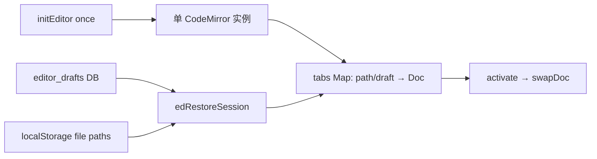

# 文件编辑页面迁移评估

> 状态：Phase 7-1 **PG5 已完成 / 页面关闭**（2026-08-11）；用户 Tauri 手测通过，legacy 已删（见 [decision.md](./decision.md)）
> 关联计划：[vue3_architecture_migration_execution_plan.md](../../../vue3_architecture_migration_execution_plan.md)
> 产出日期：2026-08-11

本文只做运行态取证与代码研究。不开始 Vue 实现；不替用户选定 L0～L3。

## 1. 页面规模

| 项 | 数量 |
| --- | ---: |
| `src/js/editor.js` | 689 行 |
| `src/css/pages/editor.css` | 199 行 |
| 页内弹窗 `#edBrowserModal` | 约 27 行 HTML（打开 / 另存为共用） |
| 顶层函数 | ~47 |
| `editor.js` 内联 `onclick` 模板 | 7 处 |
| `index.html` 静态 `onclick` / `onkeydown` | ~11 |
| CodeMirror | **5.65.16**（`src/js/vendor/codemirror/cm.bundle.{js,css}`） |
| 后端 | `sidecar/routes/editor.js` ~202 行；表 `editor_drafts` |

相对 filetransfer 体量更小，但复杂度集中在：**单 CM 实例 + 多 `Doc` 标签**、草稿库、应用内文件浏览器、脏标记语义。

## 2. 对 legacy 全局的依赖

| 依赖 | 用途 | 迁移方向 |
| --- | --- | --- |
| `API` | `/api/editor/*` | 类型化 `editor-service.ts` |
| `CodeMirror`（全局 script） | 编辑器宿主 | Vue 侧挂载；先保持 **CM5**，不升 CM6 |
| `showToast` / `showConfirm` / `showPrompt` | 反馈与脏关闭 / 重命名 | 通知 store + Confirm / Prompt Dialog |
| `closeModal` | `#edBrowserModal` | `BaseDialog` |
| `localStorage['devtools-editor-tabs']` | 仅记真实文件路径会话 | 键名保持 |
| DOM ids | `edEditorHost`、`edTabs`、状态栏、浏览器弹窗 | Vue 模板 |

**无** WS、无 servers、与 filetransfer / deploy 无会话耦合。

**易混淆（非本页）**：日志点源码走 `openFileInEditorByPath` → `POST /api/run/open-editor`（外部 VS Code / `open`），**不会**打开应用内编辑器。迁移时文案与 API 命名勿混。

## 3. PG0 运行态取证（2026-08-11）

### 3.1 信息架构（静态 DOM）

`#page-editor`：

1. 固定头：标题「文件编辑」+ 打开 / 新建 / 保存
2. 标签栏 + 编辑区（空态 CTA / `#edEditorHost`）
3. 状态栏：路径、编码/换行、脏状态
4. `#edBrowserModal`：应用内目录浏览（打开文件 / 另存为）

无原生 OS 文件对话框（代码注释明确）。

### 3.2 窗口与主题

| 检查项 | 结论 |
| --- | --- |
| 1665×1184 | 标签 + CM 填满；CM 在隐藏页挂载后需 `refresh`（`initEditor` 再进入时已做） |
| 900×600 | 工具栏与标签可挤；无独立 `@media` 大改（`editor.css` 偏薄） |
| 亮/暗 | CM theme `default` / `material-darker`，跟 `body[data-theme]` MutationObserver |
| 多标签 | UI 多 tab；底层 **一个** CM，`swapDoc` |
| 首次进入 | 无恢复文件时自动开空白草稿；关最后一 tab 也会再开草稿 → 空态 UI 难长期停留 |

### 3.3 脏标记与离开语义（关键缺口）

| 行为 | 现状 |
| --- | --- |
| 关单个脏 tab | `showConfirm` |
| 批量关（其它 / 右侧） | 有脏则一次确认 |
| 空草稿 | 无内容则不算脏 |
| **切走「文件编辑」页** | **无确认**（`switchPage` 不检查） |
| **`beforeunload`** | **无**（笔记本页有，本页无） |

主计划 Phase 7 验收要求「未保存离开页面时确认」——**当前未实现**。PG2/PG3 须决定：等价迁移后补上（建议作架构必修 / L1），还是单列。

### 3.4 打开路径边界

| 入口 | 是否进本页 CM |
| --- | --- |
| 工具栏打开 / 空态 CTA / 浏览器弹窗 | 是 |
| 会话恢复（草稿 DB + LS 文件路径） | 是 |
| ⌘T 新建、⌘⇧T 重开关闭栈 | 是 |
| 运行日志点源码 | **否**（外部编辑器） |
| Notes / Notebook / 文件传输 | **否** |

## 4. PG1 代码与数据研究

### 4.1 会话模型

- 生命周期：首次进入创建 CM + 绑快捷键 + 主题 Observer；**从不销毁**。
- 再进入：仅 `cm.refresh()`。
- 计划验收「反复进出不增实例」今日因「只建一次」碰巧满足；迁 Vue 后必须在 `onUnmounted` 拆 Observer / 按键 / CM，并在 KeepAlive 策略下明确「隐藏 ≠ 销毁文档」。

### 4.2 HTTP 契约（本页实际调用）

| 方法 | 路径 | 用途 |
| --- | --- | --- |
| GET | `/api/editor/drafts` | 恢复草稿 |
| POST | `/api/editor/drafts` | 新建草稿落库 |
| PUT | `/api/editor/drafts/:id` | 更新 / 重命名 |
| DELETE | `/api/editor/drafts/:id` | 关闭 / 另存转换 |
| GET | `/api/editor/browse?dir=` | 打开/另存浏览（跳过 node_modules） |
| POST | `/api/editor/read` | 打开（8MB / 二进制校验） |
| POST | `/api/editor/write` | 保存 / 另存 |

未使用：`POST /api/editor/create`、`GET /api/editor/stat`（mtime 已存，外部变更检测未做）。

### 4.3 必须保持的行为细节

1. 读入规范化 LF；写出按原文件 EOL 还原 CRLF（若曾检测到）。
2. 模式按扩展名映射（bundle 内多 mode）。
3. 查找/替换走 CM addon 快捷键（⌘F 等）。
4. 草稿 id 键形如 `draft:N`；真实文件用绝对路径键。
5. 与 `/api/fs/local`（文件传输）**刻意分家**——browse 规则不同，勿强行合并。

### 4.4 缺陷与风险清单

| ID | 级 | 描述 | 建议归属 |
| --- | --- | --- | --- |
| D1 | 高 | 切页无未保存确认，与 Phase 7 验收不符 | PG3：作 L1 必修 |
| D2 | 中 | CM / Observer / keydown 无 teardown，迁 Vue 必须可销毁 | 架构必修 |
| D3 | 低 | `stat` / `create` 死 API | 本轮不实现外部变更检测，除非 L3 |
| D4 | 低 | 工具栏 / 空态可能含 emoji 或字符图标 | L1 改描边 SVG |
| D5 | 低 | 设置页曾记 CM `defineSimpleMode` 控制台噪声 | 迁时可观察是否仍在 |
| D6 | 低 | 关末 tab 强制新草稿，空态难见 | 等价保留，除非 L2 |

### 4.5 Sidecar / 测试缺口

- 路由：`sidecar/routes/editor.js`
- 无针对性 editor E2E；壳层 `legacy-shell` 仅点名 page id
- 供应商包体积大，继续走现有 bundle，不在本轮换 CM6

## 5. legacy 待删清单（PG5，已执行 2026-08-11）

- [x] `src/js/editor.js` + `index.html` script
- [x] `src/css/pages/editor.css` + link
- [x] `#page-editor` → `#vue-editor-host`；`#edBrowserModal` → Vue Dialog
- [x] `app.js` 中 `initEditor()` 分支（PG4 已去）
- [x] 内联 `onclick` / 字符串拼路径
- [ ] （保留）`src/js/vendor/codemirror/*` 仍由 HTML 加载，供 CM5 全局使用

## 6. 与相邻页边界（非目标）

- 不合并 Notes / Notebook 编辑器
- 不把 filetransfer 本地栏与 editor browse 合成公共双栏
- 不把「日志打开外部编辑器」改成默认进本页（若要做，拆 L3）

## 7. 用户手动补证清单（建议 Tauri）

1. 打开已有文本文件 → 编辑 → 保存；另存为新路径
2. 多标签切换；关脏 tab 有确认；⌘S
3. 新建草稿 → 有内容后关闭 → 确认；重启后草稿/文件标签恢复
4. 亮/暗切换后 CM 主题跟随且无需重建实例观感正常
5. 切到其它页再回来：内容仍在、CM 尺寸正常（`refresh`）
6. **现状对照**：脏内容时直接切走页面——今日无拦截（作 D1 基线）

---

**下一门禁**：无（本页 PG0～PG5 已关闭）。下一步 Phase 7-2 terminal。
