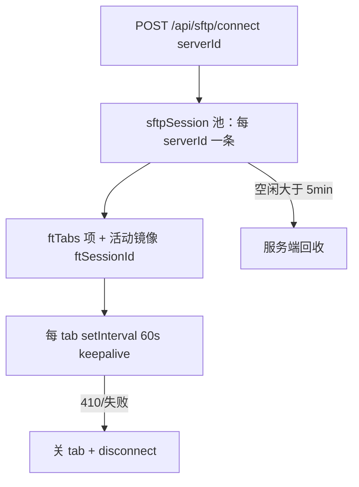

# 文件传输页面迁移评估

> 状态：Phase 6-3 **PG0～PG1 已完成**（2026-08-11）；PG2 / PG3 尚未开始，无 `decision.md`
> 关联计划：[vue3_architecture_migration_execution_plan.md](../../../vue3_architecture_migration_execution_plan.md)
> 产出日期：2026-08-11

本文只做运行态取证与代码研究，不提方案、不改 Vue 实现。本轮顺带修了 Phase 6-2 归零后的 `servers` 全局断供（见 §3.1 D0），属阻塞 PG0 连接态取证的回归修复，不是功能扩展。

## 1. 页面规模

| 项 | 数量 |
| --- | ---: |
| `src/js/filetransfer.js` | 1117 行（含 D0 修复后） |
| `src/css/pages/filetransfer.css` | 483 行 |
| 页面函数 | 95 个 |
| 内联 `onclick` / `onchange` | 13 处 |
| 模块级可变状态 | ~20 项（含 `Set`/`Map`、多 tab 镜像） |
| 页内弹窗 | 0（用 `showPrompt` / `showConfirm` + 运行时右键菜单） |
| 子 Tab | 无（单页双栏 + 远程多会话标签） |

迁移矩阵标注为「很高复杂度」：SFTP 会话池、多标签镜像、传输队列与 WS 进度、keepalive 定时器均在同一命令式文件里。

## 2. 对 legacy 全局的依赖

| 依赖 | 用途 | 迁移方向 |
| --- | --- | --- |
| `API` | 全部 HTTP | 类型化 `filetransfer-service` / `fs-service` |
| `WS.on('transfer')` | 队列进度 | Vue 侧订阅；须可销毁、防重复 |
| `getConnTimeoutMs()` | 连接超时 | 读 settings store |
| `showToast` / `showPrompt` / `showConfirm` | 反馈与表单 | 通知 store + Confirm/Prompt 组件 |
| `renderState` / `escapeHtml` / `escapeAttr` | 空态与 HTML | 模板插值 / EmptyState |
| `withButtonBusy` | 连接按钮忙态 | BaseButton `loading` |
| `sendDesktopNotification` | 传完通知（target `filetransfer`） | 既有通知适配层 |
| ~~全局 `servers`~~ | ~~下拉数据源~~ | **已切断**：改本页 `ftServers` + `GET /api/servers`（D0） |
| `localStorage` | `ft.splitRatio` / `ft.localSort` / `ft.remoteSort` | 键名保持不变 |

`ftWireOnce` 订阅 `WS.on('transfer')` **只绑一次、从不 `off`**——与计划「listener 可追踪销毁」冲突，迁移时必须改。

## 3. PG0 运行态取证（2026-08-11）

### 3.1 D0（阻塞，已修）：服务器下拉恒空

**现象**：进入「文件传输」后下拉只有「暂无服务器…」，即使部署面板里已有服务器。

**根因**：`ftRenderServerOptions` / `ftConnect` / `ftSyncSessionUI` 读全局 `servers`。Phase 6-2 删除 `deploy.js` 的 `loadServers` 与 Vue `syncLegacyServers` 后，无人写入该全局。

**修复**：`filetransfer.js` 增加模块级 `ftServers` 与 `ftLoadServers()`，`initFileTransfer` 进入页时 `API.get('/api/servers')`；不恢复 deploy 桥。迁入 Vue 后随整页删除。

### 3.2 信息架构（静态 DOM）

`#page-filetransfer` 自上而下：

1. 固定头：标题「文件传输」+ 全局刷新（未连接时 disabled）
2. 会话栏：服务器下拉、连接按钮、状态药丸、hint
3. 工作区：本地栏 | 分隔条 | 远程栏（远程栏上方为多会话 tabs）
4. 底部传输队列：冲突策略、清除已完成、全部取消、任务列表

无页内 modal；新建/重命名走系统 `showPrompt`，删除走 `showConfirm`。

### 3.3 窗口与主题（代码 + CSS 契约）

| 检查项 | 结论 |
| --- | --- |
| 默认 1665×1184 | 双栏横排；`--ft-left` 默认约 50%，可拖分隔条（20%～80%），双击复位；比例存 `ft.splitRatio` |
| 最小 900×600 | `@media (max-width: 880px)`：工作区纵向堆叠、隐藏分隔条 |
| 亮/暗/跟随 | 使用全局 token（`--bg-*` / `--text-*` / `--border` 等），无独立主题分支 |
| 未连接空态 | 远程栏占位；本地栏进页即 `ftLoadLocal('')` 列家目录 |
| 有服务器 | 下拉 `名称 · user@host:port`；连接后仍可选其他服务器开新标签（T11） |

**连接态 / 多标签 / 真实传输 / keepalive 失败 / 切页保活**：依赖真实 SFTP，自动化不得在正式库乱连。**请用户在 Tauri 用至少一台服务器补做**（见文末手动清单）。代码路径已按 §4 核对。

### 3.4 与主计划措辞的差异（取证结论）

主计划 Phase 6-3 验收写到「断线重连」。**当前实现没有自动重连**：keepalive 失败或会话丢失 → `ftHandleSessionLost` 关该 tab + toast，用户需再点「连接」。PG2/PG3 不得把「已有重连」当基线；若要做，拆 L3。

## 4. PG1 代码与数据研究

### 4.1 会话模型

- 后端：[`sidecar/services/sftpSession.js`](../../../../sidecar/services/sftpSession.js) — 同 `serverId` 复用，`reused: true`；SSH keepalive 30s；应用层 idle 5min。
- 前端：活动远程态是 **镜像**（`ftSessionId` / `ftRemotePath` / `ftRemoteItems` / …）。切 tab 必须 `ftSaveActiveTab` 再 restore，否则会操作错会话。
- 本地栏跨 tab 共享。

### 4.2 HTTP 契约（本页实际调用）

**SFTP**

| 方法 | 路径 | 用途 |
| --- | --- | --- |
| POST | `/api/sftp/connect` | 建/复用会话 |
| POST | `/api/sftp/disconnect` | 关 tab |
| POST | `/api/sftp/:sid/keepalive` | 心跳 |
| GET | `/api/sftp/:sid/list` | 远程列表 |
| POST | `/api/sftp/:sid/mkdir\|rename\|delete` | 远程 CRUD |
| POST | `/api/sftp/:sid/transfer` | 入队上传/下载 |
| POST | `/api/sftp/transfer/:taskId/cancel` | 软取消 |

未使用：`GET /api/sftp/sessions`、`GET /api/sftp/transfer/:taskId`（取消以外）。

**本地 FS**（与远程 list 形状对齐）：`GET /api/fs/local/list`，`POST .../mkdir|rename|delete`。

**服务器**：`GET /api/servers`（D0 后由本页自取）。

### 4.3 WebSocket：`transfer`

[`transferQueue.js`](../../../../sidecar/services/transferQueue.js) 广播 `{ type:'transfer', data }`，`data.phase`：

`started` → `progress`（~250ms 节流）→ `file-done|file-skipped|file-failed` → `done|failed|cancelled`。

**已知竞态（代码注释）**：WS `started` 可能早于 HTTP 返回 `taskId`。`ftOnTransferEvent` 必须能在任务表里补 `sessionId`，否则完成后无法刷新对应 tab 的远程列表。

取消为软取消：进行中的单文件会跑完；无断点续传。

### 4.4 功能矩阵（实现现状）

| 能力 | 有？ | 备注 |
| --- | --- | --- |
| 多服务器标签 | 是 | T11 |
| Keepalive | 是 | 60s / tab |
| 自动重连 | **否** | 丢失即关 tab |
| 路径建议 | 是 | T9 |
| 列排序记忆 | 是 | T8 |
| 多选 / Shift 范围 | 是 | T10 |
| 右键菜单 | 是 | 打开目录、传、重命名、删 |
| 文件拖拽互传 | **否** | 仅右键；splitter 只调宽度 |
| 冲突策略 | 是 | overwrite / skip / rename |
| 桌面通知 | 是 | 完成/失败 |
| 离开页面断连 | **否** | 会话与 keepalive 在切页后仍跑（符合计划「隐藏 ≠ 关闭」的现状，但无显式所有权模型） |

### 4.5 复杂度热点（迁移优先拆分）

1. `ftConnect` + tab 镜像 save/restore
2. `ftWireOnce`（委托 + WS 永驻订阅）
3. `ftOnTransferEvent` / 队列渲染 / 完成后刷新
4. `ftDelete` + 右键批量
5. 路径建议与排序
6. 每 tab 的 keepalive 定时器生命周期

### 4.6 Sidecar 相关文件

| 路径 | 职责 |
| --- | --- |
| `sidecar/routes/sftp.js` | HTTP |
| `sidecar/services/sftpSession.js` | 会话池 |
| `sidecar/services/transferQueue.js` | 队列 + WS |
| `sidecar/routes/fs.js` | 本地栏 |
| `sidecar/services/ssh.js` | 共用建连（与 deploy browse/test 同源，但是短连接） |

**测试缺口**：无 sftp/transfer 单测；E2E 仅 `legacy-shell` 点名页面 id。

## 5. 缺陷与风险清单（PG0/PG1）

| ID | 级 | 描述 | 状态 |
| --- | --- | --- | --- |
| D0 | 高 | Phase 6-2 后全局 `servers` 断供，下拉恒空 | **已修**（本页自取） |
| D1 | 中 | 主计划写「断线重连」，实现为关 tab；文档/验收需对齐 | 待 PG2/PG3 |
| D2 | 中 | `WS.on('transfer')` 从不卸载，多实例/热更新可能重复处理 | 待 Vue 生命周期 |
| D3 | 中 | 切页不销毁会话：符合「保活」但缺显式 session store，重挂载易重复绑事件 | 待架构 |
| D4 | 低 | 工具栏大量 emoji（🏠／⬆／↻）；Vue 页规范为描边 SVG | 待 L2 |
| D5 | 低 | 窄屏 880px 堆叠后远程 tabs + 路径栏密度高，900×600 需真机再验 | 待用户补取证 |
| D6 | 低 | 冲突策略与队列在底部，长列表时需滚动才看见进度 | 体验，PG2 评估 |

## 6. legacy 待删清单（PG5 用，预登记）

- `src/js/filetransfer.js` 整文件 + `index.html` script 引用
- `src/css/pages/filetransfer.css` + link（核实无其它消费者后整删）
- `#page-filetransfer` 内静态 DOM → Vue host
- 13 处内联 `onclick`/`onchange`
- `app.js` 中 `showPage('filetransfer')` → `initFileTransfer()` 分支
- 运行时注入的 `#ftCtxMenu`（若仍在）

## 7. 用户手动补证清单（连接态）

请在 **真实 Tauri**（修过 D0 的构建）用至少一台已配置服务器执行并回复结果：

1. 下拉能列出服务器；点连接 → 状态「已连接」；远程列出 `defaultRemotePath`
2. 再连第二台（或同台再连）→ 出现 tabs；切换 tab 路径/列表各自独立；本地栏不变
3. 右键上传/下载小文件 → 队列进度与完成后通知
4. 切到其它页面再回来 → 会话仍在、队列仍在（或明确现状）
5. 900×600 亮/暗：双栏堆叠可操作、无横向撑破

---

**下一门禁**：PG2 优化建议 + PG3 用户确认 L0～L3（默认预期：视觉/组件 L1～L2，任务语义冻结；自动重连若要做则 L3）。
