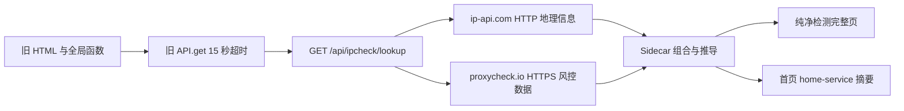

# 纯净检测页面 Vue 迁移评估

> 状态：PG0～PG5 已完成，用户 Tauri 手动 E2E 与旧实现清理均已通过
> 评估日期：2026-07-27
> 当前运行实现：`frontend/src/views/ipcheck/` + `frontend/src/services/modules/ipcheck-service.ts`
> 关联计划：[vue3_architecture_migration_execution_plan.md](../../../vue3_architecture_migration_execution_plan.md)

## 1. 评估范围

本次覆盖纯净检测页面的首次自动查询、当前公网 IP、手动 IPv4、IPv6、域名、非法输入、键盘提交、加载、成功、Sidecar 断开、错误和重试状态，并检查亮色、暗色、跟随系统模式及 1665 × 1184、1440 × 900、1280 × 720、900 × 600 四档窗口。

代码研究覆盖：

- `frontend/index.html` 中 `#page-ipcheck` 的完整 DOM。
- `src/js/ipcheck.js` 的初始化、校验、请求、状态切换和渲染逻辑。
- `src/css/pages/ipcheck.css` 的全部 701 行样式。
- `src/js/api.js` 的旧请求封装。
- `sidecar/routes/ipcheck.js` 的第三方数据源、推导规则和响应字段。
- `frontend/src/services/modules/home-service.ts` 中首页纯净度摘要。
- 已完成的项目公共 Token、主题、页面布局、表单、卡片和反馈组件。

本阶段只进行研究和文档整理，不创建 `IpCheckView.vue`，不改运行时代码，也不删除旧页面。

## 2. PG0 运行态取证

### 2.1 测试环境

- 当前工作区基线：`7a59904 docs: 完善剩余页面Vue迁移执行路线`。
- 首页 Vue 迁移基线：`0a52146 refactor: 完成首页 Vue 迁移并增加系统主题模式`。
- 测试 Sidecar：`DEVTOOLS_TEST=1`，端口 `13900`，使用独立 `sidecar/data-test`。
- 浏览器入口：`http://127.0.0.1:1420/?apiPort=13900`。
- API 错误验证：使用未监听的测试端口 `13901`，未停止生产服务、未访问生产数据库。
- 临时截图保存在仓库外，未加入 Git。

### 2.2 状态验证结果

| 状态 | 结果 | 主要观察 |
| --- | --- | --- |
| 首次进入 | 通过 | 第一次进入自动查询当前公网 IP；离开后返回仍保留结果，不重复进入加载态 |
| 当前 IP | 通过 | 返回 IP、位置、ASN、组织、风险、共享人数、原生属性、AI 可用性和场景建议 |
| 手动 IPv4 | 通过 | `8.8.8.8` 返回 Google/Level 3 数据和风险结论 |
| 手动 IPv6 | 通过 | `2606:4700:4700::1111` 返回 Cloudflare 数据；IPv4 数值显示 `-` |
| 手动域名 | 通过 | `example.com` 能解析为公网 IP 后展示结果 |
| 回车提交 | 通过 | 输入 `1.1.1.1` 后按 Enter 能完成查询 |
| 非法输入 | 部分通过 | `not-an-ip` 被拦截并显示全局 Toast；输入框本身没有错误说明 |
| 加载状态 | 通过 | 两栏完整骨架屏可见，但查询按钮未显示忙碌状态，也未阻止重复提交 |
| API 错误 | 部分通过 | 显示“无法连接 Sidecar 服务”Toast，随后退回通用空状态 |
| 重试 | 部分通过 | 可再次点击“我的 IP”，但错误状态没有页面内重试按钮和保留上次结果策略 |
| 快速切页 | 通过 | 首页与纯净检测来回切换后结果保留，未观察到重复 Enter 绑定 |
| 跟随系统 | 通过 | 主题菜单能切换为跟随系统，当前 macOS 亮色下页面采用亮色变量 |

### 2.3 四档窗口与主题

| 窗口 | 亮色/暗色表现 | 结论 |
| --- | --- | --- |
| 1665 × 1184 | 两栏完整可读，主题变量基本生效；左栏内容结束后存在大面积空白 | 可用但信息密度失衡 |
| 1440 × 900 | 主结果仍为两栏，右栏场景卡需纵向滚动；左栏空白明显 | 可用，布局不够紧凑 |
| 1280 × 720 | 地理位置换行，风险摘要标签被拆行，底部内容依赖内部滚动 | 勉强可用，需要响应式重排 |
| 900 × 600 | 仪表盘宽度 724px、内部 `scrollWidth` 812px；出现横向滚动条，IP 数值逐行拆分、位置逐字换行、风险值和标签被裁切 | 不通过最小窗口契约 |

900 × 600 的问题不是字体缩小即可解决。当前页面始终维持双列仪表盘，内部两栏又继续维持双列卡片，同时 `.item-value` 使用 `word-break: break-all`，最终把数值和中文都强制拆成单字/数字行。

### 2.4 体验审计结论

#### 已有优点

- 查询入口清晰，支持当前 IP、指定 IP、IPv6、域名和 Enter 提交。
- 加载骨架覆盖了结果区，不会显示半更新数据。
- 风险、共享人数、原生属性和场景建议形成了完整的结果闭环。
- 亮暗主题的基础颜色来自现有变量，没有出现整页不可读。

#### UX 风险

1. 左侧网络信息与右侧风险分析被强制拉成相同高度，造成左侧大面积无效空白。
2. 9 个网络字段视觉权重接近，用户无法快速区分“当前结论”和“技术详情”。
3. IP 数值、经纬度、ASN 所有者和企业/ISP 同时占用主视图，低频技术信息挤占主要结论空间。
4. 风险值和共享人数都使用相似进度条，表达重复；场景星级又增加第三套评分语言。
5. 非法输入只通过右上角短暂 Toast 告知，视线仍停留在输入框的用户容易错过。
6. Sidecar 或上游错误后退回“输入 IP 开始检测”，页面看起来像从未查询，缺少明确错误和就地重试。
7. 查询中按钮仍可点击，没有请求取消、去重或“以最后一次查询为准”的显式策略。
8. Emoji、侧边栏 SVG 和系统控件图标混用，视觉语言不统一。

#### 可访问性风险

1. 页面标题使用普通 `div`，没有页面级 `h1`。
2. 搜索框主要依赖 placeholder，没有持久可见的 label。
3. 两个进度条没有 `meter`/`progressbar` 语义、当前值说明和可访问名称。
4. 风险和建议依赖绿/黄/红及星级表达，色觉障碍用户需要同时获得明确文字。
5. 8～10px 刻度文字在亮色主题下对比度和可读性偏低。
6. 卡片 hover 动效没有在本文件中处理 `prefers-reduced-motion`。
7. Toast 的 DOM 由旧全局函数生成；截图能看到错误，但尚未验证屏幕阅读器播报顺序和焦点恢复。

截图只能支持视觉与可见交互判断，不能证明 WCAG 完整合规。键盘焦点顺序、屏幕阅读器朗读和对比度数值仍需在 PG4/PG5 使用自动规则和人工辅助技术验证。

## 3. PG1 当前功能与数据流

### 3.1 当前功能清单

1. 页面首次激活时自动调用当前公网 IP 查询。
2. 手动输入 IPv4、包含冒号的 IPv6 字符串或域名。
3. Enter 或“检测”按钮提交。
4. “我的 IP”清空输入后查询当前出口 IP。
5. 在 empty/loading/data 三种 DOM 区块间切换。
6. 展示 IP、IPv4 数值、位置、ASN、ASN 所有者、组织、坐标、原生属性和大模型可用性。
7. 展示风险值、风险等级、IP 类型、共享人数估计和四类业务场景建议。
8. 使用全局 Toast 展示输入或请求错误。

### 3.2 数据链路



完整页直接消费 snake_case 原始响应；首页另外定义了局部 `IpPurityResponse` 并单独转换 `risk_score`。如果继续各自维护，风险阈值、空值、错误和字段命名会逐渐产生两套口径。

### 3.3 `/api/ipcheck/lookup` 响应字段

| 字段 | 当前含义 | 来源/计算 | 当前消费者 |
| --- | --- | --- | --- |
| `ip` | 解析后的公网 IP | ip-api | 完整页、首页 |
| `location` | 国家/省/市拼接 | ip-api | 完整页、首页 |
| `asn` | ASN | proxycheck 优先，ip-api 回退 | 完整页 |
| `asn_owner_type` | ISP/IDC 标签 | 根据 proxy 类型推导 | 完整页 |
| `asn_owner` | ASN 所有者 | proxycheck/ip-api | 完整页 |
| `org_type`、`org` | 组织类型和名称 | proxycheck/ip-api | 完整页 |
| `longitude`、`latitude` | 当前实际返回 `lat`、`lon` | ip-api | 完整页 |
| `ip_type` | 中文 IP 类型 | proxy 类型映射 | 完整页、首页 |
| `risk_score`、`risk_label` | 风险百分比和等级 | proxy 风险值 + 本地阈值 | 完整页、首页 |
| `native_ip` | 原生/非原生 | Residential/Wireless 且非代理 | 完整页、首页 |
| `shared_users*` | 共享人数、等级、百分比 | devices 或风险/类型启发式估算 | 完整页 |
| `openai_support` | 大模型可用性 | 国家、代理、风险、类型启发式 | 完整页 |
| `scenarios` | 四类场景星级和建议 | Sidecar 启发式规则 | 完整页 |
| `_raw` | 代理、类型、风险、设备、ISP、国家码 | 两个上游数据整合 | 当前页面未直接使用 |

### 3.4 已确认的数据与实现问题

1. **重复 DOM ID**：`ipcValNative` 在网络信息和风险摘要中出现两次。`getElementById()` 只更新第一处，因此风险摘要中的“属性”始终显示 `-`。
2. **坐标字段命名相反**：Sidecar 把 `lat` 放入 `longitude`、把 `lon` 放入 `latitude`。页面恰好按“latitude, longitude”形式显示出正确视觉顺序，但字段契约本身错误，后续类型化后容易再次颠倒。
3. **风控缺失被静默当作安全**：proxycheck 无数据时，代码默认非代理风险为 15，再展示“极度纯净”。用户无法区分真实 15 分和风控服务不可用。
4. **共享人数并非始终为实测**：有 devices 时使用观测值；无 devices 时根据 IP 类型和风险启发式推导。UI 虽写“评估”，但没有说明来源和置信度。
5. **上游没有显式超时**：Sidecar 的两个 `fetch` 没有 AbortSignal。旧前端 15 秒、首页 20 秒会先终止等待，但 Sidecar 上游请求仍缺少统一截止时间。
6. **HTTP 地理请求**：`ip-api.com` 使用明文 HTTP；查询目标 IP/域名会发送给第三方，协议和隐私边界需要明确。
7. **免费额度与重复请求**：proxycheck 免费额度约 1,000 次/天，ip-api 免费额度约 45 次/分钟；当前无缓存、请求合并和速率保护，首页与完整页可能对同一当前 IP 重复查询。
8. **IPv6 校验过宽**：前端把任何包含 `:` 的字符串当作 IPv6，不能真正拦截非法 IPv6。
9. **动态 `innerHTML`**：场景名称、星级和建议通过模板字符串写入。数据当前由 Sidecar生成，但 Vue 迁移应改为文本绑定，避免未来上游字段扩展带来注入边界。
10. **错误状态丢失上下文**：请求失败后切回 empty，无法区分“尚未查询”和“查询失败”。

### 3.5 旧 CSS 污染统计

| 指标 | 数量 | 判断 |
| --- | ---: | --- |
| 总行数 | 701 | 不得整文件复制 |
| `!important` | 36 | 主要用于压过全局输入、透明表面和动态状态 |
| `#page-ipcheck` 选择器行 | 97 | 高特异性页面 ID 依赖明显 |
| 十六进制颜色 | 6 | 少量 |
| `rgb/rgba()` | 35 | 多个页面私有状态色和光效 |
| `:has()` | 7 | 样式依赖子节点状态，迁移后应改为显式状态 class/prop |
| `backdrop-filter` | 10 | 视觉成本重复且缺少必要性分级 |
| `animation` | 6 | 未在本文件处理减弱动效 |
| `@media` | 0 | 900 × 600 失效的直接原因之一 |

文件开头 `.skeleton` 是未限定页面根的全局规则，会污染其他页面；输入框、卡片、状态边框和 hover 又依赖大量 `!important`。Vue SFC 必须基于现有 Semantic/Component Token 重写，不保留旧选择器权重。

### 3.6 当前架构耦合

- 6 个全局函数、23 次 `getElementById()` 和 5 次 `innerHTML` 写入集中在 306 行脚本中。
- 初始化依赖全局 `isIpCheckInitialized` 和 `input.dataset.bound`。
- 页面请求使用旧 `API`，无法从组件卸载生命周期取消。
- 没有纯净检测专属测试文件。
- 页面 DOM 使用内联 `onclick`、内联 `style` 和全局 Toast。
- 首页已经使用 TypeScript service，但纯净检测契约仍由首页和旧页面分别解释。

## 4. PG2 保留、优化、删除与新增建议

### 4.1 保留

| 项目 | 原因 | 优先级 |
| --- | --- | --- |
| 当前 IP 与指定 IP/域名两种查询入口 | 是页面核心任务 | P0 |
| IPv4、IPv6、域名和 Enter 提交 | 已验证可用，符合技术工具习惯 | P0 |
| 风险值、IP 类型、原生属性 | 用户判断 IP 是否适用的核心结论 | P0 |
| ASN、组织、位置等技术详情 | 有排障价值，但应降低视觉权重 | P1 |
| 共享人数和场景建议 | 有参考价值，但必须明确“估算/规则建议” | P1 |
| 亮色、暗色、跟随系统 | 项目统一主题契约 | P0 |

### 4.2 优化

| 项目 | 建议 | 收益 | 成本/风险 | 优先级 |
| --- | --- | --- | --- | --- |
| 信息结构 | 顶部先展示 IP、位置、风险、类型、原生属性组成的“结论摘要”；技术详情与场景建议下沉 | 一眼获得结论 | 需要 L2 原型 | P0 |
| 页面布局 | 默认窗口采用内容驱动的 7/5 或 3/2 两栏，不再强制等高；较窄窗口切为单列 | 消除大面积空白和嵌套横向滚动 | 中 | P0 |
| 搜索交互 | 使用 `BaseInput` + `BaseButton`；提供持久 label、内联校验、loading、disabled 和清空 | 错误更靠近操作点 | 低 | P0 |
| 风险表达 | 只保留一套主风险刻度；为当前值、阈值和数据来源提供文本 | 降低重复评分语言 | 低～中 | P0 |
| 共享人数 | 改为紧凑估算卡，标注“观测/规则估算”和可信度，不再复制大型进度条 | 避免把估值当精确人数 | 需要 API 来源字段时为 L3 | P0 |
| 场景建议 | 以“适合/谨慎/不建议”状态标签和一句依据替代发光星级 | 更专业、易理解 | 中 | P1 |
| 技术详情 | 合并 ASN 所有者与组织；IP 数值、坐标放入次级“技术详情”区 | 减少主视图噪声 | 低 | P1 |
| 错误恢复 | 保留上次成功结果并显示非阻塞错误，或显示 `ErrorState` + 重试；不退回初始空状态 | 失败原因和恢复动作明确 | 低 | P0 |
| 请求生命周期 | 取消上一次请求、以最后一次查询为准、卸载时 abort；当前 IP 短时缓存并与首页共享 | 避免竞态和额度浪费 | 中 | P0 |
| 图标与字体 | 移除 Emoji 混用，复用项目已有图标来源；正文不低于项目 xs/sm Token | 统一视觉和可读性 | 低 | P1 |
| 动效 | 仅保留轻量进度过渡，并支持 `prefers-reduced-motion` | 降低干扰 | 低 | P1 |

### 4.3 删除或降级

| 项目 | 处理 | 原因 | 优先级 |
| --- | --- | --- | --- |
| 主视图中的 IPv4 数值 | 移入技术详情或默认隐藏 | 决策价值低，窄窗口最易破坏布局 | P1 |
| 主视图中的经纬度 | 移入技术详情 | 低频信息 | P1 |
| 重复的原生属性 | 只保留摘要中的一处 | 当前重复 ID 已导致显示错误 | P0 |
| 场景星级与霓虹发光 | 用语义状态替换 | 易被误解为精确评分，且与整体组件风格不一致 | P1 |
| 两套大型进度条 | 共享人数改为紧凑表达 | 与风险值重复 | P1 |
| 全局 `.skeleton`、内联样式和内联事件 | PG5 删除 | 防止继续污染 | P0 |
| 旧 `ipcheck.js`、`ipcheck.css` 和页面 DOM | PG5 删除 | 新旧实现不可长期并行 | P0 |

### 4.4 新增

| 项目 | 说明 | 范围 |
| --- | --- | --- |
| 统一 IP 契约 | `ipcheck-service.ts` 导出完整响应、归一化模型和首页摘要转换 | L0～L2 架构迁移 |
| `useIpCheck` | 管理 query、validation、loading、error、data、abort 和 retry | L0～L2 架构迁移 |
| 页面内错误状态 | 输入错误内联展示；系统错误使用 `ErrorState`/Toast 分层 | L1/L2 |
| 响应式断点 | 大屏两栏、中小屏单列；任何宽度不产生横向滚动 | L0 必须 |
| 数据来源/可信度 | 返回 risk、shared users 的 provider、observed/estimated、available | L3-A API 可信度子阶段 |
| Sidecar 上游超时与短时缓存 | 两个第三方请求统一超时，对相同目标短时复用 | L3-A API 可信度子阶段 |
| 隐私说明 | 说明查询会请求第三方 IP 信息服务及免费额度边界 | L3-A/文案 |

## 5. 推荐的页面结构

如果选择 L2，建议先制作亮暗主题 HTML 原型，验证以下信息层级：

```text
IpCheckView
├── PageTop
│   ├── PageHeader：纯净检测 + 简短说明
│   └── PageToolbar：查询输入 + 检测 + 我的 IP
└── PageBody
    ├── IpResultSummary：IP、位置、风险、类型、原生属性
    ├── 两栏内容区
    │   ├── IpNetworkDetails：ASN、组织、坐标、技术详情
    │   └── IpRiskDetails：风险刻度、共享估算、来源说明
    └── IpScenarioGrid：四类业务建议
```

响应式约束：

- 1665/1440：摘要横跨全宽，详情使用两栏但不强制等高。
- 1280：压缩为更紧凑的两栏，长文本正常换行或省略并可查看完整值。
- 900：详情和场景切为单列/两列自适应，只允许页面纵向滚动。
- 任何宽度下不得使用 `word-break: break-all` 拆分 IP 数值或中文位置。

## 6. 公共组件与代码归属

### 6.1 直接复用

- `PageFrame`、`PageTop`、`PageHeader`、`PageToolbar`、`PageBody`。
- `BaseInput`、`BaseButton`。
- `BaseCard`、`BaseBadge`、`StatusIndicator`。
- `LoadingState`、`EmptyState`、`ErrorState` 和全局 `AppToastHost`。

页面不得直接导入 Naive UI；确有缺失能力时先扩展项目 Base 组件的 prop/variant、预览和测试。

### 6.2 页面私有组件

```text
frontend/src/views/ipcheck/
├── IpCheckView.vue
├── components/
│   ├── IpQueryBar.vue
│   ├── IpResultSummary.vue
│   ├── IpNetworkDetails.vue
│   ├── IpRiskDetails.vue
│   └── IpScenarioGrid.vue
└── composables/useIpCheck.ts
```

`IpRiskMeter` 先保留为页面私有展示，不提前抽象成公共组件；目前项目中没有第二个语义一致的消费者。

### 6.3 唯一数据归属

`frontend/src/services/modules/ipcheck-service.ts` 应成为唯一 IP 契约与格式化入口：

- 定义后端原始响应类型和页面归一化模型。
- 统一风险百分比、阈值、空值、位置、坐标和场景建议格式化。
- 提供 `lookupIp(target, signal)` 和 `getCurrentIpPuritySummary(signal)`。
- 首页 `home-service.ts` 不再维护局部 `IpPurityResponse`，改为复用纯净检测 service 的摘要函数/类型。
- View 不直接解释 snake_case，不直接计算阈值。

Pinia 不适合保存该页面的一次性查询结果；当前页面状态放在 `useIpCheck`。只有未来明确需要跨页面长期共享查询历史时，才评审 store。

## 7. 实施分层与风险

### 7.1 L2 页面迁移范围

- 新 Vue SFC、service、composable 和页面私有组件。
- 新的结果信息结构、亮暗主题原型和响应式布局。
- 输入内联校验、页面内错误重试、加载/空状态和请求取消。
- 修复重复 DOM ID、坐标展示、CSS 污染和首页/完整页类型重复。
- 不改变 Sidecar 的第三方供应商和业务推导规则。

### 7.2 L3-A API 可信度子阶段

以下内容涉及 API 语义，必须独立评审、独立提交和独立测试，不混入 Vue 架构提交：

- 区分 proxycheck 真实风险值与 15% fallback，不再把缺失数据显示为“极度纯净”。
- 为共享人数返回 observed/estimated 和来源说明。
- 增加上游超时、有限重试、短时缓存、速率保护和部分数据降级。
- 修正 latitude/longitude 字段契约并提供兼容期。
- 评估 ip-api HTTP、第三方隐私说明和未来 API Key/供应商配置。

## 8. 建议等级

推荐采用 **“L2 页面重设计 + 独立 L3-A 数据可信度修正”**：

- 当前 900 × 600 的结构性溢出、信息层级和平衡问题无法靠 L1 间距调整解决，页面应先做 L2 原型。
- 页面核心功能完整，无需增加更多卡片或业务入口；重设计重点是结论优先、技术详情降级和专业化表达。
- 风控缺失默认 15%、共享人数来源不透明和上游无超时属于数据可信度问题，应单独作为 L3-A，而不是静默夹在 Vue 迁移中。

如果本轮只希望控制范围，也可选择：

- **L0**：只迁移 Vue、修复响应式和 CSS，不改信息结构。
- **L1**：在 L0 上统一组件、间距、错误状态和字号，不制作原型。
- **L2**：按本文结构先制作亮暗主题 HTML 原型，再实施 Vue；暂不改 API 语义。
- **L3（推荐完整方案）**：L2 原型 + 独立 L3-A API 可信度子阶段。

PG3 通过前不创建正式 Vue 页面。用户已于 2026-07-27 确认最终 HTML 原型，当前约束已满足。

## 9. PG0～PG2 结论

- PG0：**已通过**。四档窗口、三态主题和关键查询/错误状态已经取证。
- PG1：**已通过**。DOM、JS、CSS、请求封装、Sidecar、第三方来源和首页摘要已经梳理。
- PG2：**已通过**。保留/优化/删除/新增、公共组件、代码归属、响应式和风险建议已经形成。
- PG3：**已通过**。用户已确认最终 HTML 原型，并选择 L2 页面重设计 + 独立 L3-A 数据可信度修正。
- PG4 自动验收：**已通过**。Vue SFC、统一 service、查询 composable、公共组件复用和浏览器验收均已完成。
- PG5 手动 E2E：**已通过**。用户已于 2026-07-27 确认实际 Tauri 软件中的页面功能和最终样式没有问题。
- PG5 清理：**已完成**。旧 DOM、`src/js/ipcheck.js`、`src/css/pages/ipcheck.css`、旧脚本/样式引用和回退初始化均已删除。
- 清理后回归：typecheck、完整 Lint、Token lint、10 个测试文件 / 37 项单元测试、4 项 Playwright E2E 和正式前端构建均通过；内置浏览器确认首页往返、结果保留、跟随系统/暗色切换、唯一 Vue 根及无横向溢出。
