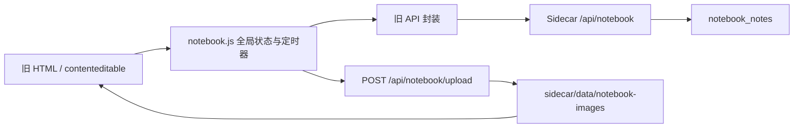

# 个人笔记页面 Vue 迁移评估

> 状态：PG0～PG5、清理后 Tauri 手动 E2E 与独立本地提交 `f940bd8` 均已完成
> 评估日期：2026-07-28
> 当前实现：`frontend/src/views/notebook/` + `frontend/src/services/modules/notebook-service.ts`
> 关联计划：[vue3_architecture_migration_execution_plan.md](../../../vue3_architecture_migration_execution_plan.md)

## 1. 评估范围与阶段边界

本次覆盖个人笔记页面的空列表、已有笔记、新建、编辑、自动保存、搜索、选择、置顶、排序、删除、标签、富文本、图片、Sidecar 断开、亮暗主题与窗口适配，并研究当前 HTML、JavaScript、CSS、Sidecar API 和 SQLite 数据结构。

研究文件包括：

- `frontend/index.html` 中 `#page-notebook` 的完整旧 DOM。
- `src/js/notebook.js` 的列表、编辑、自动保存、标签、图片粘贴和快捷键逻辑。
- `src/css/pages/notebook.css` 的页面布局、状态和主题覆盖。
- `src/js/app.js` 中页面激活与 `initNotebook()` 调用关系。
- `sidecar/routes/notebook.js` 的列表、详情、保存、排序、标签和图片接口。
- `sidecar/services/database.js` 中 `notebook_notes` 表结构和测试数据隔离。
- `frontend/src/` 已建立的公共页面头部、表单、按钮、反馈、主题 Token 与 Service 约束。

本阶段只进行研究、运行态取证和文档回写，不创建 `NotebookView.vue`，不改 Sidecar 接口，不删除旧页面。

## 2. PG0 运行态取证

### 2.1 测试环境

- 代码基线：`dc2ea33 refactor: 完成工时内容Vue迁移并整合Git活动`。
- 测试 Sidecar：`DEVTOOLS_TEST=1`，端口 `13900`，使用独立 `sidecar/data-test`。
- 浏览器入口：`http://127.0.0.1:1420/?apiPort=13900`。
- 正式端口 `13456` 和正式数据库均未访问。
- 临时截图只在内置浏览器中查看，没有写入仓库。
- 窗口验证：内置浏览器默认 1280 × 720；自动布局测量补充 1665 × 1184、1280 × 720、900 × 600。

### 2.2 当前功能状态

| 状态 | 结果 | 主要观察 |
| --- | --- | --- |
| 空列表 | 通过 | 左侧显示“暂无笔记”，右侧编辑器仍可见，但未明确表现为禁用状态 |
| 新建笔记 | 通过 | 创建“无标题”笔记并自动聚焦标题输入框 |
| 标题与正文编辑 | 通过 | 标题使用普通输入框，正文使用 `contenteditable` |
| 800ms 自动保存 | 通过 | 等待 800ms 后标题与 HTML 正文保存到测试数据库，页面显示“已保存” |
| 搜索 | 部分通过 | 标题和正文均可查询，但输入即请求，没有防抖、加载或空结果上下文 |
| 搜索前未保存草稿 | **不通过** | 编辑后在 800ms 内搜索会取消保存计时器；重新选择笔记后未保存内容被旧数据覆盖 |
| 笔记选择 | 部分通过 | 普通切换前会保存当前笔记；快速切换没有请求所有权，迟到详情响应存在覆盖新选择的风险 |
| 置顶 | 通过 | 状态能够保存并重新排序；搜索或标签过滤下的顺序语义没有明确说明 |
| 上下排序 | 通过 | 通过列表内悬浮按钮交换当前查询结果顺序并批量保存 `sortOrder` |
| 删除 | 通过 | 使用全局确认弹窗删除数据库记录；不会清理正文已引用的本地图片 |
| 标签 | **不通过** | 后端能提取标签，但页面没有标签列表 DOM；富文本 HTML 又会污染标签文本 |
| 富文本与快捷键 | 部分通过 | 支持 Tab 和 `Cmd/Ctrl + Shift + L`，但只有文本对齐能力，没有明确编辑格式模型 |
| 图片粘贴 | 部分通过 | 可上传并插入图片；上传接口缺少 MIME、大小、扩展名白名单和回收机制 |
| Sidecar 断开 | **不通过** | 左侧静默变为“暂无笔记”，右侧仍保留旧内容和操作按钮，只在控制台警告，用户无法判断是空数据还是服务断开 |
| 亮色/暗色 | 通过 | 两种主题均可读，但整体仍是旧页面的输入框、图标按钮和高特异性样式 |

### 2.3 已复现的数据丢失路径

1. 选择已有笔记。
2. 修改正文，页面进入“正在编辑”状态。
3. 在 800ms 自动保存触发前立即输入搜索条件。
4. `nbSearchNotes()` 直接 `clearTimeout(nbSaveTimer)`，但没有调用 `nbSaveCurrentNote()`。
5. 清空搜索并重新选择该笔记。
6. 详情 API 返回数据库旧正文并写入 `innerHTML`，未保存草稿被覆盖。

该问题已在隔离测试数据库中真实复现，不是静态代码推测。Vue 迁移时必须把“搜索、切换笔记、切换页面、窗口关闭”统一纳入草稿 flush/离开保护，不能只迁移当前 800ms 定时器。

### 2.4 三档窗口布局

| 窗口 | 运行态尺寸 | 结论 |
| --- | --- | --- |
| 1665 × 1184 | 页面 1469 × 1126；列表 280px；正文 1187px；无页面溢出 | 可用，正文最大 800px，宽屏留白较大但阅读行长受控 |
| 1280 × 720 | 页面 1084 × 662；列表 280px；正文 802px；无页面溢出 | 当前默认窗口可用 |
| 900 × 600 | 页面 724 × 546；列表仍为 280px；正文仅 442px；无页面溢出 | 没有横向溢出，但固定列表宽度明显挤压编辑区，应在迁移设计中考虑可折叠/可调宽或窄屏模式 |

### 2.5 当前页面体验判断

已有优点：

- 双栏“列表 + 编辑器”符合笔记工具的基本心智模型。
- 新建、搜索、置顶、排序、删除等核心操作已经形成完整闭环。
- 正文阅读宽度通过 `max-width: 800px` 控制，宽屏不会形成过长行。
- 本地 SQLite 和本地图片目录符合项目本地优先方向。

主要体验问题：

1. 顶部仍是旧的 Emoji 标题和描述，未使用正式 Vue 公共页面头部。
2. 空列表、未选择、加载失败和 Sidecar 断开共用近似空状态，错误语义不清。
3. 列表只显示标题、单行预览和创建日期，缺少更新状态、标签、图片等轻量识别信息。
4. 搜索输入即请求，列表会突然变化，但没有搜索中、结果数、清空或无结果恢复提示。
5. 排序按钮只在 hover 时出现，图标尺寸很小；触屏、键盘和低精度操作不友好。
6. 编辑器工具栏的“对齐、置顶、删除”视觉权重接近，危险操作与内容工具混在一起。
7. 保存状态是单一短文本，无法表达“待保存、保存中、失败、离线、重试”完整状态。
8. 固定 280px 列表在较窄窗口挤压正文；宽屏下编辑器两侧留白又缺少可调整策略。

### 2.6 可访问性风险

1. 页面标题为普通 `div`，不是页面级 `h1`。
2. 标题和搜索主要依赖 placeholder，没有持久可见 label。
3. 正文 `contenteditable` 没有可访问名称、编辑器语义或保存状态关联。
4. 图标按钮依赖 `title`，缺少稳定的可访问名称和焦点说明。
5. 排序按钮默认透明度为 0，键盘聚焦时没有与 hover 等价的显式展示规则。
6. 列表项使用带 `onclick` 的 `div`，不能自然获得键盘选择语义。
7. 保存、失败和删除确认依赖旧全局 DOM 反馈，尚未建立统一焦点恢复与屏幕阅读器播报。

## 3. PG1 功能、数据与代码结构

### 3.1 当前功能清单

1. 读取全部笔记，按置顶、`sortOrder`、创建时间排序。
2. 按标题或 HTML 正文模糊搜索。
3. 新建空白笔记并聚焦标题。
4. 读取单篇详情并把原始 HTML 写入正文编辑器。
5. 标题和正文输入后 800ms 自动保存。
6. 切换笔记前尝试保存当前笔记。
7. 置顶/取消置顶。
8. 当前查询结果中的上下排序。
9. 删除笔记。
10. 从正文提取 `#标签` 并提供标签统计/过滤 API。
11. 粘贴图片后上传到本地目录并插入正文。
12. 正文插入 Tab 字符。
13. `Cmd/Ctrl + Shift + L` 对选中文本进行 Tab 对齐。

### 3.2 当前数据链路

### 3.3 `notebook_notes` 数据模型

| 字段 | 当前用途 | 迁移关注点 |
| --- | --- | --- |
| `id` | `note-` 前缀的时间随机 ID | 保持兼容，不重建用户数据 |
| `title` | 笔记标题 | 允许空字符串，UI 显示“无标题” |
| `content` | 原始 HTML 正文 | 必须定义清洗、可信来源和编辑器格式边界 |
| `pinned` | 0/1 置顶 | Vue service 归一化为 boolean |
| `tags` | JSON 字符串数组 | 当前从含 HTML 的正文直接提取，存在污染 |
| `sortOrder` | 手动排序序号 | 过滤/搜索/置顶后的重排语义需冻结 |
| `createdAt` | 创建时间 | 列表当前只显示该字段 |
| `updatedAt` | 更新时间 | 应用于保存冲突、列表排序或状态展示 |

迁移必须复用现有表和数据，不允许为实现 Vue 页面清空或替换用户数据库。

### 3.4 API 现状

| 方法与路径 | 作用 | 已发现问题 |
| --- | --- | --- |
| `GET /api/notebook` | 列表、搜索、标签过滤 | 注释称不返回正文，实际返回完整 `content`，数据量会随笔记增长 |
| `GET /api/notebook/:id` | 单篇详情 | 原始 HTML 直接返回 |
| `POST /api/notebook` | 新建 | 创建后由前端再请求完整列表 |
| `PUT /api/notebook/:id` | 标题、正文、置顶 | 没有版本号、更新时间条件或冲突检测 |
| `PUT /api/notebook/reorder` | 批量排序 | 接受任意 ID 数组，未校验完整性与重复项 |
| `DELETE /api/notebook/:id` | 删除 | 不清理孤立图片 |
| `GET /api/notebook/tags/list` | 标签统计 | 当前页面没有对应 DOM，属于不可达功能 |
| `POST /api/notebook/upload` | Base64 图片上传 | 无大小、MIME、扩展名白名单；同步写文件 |
| `GET /api/notebook/images/:filename` | 读取本地图片 | 未建立笔记与图片的引用关系 |

### 3.5 已确认的实现风险

#### P0：数据与安全

1. 搜索会取消未保存草稿，已真实复现数据丢失。
2. 切换页面、页面卸载和关闭窗口没有明确 flush 或离开保护。
3. 详情请求没有请求 ID/AbortController；快速切换时迟到响应可能覆盖当前笔记。
4. 正文以原始 HTML 存储，加载时直接赋给 `innerHTML`，没有内容清洗边界。
5. 图片上传缺少类型、大小、扩展名白名单和异常文件清理。

#### P1：数据模型与功能一致性

1. 标签功能的 JS 和 API 存在，但 HTML 缺少 `nbTagsList`、`nbAllCount`、`.nb-tag-all`，用户无法使用。
2. `extractTags()` 直接处理 HTML；测试正文 `#迁移
第二段内容
` 被错误提取为完整标签 `迁移
第二段内容
`。
3. 删除笔记不会删除其正文引用图片，长期使用会产生孤立文件。
4. 列表接口实际传输完整正文，与详情接口职责重复。
5. 全局保存状态没有绑定笔记 ID；并发保存、切换和失败状态可能串到另一篇笔记。
6. 搜索、标签、置顶和手动排序共同作用时，没有清晰、可预测的顺序规则。

#### P2：架构与维护

1. `notebook.js` 共 361 行，包含 23 次 `getElementById()`、12 次 `innerHTML` 和 3 个全局 `document` 事件监听。
2. `paste` 与两个 `keydown` 监听在应用生命周期内常驻；Vue 迁移必须在组件挂载/卸载时注册和清理。
3. `nbNotes`、`nbCurrentId`、`nbCurrentTag`、`nbSaveTimer`、`nbInitialized` 全部为跨页面全局状态。
4. 页面依赖内联 `onclick`、`oninput` 和旧 `API`、`showToast`、`showConfirm`。
5. 当前没有个人笔记专项自动测试。

### 3.6 CSS 污染与迁移边界

| 指标 | 数量 | 结论 |
| --- | ---: | --- |
| `notebook.css` 行数 | 389 | 不应整文件复制到 SFC |
| `!important` | 15 | 主要用于压制旧页面布局和输入样式 |
| `#page-notebook` | 3 | 页面根高特异性依赖 |
| `body[data-theme]` | 3 | 页面直接读取全局主题 DOM |
| 固定列表宽度 | 280px | 900px 窗口下正文只剩 442px |

Vue 实现应：

- 使用正式 `PageHeader`、项目二次封装按钮/输入/确认/反馈组件。
- 以语义 Token 和局部类重写布局，不复制旧 `!important`。
- 把编辑、列表、保存状态、图片上传拆成有明确职责的 composable/service/component。
- 所有全局事件监听必须跟随组件生命周期清理。
- 保持现有 SQLite 数据兼容，不通过架构迁移改变用户数据格式。

## 4. PG0～PG1 结论

Phase 5-1 可以继续，但不能直接进入 Vue 实现。必须先冻结正文编辑器、标签、图片安全、草稿保护和页面布局范围。

本轮手动 E2E：**不需要**。本轮只修改评估和执行状态文档，没有运行时代码变更；真实功能与体验的手动 E2E 应在 PG4 实现和 PG5 清理阶段执行。

## 5. PG2 保留、优化、删除与新增清单

### 5.1 保留

| 项目 | 保留方式 | 原因 | 优先级 |
| --- | --- | --- | --- |
| 本地 SQLite 持久化 | 保持现有 `notebook_notes` 表和历史数据兼容 | 符合本地优先方向，避免迁移损坏用户数据 | P0 |
| 列表 + 编辑器双栏结构 | 保留核心心智模型，重新设计尺寸和窄窗行为 | 笔记查找与编辑可以并行完成 | P0 |
| 新建、选择、删除 | 迁移为 Vue 事件与公共确认组件 | 核心闭环 | P0 |
| 标题和正文 | 保持标题 + 自由正文，不强制用户学习新格式 | 核心内容模型 | P0 |
| 800ms 自动保存 | 保留防抖体验，重写为可 flush、可串行、可重试的保存队列 | 输入体验轻量，但当前可靠性不足 | P0 |
| 搜索 | 保留标题与正文搜索，增加防抖、结果数和清空 | 笔记增长后的核心入口 | P0 |
| 置顶 | 保留，并在列表中提供稳定可见的置顶状态 | 常用笔记快速访问 | P1 |
| 手动排序 | 保留能力，但只在“手动排序”模式中出现 | 当前用户数据已有 `sortOrder` | P1 |
| 图片粘贴 | 保留本地图片能力，补齐上传安全和失败反馈 | 是个人知识库的重要输入方式 | P0 |
| Tab 与文本对齐 | 暂时保留快捷键兼容，降级到更多菜单/快捷键说明 | 防止直接删除潜在用户习惯 | P2 |
| 亮色、暗色、跟随系统 | 全部使用公共主题 Token | 项目统一主题契约 | P0 |

### 5.2 优化

| 项目 | 建议 | 收益 | 成本/风险 | 优先级 |
| --- | --- | --- | --- | --- |
| 页面头部 | 使用公共 `PageTop`；只保留标题、笔记数量、搜索和主“新建”按钮 | 删除 Emoji 和冗余描述，统一全软件风格 | 低 | P0 |
| 列表信息 | 展示标题、两行预览、更新时间、置顶与图片轻量标识 | 比单行预览和创建日期更利于识别 | 低 | P1 |
| 搜索交互 | 250～300ms 防抖；显示搜索中、结果数、无结果和一键清空 | 避免每次击键刷新列表且错误语义更明确 | 低 | P0 |
| 列表排序 | 提供“最近更新 / 创建时间 / 手动排序”；仅手动模式显示拖拽或排序入口 | 解决置顶、搜索和排序语义混乱 | 中，需要冻结排序规则 | P1 |
| 编辑器头部 | 标题、保存状态、置顶和更多菜单分层；删除移入更多菜单 | 降低危险操作视觉权重 | 低 | P0 |
| 保存状态 | 建立 `idle / dirty / saving / saved / failed / offline` 六态；状态绑定笔记 ID | 避免状态串线并提供明确恢复动作 | 中 | P0 |
| 切换保护 | 搜索、切笔记、切页面和关闭窗口前统一 flush；失败时阻止覆盖并提示 | 消除已复现草稿丢失 | 中 | P0 |
| 请求所有权 | 详情和搜索使用 AbortController/请求版本，只接受最后一次有效响应 | 避免快速切换时旧响应覆盖新笔记 | 低～中 | P0 |
| 空与错误状态 | 区分“没有笔记、没有搜索结果、未选择、加载失败、服务断开” | 用户能判断当前真实状态 | 低 | P0 |
| 正文布局 | 默认保持舒适阅读宽度；宽屏居中，窄屏允许收起列表或切为列表/编辑模式 | 兼顾默认窗口和 900 × 600 | 中 | P0 |
| 粘贴样式 | 默认保留语义结构并清除来源网页的视觉样式；提供主动“统一整篇格式” | 避免同一笔记出现多套字体、颜色和间距 | 中，需要与 HTML 清洗共用规则 | P0 |
| 自定义凭据信息表 | 通过“更多”显式插入凭据信息表；项目名称、字段名、字段列和记录行均可编辑或增删，完成后任意值单元格可整格点击复制 | 同时覆盖多账号、账号/密码/TOTP 密钥、OSS AccessKey 等结构，不再被固定双列模型限制 | 中，需要受控 HTML 标记、动态行列维护、选区语义，并以“编辑 / 完成”状态隔离编辑光标与复制动作 | P1 |
| 网页链接 | 选中文字后通过“更多”显式设置链接；完整网址可直接使用，普通文字通过公共弹窗填写跳转地址；普通点击保持编辑，`Command + 单击`通过系统浏览器打开 | 不自动识别正文内容，避免误转换普通文字、账号和令牌 | 低～中，需要协议校验、选区保存和 Tauri opener 适配 | P1 |
| 键盘与焦点 | 列表项改为可聚焦控件；新建聚焦标题；删除后焦点回到合理位置 | 提升效率与可访问性 | 低 | P1 |
| 组件复用 | 页面头部、按钮、输入、下拉、状态、确认、空状态均复用项目封装组件 | 避免产生新一轮页面私有控件 | 低 | P0 |

### 5.3 删除或降级

| 项目 | 处理 | 原因 | 优先级 |
| --- | --- | --- | --- |
| 旧页面完整 DOM、内联事件 | PG5 删除，只保留 Vue 根 | 避免两套实现 | P0 |
| `notebook.js` 全局函数和全局状态 | PG5 删除 | 当前竞态和生命周期问题的主要来源 | P0 |
| `notebook.css` 和 `!important` 覆盖 | PG5 删除，使用新页面局部样式和 Token | 避免旧 CSS 污染 | P0 |
| 输入框内 Emoji/旧图标语言 | 使用项目统一图标 | 统一视觉体系 | P1 |
| hover 才出现的上下箭头 | 用明确排序模式与拖拽/菜单替代 | 键盘和低精度操作不可用 | P1 |
| 主工具栏中的删除按钮 | 移入更多菜单并保持二次确认 | 降低误触和视觉噪声 | P1 |
| 直接处理 HTML 的标签提取 | 删除当前实现 | 已确认会把 `
` 等标签写进标签名 | P0 |
| 不可达标签 DOM 查询 | 删除旧 `nbTagsList`、`nbAllCount`、`.nb-tag-all` 逻辑 | 当前 HTML 根本没有对应节点 | P0 |
| 列表 API 返回完整正文 | 改为只返回摘要字段 | 避免笔记增长后重复传输全部 HTML | P1，需要 Sidecar 小改 |

### 5.4 新增

| 项目 | 建议 | 价值 | 等级 |
| --- | --- | --- | --- |
| 会话草稿保护 | 当前进程内按笔记保存未落库草稿，失败后可重试，不被搜索/切换覆盖 | 解决核心数据安全问题 | 所有等级必做 |
| 页面内错误与重试 | 加载、保存、上传失败均有就地反馈和重试 | 替代控制台警告与静默空状态 | 所有等级必做 |
| 离线/Sidecar 状态 | 明确显示断连，禁止把断连渲染为“暂无笔记” | 防止误判为空数据 | 所有等级必做 |
| 图片上传约束 | MIME/文件头、扩展名、大小白名单；上传失败不写入正文 | 防止异常文件和超大 Base64 请求 | 所有等级必做 |
| HTML 安全边界 | 渲染时基于允许列表清洗；不直接改写历史原始数据；新保存内容只保留允许结构 | 降低 XSS 风险且保护历史数据 | 所有等级必做 |
| 列表统计 | 显示总笔记数、当前搜索结果数 | 提供轻量上下文 | L1+ |
| 可折叠列表 | 默认窗口保持双栏，窄窗口可收起列表 | 提升编辑空间 | L1+ |
| 最近更新/手动排序切换 | 冻结可预测排序策略 | 让列表顺序符合不同使用场景 | L2 |
| 回收站 | 删除后先软删除，可恢复 | 防止误删 | L3 |
| 版本历史 | 保存有限版本快照，可查看和恢复 | 防止内容覆盖 | L3 |
| 持久草稿恢复 | 应用异常退出后恢复未落库内容 | 提升极端情况下的数据可靠性 | L3 |
| 图片引用回收 | 建立引用扫描或延迟清理孤立图片 | 控制本地垃圾文件 | L3 |

## 6. 所有等级都必须完成的可靠性与安全基线

以下内容不属于“页面美化”，无论选择 L0、L1、L2 还是 L3 都必须完成：

1. 修复搜索取消保存导致的草稿丢失。
2. 切笔记、切页面和关闭窗口前 flush 当前草稿。
3. 保存串行化，保存状态绑定笔记 ID。
4. 详情与搜索请求以最后一次有效请求为准。
5. Sidecar 断开不能显示成“暂无笔记”。
6. 原始 HTML 采用允许列表清洗后再渲染，不批量覆盖历史原文。
7. 图片上传校验类型、文件头、大小和扩展名。
8. Vue 组件卸载时清理定时器、AbortController 和键盘/粘贴监听。
9. 保持现有 SQLite 表和历史笔记可读，不清空、不静默迁移用户数据。
10. 增加 composable、service 和页面 E2E，覆盖草稿、竞态、断连、图片、主题和窗口尺寸。

## 7. L0～L3 优化等级方案

### L0：可靠迁移

范围：

- 保持现有双栏布局和主要视觉结构。
- 把旧 DOM/JS/CSS 迁移为 Vue SFC、service 和 composable。
- 使用公共页面头部、按钮、输入、确认和反馈组件。
- 完成第 6 节全部可靠性与安全基线。
- 删除不可达标签逻辑，不在本等级恢复标签 UI。

优点：范围最小、迁移速度最快。
不足：页面仍接近当前旧设计，列表和编辑体验提升有限。

### L1：轻量体验优化

包含 L0，并增加：

- 列表显示更新时间、两行预览和稳定置顶状态。
- 搜索防抖、结果数、清空与无结果状态。
- 保存六态和就地重试。
- 删除移入更多菜单。
- 900 × 600 支持收起列表或列表/编辑切换。
- 轻量调整留白、字号、边框和主题效果。

优点：不大改信息结构，已经能明显降低旧页面感。
不足：仍是传统简单笔记页，排序体系没有真正整理。

### L2：专业个人知识工作区

包含 L1，并重新设计页面：

- 公共 `PageTop` 集成笔记数量、全局搜索、筛选与新建。
- 左侧为可调/可折叠笔记导航，支持置顶、最近更新和手动排序模式。
- 右侧为专注编辑区，标题、保存状态、置顶和更多菜单分层。
- 默认窗口双栏铺满；窄窗口切为列表/编辑模式；宽屏保持舒适阅读宽度。
- 不恢复标签展示、提取和过滤，保持个人笔记的直接性。
- 图片和快捷键只作为轻量辅助，不把页面变成复杂富文本软件。
- 文本/HTML 粘贴默认匹配当前样式，并提供历史内容主动格式统一。
- 显式凭据信息表可在同一表格中自由维护字段列与记录行，任意值单元格支持不干扰编辑光标的精确复制，普通正文保持纯编辑状态。
- 用户所称“Google 身份验证码”实际指用于生成 TOTP 的长期 Seed/Secret，而非每 30 秒变化的六位码。它可作为自定义字段值保存和复制，但会沿用笔记正文的本地 SQLite 存储，不因此获得 Keychain 或密码管理器级加密。
- 制作亮色、暗色 HTML 原型并在 PG3 后先完成视觉验收。

优点：在本次 Vue 迁移中同步解决布局、信息层级、可靠性和视觉统一，后续无需再做一轮页面重构。
成本：中等，需要先确认原型。

### L3：数据与编辑体系增强

在 L2 上按独立子项选择：

- L3-A：应用异常退出后的持久草稿恢复。
- L3-B：软删除回收站。
- L3-C：有限版本历史与恢复。
- L3-D：图片引用追踪与孤立文件回收。
- L3-E：引入成熟富文本编辑器、格式工具栏、粘贴清洗和结构化内容。

L3 涉及数据库、Sidecar、存储格式或新依赖，必须拆分评审和提交，不能默认随页面迁移一并加入。

## 8. 推荐方案与 PG3 待确认项

推荐选择：**L2 + 第 6 节全部可靠性与安全基线，暂不加入 L3**。

原因：

- 当前页面功能已经足够形成个人笔记闭环，主要问题是旧架构、数据可靠性和页面层级。
- 只做 L0/L1 会留下明显的旧页面结构，后续很可能再进行一次视觉和交互重构。
- L2 能复用已经建立的公共组件和主题体系，同时保持双栏笔记工具的熟悉操作。
- 回收站、版本历史、持久草稿和完整富文本编辑器会显著扩大数据库与依赖范围，适合后续独立评估。

PG3 用户确认结果：

1. 选择推荐的 **L2**。
2. 制作支持亮色、暗色和窄窗口的 HTML 原型。
3. 不保留标签功能，不展示、不提取、不参与搜索或筛选。
4. 保留 `Cmd/Ctrl + Shift + L` 文本对齐快捷键，但移入更多菜单。
5. 暂不加入 L3-A～L3-E。

PG3 已由用户确认通过，正式实现范围冻结为 L2，不加入 L3-A～L3-E。

## 9. PG4 正式实现与自动验收记录

2026-07-28 已完成：

- 新增 `NotebookView.vue`、`NotebookSidebar.vue`、`NotebookEditor.vue`、`NotebookRichEditor.vue` 与 `notebook.css`。
- 页面通过 `MigrationHost` 的 Teleport + KeepAlive 接入 `#vue-notebook-host`；旧业务 DOM 已替换为 Vue 根。
- 页面头部、按钮、输入、下拉、卡片、状态、确认、空状态和错误状态均复用项目公共组件。
- 新增类型化 `notebook-service.ts` 与 `useNotebook.ts`，实现 800ms 自动保存、按笔记串行保存、搜索/切换前 flush、请求版本与 AbortController、失败草稿保护。
- Sidecar 列表不再向前端下发全文；新建与更新不再生成标签；保留历史 `tags` 字段但不改写历史值。
- 图片上传限制为 PNG/JPEG/WebP/GIF、最大 8MB，并同时校验声明 MIME、Base64 解码后大小、文件头和严格随机文件名。
- HTML 展示和保存均经过允许列表清洗；历史内容只在展示层清洗，不执行数据库批量覆盖。
- 凭据信息表支持项目名称、字段列和记录行的动态编辑与增删，完成后值单元格整格复制；复制提示不回显原文。
- 独立 `http/https` 地址支持粘贴和回车识别；正式 Tauri 通过受限 `open_external_url` command 调用系统浏览器。
- 全局 Toast 改为 Teleport 到 `body`，修复迁移页面离开首页容器后通知被隐藏的问题。
- 内置浏览器真实复核发现并修正编辑器 Grid 行归属，正文区现已铺满标题与底部状态栏之间的全部剩余高度。

自动验证：

- `vue-tsc --noEmit` 通过。
- Notebook service、HTML 清洗和 composable 共 12 项单元测试通过。
- Notebook Playwright 专项 4 项通过：亮暗主题、900 × 600、自动保存与离开 flush、粘贴清洗、凭据表增删和复制反馈。
- `node --check sidecar/routes/notebook.js` 与 `cargo check` 通过。
- 内置浏览器在隔离 `DEVTOOLS_TEST=1` / 13900 / `data-test` 环境完成亮暗主题、新建、编辑、自动保存和铺满布局复核；未访问正式端口或正式数据库。

PG4 手动 E2E：**必须，已由用户在真实 Tauri 软件确认通过**。

## 10. PG5 清理与回归记录

2026-07-28 已完成：

- 删除旧 `src/js/notebook.js`、`src/css/pages/notebook.css`、加载引用和 `initNotebook()` 激活调用。
- 删除共享旧 CSS 中无消费者的 `.nb-*`、旧 Notebook 标题和旧页面头部选择器。
- 将文件编辑器曾从 `notebook.js` 借用的 HTML 转义函数收回 `editor.js`，消除跨页面隐式依赖。
- 新增旧 DOM、旧脚本、旧样式和旧全局函数不存在的 E2E 断言。
- 正式交互按后续用户确认收敛：网页链接只由用户选中文字后显式设置，不自动识别；凭据表点击空白不自动完成，使用“完成”或 `Command/Ctrl + S` 保存并结束编辑；空白字段使用占位提示而非真实正文。
- 前端构建、全量 Lint、63 项单元测试、Rust/Sidecar/旧脚本检查和 16 项全量 Playwright 均通过。
- 内置浏览器确认 Notebook 只有一个 Vue View 和一个活动页，旧 DOM、旧资源与旧全局函数均不存在；文件编辑页面未出现清理引入的新错误。

PG5 清理后手动 E2E：**必须，已通过**。用户已于 2026-07-28 确认个人笔记页面和文件编辑页面没有问题；Phase 5-1 已通过本地提交 `f940bd8` 归档。

## 11. 凭据表交互跟进修复

2026-07-28 用户在真实历史笔记中继续发现：

1. 凭据值单元格可能残留无法删除的尾部空行。
2. 新增字段将“字段 N”写成真实正文，且中文输入法组合输入不稳定。
3. 依赖鼠标悬浮的单一工具条会在滚动或内容高度变化后错位，也不便于发现。

本轮已完成：

- 空单元格和删除操作会清理浏览器生成的空 `div`、`p`、`br`；结束编辑或失焦时再次清理尾部空节点，内部有效换行继续保留。
- 新增字段的实际文本为空，“字段 N”只通过临时占位属性显示；序列化时不把占位属性写入笔记正文。
- 增加输入法组合事件边界，组合输入期间不触发模型回写，组合结束后统一保存，支持中文字段名。
- 每张凭据卡的标题单元格内部固定保留独立编辑区；进入编辑后，增删记录、增删字段和完成操作直接在同一标题区域展开，不再使用编辑器外部浮层、滚动坐标换算或 hover 定位。
- 自动验收覆盖中文字段、纯占位字段、删除残留空行、固定操作区、`Command + S` 完成、亮暗主题和窄窗口。

自动验证：

- TypeScript、ESLint、迁移 CSS Stylelint 与 63 项单元测试通过。
- Notebook Playwright 7/7、全量 Playwright 16/16 通过。
- 前端生产构建通过。
- 内置浏览器使用 `13900` / `data-test` 确认操作区是对应卡片标题单元格的直接子节点；滚动前后保持 8px 右侧间距且展开工具条完整位于标题内部，新增字段实际文本为空且中文输入、`Command + S` 正常。

本轮修改了正式 Notebook 运行时代码，手动 E2E：**必须，已通过**。用户已于 2026-07-28 确认凭据表空行、中文字段和卡片标题内操作区没有问题；下一步建立独立修复提交，再恢复 Phase 5-2 系统设置 PG1。
