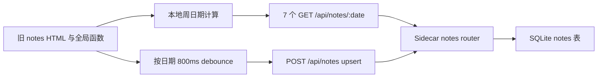
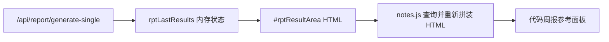

# 工时内容页面 Vue 迁移评估

> 状态：PG0～PG5 与编辑区铺满修复均已通过自动和 Tauri 手动验收，等待本地提交
> 评估日期：2026-07-27
> 迁移前实现：`frontend/index.html` + `src/js/notes.js` + `src/css/pages/notes.css`
> PG4 实现：`frontend/src/views/notes/` + `frontend/src/services/modules/notes-service.ts`
> 关联计划：[vue3_architecture_migration_execution_plan.md](../../../vue3_architecture_migration_execution_plan.md)

## 1. 评估范围

本次覆盖工时内容页面的本周、上周、下周切换，工作日和周末显示，标题与正文编辑，800ms 自动保存，快速切周，Sidecar 断开，参考周报空状态，亮色、暗色以及 1665 × 1184、900 × 600 两档窗口。

代码研究覆盖：

- `frontend/index.html` 中 `#page-notes` 的完整旧 DOM。
- `src/js/notes.js` 的日期计算、加载、渲染、自动保存和周报引用逻辑。
- `src/css/pages/notes.css` 及 `components.css`、`overrides.css` 中的跨页覆盖。
- `src/js/api.js` 的 15 秒请求超时和错误归一化。
- `sidecar/routes/notes.js` 与 SQLite `notes` 表。
- `src/js/report.js`、`sidecar/routes/report.js` 和 `#rptResultArea` 的周报依赖。
- 已完成的公共 Page、表单、按钮、反馈、Token、主题和 service 规范。

第 2～5 节保留迁移前取证与决策依据；当前已经完成 PG4 Vue 实现和 PG5 清理。Sidecar 与数据库契约未修改。

## 2. PG0 运行态取证

### 2.1 测试环境

- 当前基线：`2ecbd98 refactor: 完成纯净检测页面Vue迁移`。
- 测试 Sidecar：`DEVTOOLS_TEST=1`，端口 `13900`，使用独立 `sidecar/data-test`。
- 浏览器入口：`http://127.0.0.1:1420/?apiPort=13900`。
- 测试写入只发生在隔离数据库，验证完成后已删除测试记录。
- 截图保存在仓库外的临时目录，没有加入 Git。

### 2.2 状态验证结果

| 状态 | 结果 | 主要观察 |
| --- | --- | --- |
| 本周加载 | 通过 | 周一到周五并行读取，当前日高亮，默认隐藏周末 |
| 上一周/下一周 | 通过 | 周标签和日期能正确切换，当前页面允许无限向前或向后 |
| 显示周末 | 功能通过、布局较差 | 7 张卡片全部出现，但卡片被压成很薄的输入条，页面下半部分大面积留白 |
| 正常自动保存 | 通过 | 停止输入约 800ms 后 POST 成功并显示“已保存” |
| 快速输入后切周 | 失败 | 800ms 内切换周次后，计时器无法找到旧日期 DOM，最后一次输入静默丢失 |
| Sidecar 断开后切周 | 失败 | 7 个读取错误全部被当作“当天没有记录”，页面显示空白且仍保留旧“已保存”状态 |
| 参考周报空状态 | 部分通过 | 能打开说明面板，但只能提示先去代码周报生成，没有直接跳转或重试动作 |
| 页面重载 | 通过 | 周末显示偏好保存在 `localStorage`；当前周偏移只保存在内存 |
| 亮色/暗色 | 基本通过 | 表面和边框能跟随主题；暗色占位文字和次级文字对比较低 |

### 2.3 视觉与响应式观察

#### 默认窗口 1665 × 1184

- 周一到周五平均分配剩余高度，页面能铺满。
- 每张卡片由固定 80px 日期列、很薄的标题输入和大面积正文组成，内容层级单一。
- 空数据时五块超大输入区域同时出现，视觉重量偏重，用户需要扫描整个页面才能定位今天。
- 标题和正文都只依赖 placeholder，实际输入后字段含义会消失。

#### 显示周末

- `.show-weekend` 从“平分高度”切为“自然高度”，但每张卡片没有合理的弹性高度策略。
- 7 张卡片集中在页面上半部分，正文编辑区明显变薄，下半部分出现大面积空白。
- 周末卡片通过 `opacity: 0.6` 整体降级，输入文字也会一起降低对比度。

#### 900 × 600

- 不打开参考面板时没有横向溢出，5 张工作日卡片仍可显示。
- 页面控件、日期和输入区均缩得较小，标题输入接近一条分隔线，点击和阅读压力较大。
- 打开参考面板后，参考面板固定 380px，周编辑区只剩约 330px；虽然没有横向滚动，但主任务被明显挤压。
- 当前 CSS 没有 `@media` 规则，最小窗口只是依赖 Flex 压缩，并非经过设计的响应式重排。

### 2.4 当前体验的优点

1. “一周一屏”的心智模型直接，日期、标题和正文位置固定。
2. 当前日使用边框、侧边指示条和“今天”标签三重提示，定位明确。
3. 自动保存减少显式提交操作，正常等待时接口写入可靠。
4. 周末开关能记住用户偏好。
5. 卡片 `focus-within` 有可见反馈，亮暗主题基本可用。

### 2.5 UX 风险

| 优先级 | 问题 | 影响 |
| --- | --- | --- |
| P0 | 快速切周会丢失 800ms 内尚未保存的输入 | 用户可能永久丢失刚记录的工作内容 |
| P0 | 加载失败与 404 空记录被统一吞掉 | Sidecar 中断时页面伪装成“本周没有内容” |
| P0 | 接口断开后仍显示旧“已保存” | 明确产生错误信任 |
| P1 | 保存状态是整页唯一文本，不属于具体日期 | 多日并行保存时成功/失败会互相覆盖 |
| P1 | 参考周报依赖另一个页面当前 DOM | 重载后失效，无法建立稳定数据契约 |
| P1 | 参考周报不校验当前周次与报告日期范围 | 浏览上周时仍可能引用其他日期报告 |
| P1 | 周报结果分组选择器已与当前结果 DOM 漂移 | `.rpt-group-header` 不是当前结果分组标题，分组信息可能丢失 |
| P1 | 7 日模式高度策略失衡 | 编辑区过薄且页面下半部分空白 |
| P1 | 最小窗口参考面板固定 380px | 次级任务挤压主编辑区 |
| P2 | 每次切周并行发送 7 个 GET | 请求量和错误状态处理复杂，缺少整体 loading |
| P2 | 清空内容仍会保留空记录 | SQLite 可能长期积累无意义空行 |

### 2.6 可访问性风险

1. 页面标题是普通 `div`，没有页面级 `h1`。
2. 标题和正文没有持久可见的 `label`，只使用 placeholder。
3. 输入框没有与“周一、07-27”建立程序化关联，屏幕阅读器难以确定正在编辑哪一天。
4. 保存状态没有 `aria-live`，成功和失败不一定被辅助技术感知。
5. 加载错误没有页面内状态、重试按钮或焦点提示。
6. 周末开关原生方框只有 14 × 14px，虽然 label 可点击，但可见目标偏小。
7. 周末卡片整体降低透明度，可能使正文和 placeholder 对比不足。
8. 暗色主题的 placeholder、日期和说明文字对比较低。
9. 卡片 hover 横移和 focus 横移没有在页面 CSS 中处理 `prefers-reduced-motion`。

截图只能支持视觉层级、可见交互和布局判断，不能证明完整 WCAG 合规。键盘顺序、屏幕阅读器朗读、缩放 200% 和对比度数值仍需在 PG4/PG5 验证。

## 3. PG1 当前功能与数据流

### 3.1 当前功能清单

1. 以本地时区计算当前周周一到周日。
2. 默认显示周一至周五，可切换显示周末。
3. 上一周、下一周切换，周偏移保存在全局变量。
4. 每天包含项目/标题输入和工作内容 textarea。
5. 输入后按日期建立 800ms 防抖计时器。
6. 使用 POST upsert 保存标题和正文。
7. 页面顶部显示全局“已保存/保存失败”文字。
8. 从代码周报页面当前 `#rptResultArea` DOM 提取仓库和提交内容。
9. 在没有周报结果时显示说明性空状态。

### 3.2 Notes 数据链路

### 3.3 参考周报链路

该链路没有共享 service、store 或稳定 DTO。工时内容页依赖代码周报页是否在本次应用会话中生成过 DOM，无法在重载后恢复，也不能可靠判断报告日期范围是否与当前周一致。

### 3.4 `/api/notes` 契约

| 方法 | 路径 | 请求/响应 | 当前用途 |
| --- | --- | --- | --- |
| GET | `/api/notes` | 日期、标题、60 字预览、更新时间列表 | 当前工时页未使用 |
| GET | `/api/notes/:date` | 完整单日记录；不存在返回 404 | 每周并行读取 7 次 |
| POST | `/api/notes` | `{ date, title, content }`，按日期 upsert | 自动保存 |
| DELETE | `/api/notes/:date` | 删除单日记录 | 当前工时页未提供入口 |

SQLite `notes` 表以 `date TEXT` 为主键，另含 `title`、`content`、`createdAt` 和 `updatedAt`。路由只检查日期是否为空，没有验证 `YYYY-MM-DD` 格式或日期合法性。

### 3.5 已确认的实现问题

#### P0：防抖保存与切周冲突

`onWeekNoteInput()` 只记录日期并延迟调用 `saveWeekNote(date)`。切周会立即重新渲染整个周网格；计时器触发后使用 `querySelector()` 查找旧日期输入框，找不到就直接 `return`。当前没有 flush、草稿快照或离开保护。

#### P0：读取错误被当作空记录

`loadWeekNotes()` 对每个日期使用同一个空 `catch`：

- 404 不存在；
- Sidecar 断开；
- 请求超时；
- 500；
- 数据解析错误；

以上全部写成空标题和空内容。用户无法区分“没有记录”和“记录加载失败”。

#### P1：全局保存状态存在竞态

多天输入会启动多个计时器，但所有请求共用 `#notesSaveStatus`。较早请求失败、较晚请求成功或顺序相反时，最后显示的文本不一定代表用户正在看的那一天。

#### P1：切周加载没有请求所有权

快速连续切周没有 AbortController、请求序号或“最后一次请求生效”规则。多个 `Promise.all()` 会同时写入全局 `notesWeekData` 和 `notesWeekTitles`。

#### P1：参考周报依赖展示 DOM

工时页没有复用 `rptLastResults` 的类型化数据，也没有调用报告 API，而是读取另一个页面的表格 HTML，再拼装新的 `innerHTML`。报告切换为时间线视图、分组结构变化或页面重载都会改变结果。

#### P2：日期与空记录契约不完整

- API 未校验日期格式。
- 当前周偏移只保存在内存，应用重载后回到本周。
- 清空标题和正文仍会 upsert 空记录，而不是删除。
- GET 列表只返回 preview，无法直接作为一次性周批量接口。

### 3.6 旧代码与 CSS 污染统计

| 指标 | 数量 | 判断 |
| --- | ---: | --- |
| `src/js/notes.js` | 211 行 | 15 个全局函数，状态和 DOM 操作耦合 |
| `src/css/pages/notes.css` | 355 行 | 不应整文件复制到 SFC |
| `!important` | 11 | 主要用于页面布局和旧壳覆盖 |
| `#page-notes` 相关选择器 | 至少 9 处 | 页面 CSS 与全局 components/overrides 共同控制 |
| `innerHTML` | 8 次 | 周卡片和周报引用均使用字符串渲染 |
| `getElementById()` | 9 次 | 强依赖旧 DOM ID |
| `querySelector/All()` | 9 次 | 保存和跨页 DOM 抓取耦合 |
| notes 专属内联事件 | 7 处 | 旧 DOM 5 处，动态周卡片 2 处 |
| `@media` | 0 | 没有页面自己的响应式重排策略 |

旧 CSS 同时受 `components.css` 和 `overrides.css` 的标题、工具栏、圆角、输入框与页面头部规则影响。Vue 迁移必须使用公共组件和 scoped 页面样式重新建立权重，不保留这套覆盖链。

## 4. 保留兼容项

1. SQLite `notes` 表与已有日期主键数据。
2. `{ date, title, content }` 的业务字段。
3. 本地时区下周一到周日的日期口径。
4. `devtools-notes-show-weekend` localStorage key。
5. 800ms 自动保存体验，但必须增加可靠 flush、状态归属和错误恢复。
6. 上一周、下一周和本周日期范围表达。
7. 代码周报作为可选参考来源，但需要改成共享数据模型或 service。

## 5. PG0～PG2 结论

- PG0：**已通过**。关键页面状态、亮暗主题、默认和最小窗口已经取证。
- PG1：**已通过**。DOM、JS、CSS、API、数据库、日期计算、自动保存和周报引用链路已经梳理。
- PG2：**已通过**。“保留 / 优化 / 删除 / 新增”清单、公共组件边界、L0～L3 和推荐方案已写入 [decision.md](./decision.md)。
- 本节结论记录 PG0～PG2 时点；PG3 后续已确认 L2 与最终原型，暂不加入 L3-A。

## 6. PG4 实现回写

PG4 已按冻结范围完成：

1. `notes-service.ts` 保持既有 Sidecar 和 SQLite 契约，只把 404 作为空记录，其他错误继续向页面暴露。
2. `useWeeklyNotes.ts` 为每个日期维护独立 load/save 状态、revision、800ms 计时器和串行保存队列。
3. 切日期、切周、切页面和组件停用前会启动 flush；快速切周使用 AbortController 与请求版本，旧请求不能覆盖新周。
4. 会话草稿不会被迟到的加载结果覆盖；本轮没有写入 localStorage 草稿，符合“不加入 L3-A”边界。
5. 正式页面采用“周列表 + 单日专注编辑”，900 × 600 使用横向周概览；用户追加确认后，Git 活动参考改为右侧占位式工作区，展开时压缩编辑器但不覆盖内容。
6. Git 活动参考不再读取 `#rptResultArea`，而是通过类型化 `report-service.ts` 复用既有配置与生成接口；支持当前周查询、分组、目标日期、写入和撤销。
7. PG4 期间旧 notes DOM、JS 和 CSS 仅作为 PG5 前回退；用户 Tauri E2E 通过后已经删除。

自动验收已通过 typecheck、lint、Token lint、14 文件 / 51 项单测、前端构建、5 项 Notes 专项 E2E 和 9 项全量 E2E。内置浏览器已复验默认窗口与 900 × 600 的亮暗主题、占位布局、空状态和空白处不关闭行为。

## 7. PG5 清理与最终结论

用户于 2026-07-28 确认真实软件手动 E2E 没有问题，随后完成：

1. 删除旧 Notes DOM、`notes.js`、`notes.css`、全局初始化和跨页补丁，Vue 页面成为唯一实现。
2. 删除已被右侧 Git 活动工作区吸收的独立代码周报页面、菜单项、`report.js`、`report.css` 和批量导入弹窗。
3. 保留 Sidecar `/api/report` 接口、系统设置中的 GitLab Token/作者/仓库配置以及 Vue `report-service.ts`，不迁移、不重写服务端契约。
4. 修正设置保存逻辑对旧全局 `rptRepos` 的引用，避免删除 `report.js` 后出现 `ReferenceError`。
5. 更新 legacy bridge 和 E2E 页面契约为 13 个实际页面，并断言 `#page-report`、report 菜单、旧 Notes fallback 和 `#notesWeekGrid` 不再存在。
6. 清理后重新通过 `npm run build:frontend`、`npm run lint`、`npm run lint:tokens`、14 个测试文件 / 51 项单测和 9 项全量 E2E。

最终结论：工时内容 Phase 4-2 的 PG0～PG5 已完成。独立代码周报 Phase 4-3 取消，其有效能力已经归入 Notes；下一业务页面在本阶段建立独立本地提交后再进入 PG0。

PG5 清理前手动 E2E 已通过。PG5 后用户发现正文输入区自动行拉伸问题，现已修复为“标签贴顶 + 文本域占满剩余高度 + 禁止原生拖拽改变布局”，并通过构建、Lint、专项与全量 E2E。

当前手动 E2E：**必须，已通过**。用户于 2026-07-28 确认真实软件默认窗口布局没有问题；本阶段尚未提交，等待用户明确授权。
