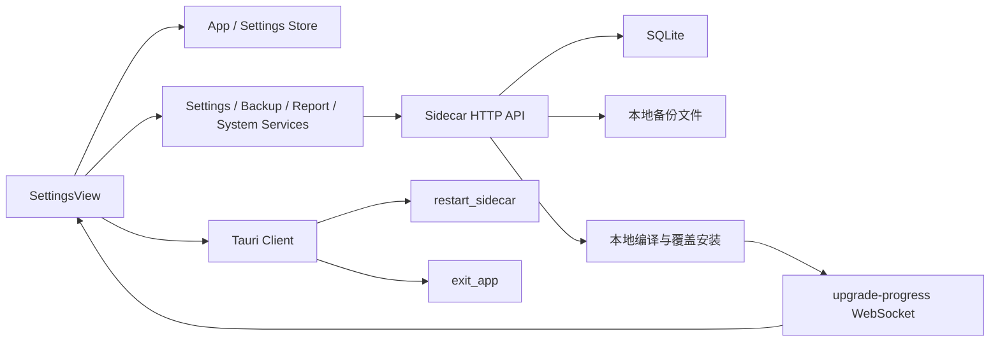

# 系统设置页面 Vue 迁移评估

> 状态：PG0～PG2 已完成；PG3 已确认 L2 并完成 HTML 原型，等待用户验收原型
> 评估日期：2026-07-28
> 当前实现：`frontend/index.html` + `src/js/settings.js` + `src/css/pages/settings.css`
> 关联计划：[vue3_architecture_migration_execution_plan.md](../../../vue3_architecture_migration_execution_plan.md)

## 1. 评估范围与阶段边界

本页计划覆盖系统设置中的运行状态、连接超时、外观特效、数据库备份、菜单排序、系统通知、GitLab 活动配置、应用更新和关于信息。

PG0 只进行隔离环境运行态取证与问题记录，不修改设置值，不触发重启、停止进程、备份、恢复、删除、通知授权、GitLab 配置保存或应用更新，不创建 Vue 页面，也不改变正式数据库。

PG1 已在 PG0 取证基础上完整梳理以下边界：

- `src/js/settings.js` 的全局状态、初始化、副作用与页面生命周期。
- `frontend/index.html` 中 `#page-settings` 的 DOM、内联事件和弹窗依赖。
- `src/css/pages/settings.css` 与共享 CSS 的层叠关系和跨页面污染。
- `/api/settings`、`/api/backup`、`/api/report/config`、`/api/system/test-sidecars`、`/api/upgrade` 与 `/api/health`。
- Tauri Sidecar 重启、系统通知、菜单顺序、主题模式和跨页面 Settings Store 的所有权。

## 2. PG0 运行态取证

### 2.1 测试环境

- 代码基线：`f940bd8 refactor: 完成个人笔记Vue迁移与旧实现清理`。
- 测试 Sidecar：使用 `DEVTOOLS_TEST=1` 和 Node 18.19.1 启动，端口 `13900`，数据库位于独立 `sidecar/data-test`。
- 浏览器入口：`http://127.0.0.1:1420/?apiPort=13900`。
- 正式端口 `13456` 和正式数据库均未访问。
- 临时截图只在内置浏览器中查看，没有写入仓库。
- 已检查暗色、亮色、1280 × 720 默认窗口和 900 × 600 窄窗口。
- 当前 Node 26 与已安装的 `better-sqlite3` ABI 不兼容；改用项目支持且与现有原生模块一致的 Node 18 后正常启动。未重编译或重装依赖。

### 2.2 当前可见功能与状态

| 区域 | 当前可见能力 | PG0 观察 |
| --- | --- | --- |
| 通用 | Sidecar 状态、重启后端、测试沙箱进程、扫描目录、Node 版本、连接超时、Live2D、点击粒子 | 数据均能加载；高风险操作与普通只读信息混在同一区域 |
| 数据备份 | 最近备份、立即备份、备份列表、恢复、删除 | 测试库展示 7 条历史备份；完整列表长期占据较大垂直空间 |
| 菜单排序 | 11 个业务页面上移、下移、恢复默认 | 所有菜单项完整展开，单一区域高度约 678px |
| 通知 | 通知开关、授权状态、发送测试 | 测试环境显示已开启但未授权，状态语义可以理解 |
| GitLab 活动配置 | Token、默认作者、仓库列表、保存 | 测试库为空；敏感配置与普通设置使用相同表单层级 |
| 应用更新 | 本地重新打包、安装和重启 | 属于高影响操作，但当前只以普通主按钮展示 |
| 关于 | 版本、架构、功能模块、数据存储 | 信息可读，但与可操作设置同处长滚动页面末尾 |

为避免产生副作用，PG0 没有点击重启、停止测试服务、备份、恢复、删除、通知测试、保存 GitLab 配置或立即更新。

### 2.3 页面尺寸与滚动

| 窗口 | 页面内容区域 | 内容滚动高度 | 结论 |
| --- | --- | ---: | --- |
| 1280 × 720 | 1084 × 600 | 2437px | 无横向溢出，但需要约四屏滚动才能浏览全部设置 |
| 900 × 600 | 724 × 486 | 2437px | 无横向溢出和重叠，控件仍可读；文字密度更高，纵向查找成本明显 |

七个设置区块当前全部纵向展开：

| 区块 | 1280 × 720 下测得高度 |
| --- | ---: |
| 通用 | 438px |
| 数据备份 | 439px |
| 菜单排序 | 678px |
| 通知 | 155px |
| GitLab 活动配置 | 314px |
| 应用更新 | 99px |
| 关于 | 212px |

### 2.4 亮暗主题

- 暗色主题中的卡片、状态徽标、输入和开关均可识别。
- 亮色主题没有出现暗色残留、透明背景或双层边框。
- 主题菜单可以切换亮色和暗色；取证结束后已恢复原暗色状态。
- 两种主题均沿用旧设置页视觉，尚未使用正式 Vue 页面头部和项目二次封装表单组件。

### 2.5 已发现的运行态问题

1. 页面已连接 `13900` 测试 Sidecar，Sidecar 状态显示在线，但“测试沙箱进程”同时显示“无测试进程”。PG1 已确认进程发现逻辑只识别 `--test` 参数、未识别 `DEVTOOLS_TEST=1`。
2. 内容高度约 2437px，备份列表和菜单排序占用主要滚动空间；用户需要记住设置所在位置，缺少分类导航、折叠或搜索。
3. 通用区混合只读状态、普通偏好与后端重启等高影响操作，信息层级不清。
4. 备份恢复、备份删除、停止测试服务和应用更新属于不同风险级别，但视觉权重与普通按钮接近。
5. 页面顶部仍是旧 Emoji 标题与描述，不是正式 Vue `PageHeader`。
6. 大部分项目同时展示名称和说明，文字量很高；设置行之间主要依靠细边框分隔，连续阅读容易疲劳。
7. 项目扫描目录以只读值出现，文案称为全局设置，但当前页面看不到修改入口。
8. GitLab Token、作者和仓库列表必须滚动到页面后段才能维护；Notes 已依赖这些配置，查找路径偏长。
9. 默认窗口和窄窗口没有横向溢出，但窄窗口仍完整保留长描述，首屏有效操作密度低。
10. 控制台仍有既有 CodeMirror `defineSimpleMode` 错误；它来自全局文件编辑器 bundle，没有证据表明由系统设置页引起。

### 2.6 当前页面已有优点

- 设置已经按“通用、备份、菜单、通知、GitLab、更新、关于”形成基本分组。
- 所有内容都在页面自身滚动容器内，默认与窄窗口均未污染应用整体滚动。
- 在线、离线、未授权等状态使用独立徽标，基本反馈明确。
- 备份恢复明确提示需要重启，避免用户误以为立即替换正在使用的数据库。
- 亮暗主题已有可用基线，后续 Vue 迁移无需重新定义主题机制。

## 3. PG0 结论

PG0 结论是系统设置页面可以进入 PG1，但不能直接开始 Vue 实现。PG1 已据此确认配置的权威来源与副作用所有权，尤其是：

- 哪些设置属于 Sidecar/SQLite，哪些属于 `localStorage`，哪些属于 Tauri 或运行时只读状态。
- 已存在的 `useSettingsStore` 是否只覆盖连接超时，以及如何扩展而不缓存 Token 等敏感信息。
- Sidecar 重启、WebSocket 重连、备份恢复、通知权限和应用更新如何在 Vue 生命周期中保持现有语义。
- 菜单排序属于应用壳状态，不能在设置页面迁移时形成第二套导航权威。
- `settings.css` 是否混入其他页面和弹窗规则，PG5 清理时必须逐项验证消费者，不能整文件直接删除。

本轮只修改评估与计划文档，没有运行时代码变更。

**手动 E2E：不需要**。PG0 为只读取证；涉及设置保存、重启、备份、通知、更新和 Vue 页面替换的手动 E2E 将在后续 Gate 单独判定。

## 4. PG1 功能、数据与依赖研究

### 4.1 页面激活与生命周期

当前设置页由 `src/js/app.js` 的 `switchPage('settings')` 调用全局 `loadSettings()` 激活，页面本身没有独立 mount/unmount 生命周期。

`loadSettings()` 的刷新策略分为两层：

1. 每次进入页面都重新渲染菜单顺序，并刷新 Sidecar 状态、测试沙箱状态和备份列表。
2. `settingsLoaded` 第一次置为 `true` 后，Node 版本、通知、GitLab 配置、连接超时、Live2D 和点击粒子不再重新读取。

这套策略能减少请求，但存在以下问题：

- 没有统一的 `loading / success / empty / error` 状态，只通过修改 DOM、控制台警告和 Toast 表达结果。
- 没有请求取消或请求版本，离开页面后已发出的异步请求仍可继续写入旧 DOM。
- GitLab 配置、连接超时等可被其他页面或进程修改的数据，在设置页第二次进入时可能显示旧值。
- Sidecar 重启同时修改旧全局 `API_BASE`、清理旧 `WS` 重连计时器并重新连接，不能简单迁移为页面局部按钮逻辑。
- Live2D 和点击粒子在脚本加载时通过立即执行函数恢复，不属于设置页组件生命周期。

Vue 迁移后应由 `SettingsView` 负责页面级加载与操作状态；跨页面主题、菜单、Sidecar 和通知能力继续由应用壳或 Store 持有。页面进入时刷新可变运行态，卸载时清理页面请求和订阅，不能复刻单一 `settingsLoaded` 布尔值。

### 4.2 功能清单与风险等级

| 功能 | 当前行为 | 副作用/风险 | 迁移要求 |
| --- | --- | --- | --- |
| Sidecar 状态 | 读取 `/api/health`，展示 PID 和端口 | 只读 | 页面进入时可刷新，失败显示明确离线状态 |
| 重启 Sidecar | Tauri `restart_sidecar`，更新 API 地址并重连 WebSocket | **高**；中断构建、部署与其他任务 | 使用公共确认；独立 `restarting` 状态；成功后统一刷新端口、连接与备份 |
| 测试沙箱进程 | 查询或终止测试 Sidecar | **高**；终止开发进程 | 只在开发/测试环境显示；修正识别契约后再实现 |
| Node 版本 | 查询 `/api/projects/node-versions/list` | 只读 | 作为运行环境信息，不伪装成可编辑设置 |
| 项目扫描目录 | 页面硬编码 `/Users/ldy/project/` | 只读且页面值可能漂移 | 与 Sidecar 权威常量对齐；未支持修改前明确标记为只读 |
| 连接超时 | 读取/保存 `/api/settings`，范围 5～300 秒 | 中；影响 SSH 请求行为 | 表单校验后显式保存或可靠自动保存，并同步 Vue Store 与旧桥接缓存 |
| Live2D | `localStorage` 开关，动态加载外部 CDN | 中；外网依赖和全局 DOM | 建议移入实验功能；由应用壳管理加载/卸载 |
| 点击粒子 | `localStorage` 开关，全局捕获 click 并创建动画节点 | 低～中；全局监听和性能 | 建议移入实验功能且默认关闭；由应用壳管理监听 |
| 备份列表 | 读取本地备份文件与待恢复状态 | 只读 | 区分加载、空、失败和待恢复状态 |
| 立即备份 | SQLite 在线备份 | 中；文件写入 | 独立进行中状态，完成后刷新摘要与列表 |
| 恢复备份 | 暂存 `restore-pending.db`，重启时换库并保留原库副本 | **很高**；改变完整应用数据 | 两段式确认、清晰展示待生效状态、支持取消，不能简化为普通 Toast |
| 删除备份 | 删除指定备份文件 | **高**；不可直接撤销 | 危险确认，操作粒度绑定文件，避免列表并发串线 |
| 菜单排序 | 读写 `devtools-menu-order` | 中；影响应用导航 | 由应用壳维持唯一权威；设置页只调用共享 action |
| 通知 | 本地开关、系统授权、测试通知 | 中；触发系统权限 | 区分“功能关闭、未授权、已授权、授权失败” |
| GitLab 配置 | 保存 Token、作者和仓库列表 | **高**；含敏感凭据 | 页面局部表单持有 Token，不进入持久 Pinia；保存后供 Notes 统一读取 |
| 应用更新 | 本地编译、覆盖 `/Applications/DevTools.app` 并重启 | **最高** | 独立风险区、二次确认、不可关闭的任务进度、WebSocket 断线与退出兜底 |
| 关于 | 版本、架构和存储信息 | 只读 | 压缩为紧凑信息区域或复用关于弹窗 |

### 4.3 数据所有权

| 数据 | 当前权威来源 | Vue 迁移后的所有者 | 约束 |
| --- | --- | --- | --- |
| 连接超时 | SQLite `app_settings.connTimeoutSec`；`GET/PUT /api/settings` | 扩展 `useSettingsStore` | 后端仅接受 5～300 秒；保存成功后同步旧兼容缓存 |
| GitLab Token、作者、仓库 | SQLite `report_config`；旧 JSON 仅作读取 fallback | `SettingsView` 局部表单 + `report-service` | Token 当前为本地 SQLite 明文，不得宣称 Keychain 或加密存储 |
| 备份与待恢复状态 | `sidecar/data[-test]/backups`、`restore-pending.db` | `backup-service` + 页面 composable | 不复制进 localStorage 或 Pinia 持久化 |
| 菜单顺序 | `localStorage: devtools-menu-order` | 应用壳导航 Store/action | 设置页不能建立第二份菜单列表权威 |
| 通知开关 | `localStorage: devtools-notifications-enabled` | 应用级通知服务/Store | 系统权限与本地开关是两个不同状态 |
| Live2D | `localStorage: devtools-live2d-enabled` | 应用壳实验功能管理器 | 页面只改变偏好，不直接遗留全局节点或监听 |
| 点击粒子 | `localStorage: devtools-click-effect-enabled` | 应用壳实验功能管理器 | 页面只改变偏好 |
| 主题 | `useAppStore` + `localStorage: devtools-theme` | 现有 `useAppStore` | 保持 `system / light / dark` 三态，不在设置页另建主题状态 |
| Sidecar 状态与端口 | `/api/health`、Tauri Sidecar | 现有 `useAppStore` + API/Tauri client | 重启后必须统一更新端口并重连 WebSocket |
| Node 版本 | `/api/projects/node-versions/list` | 页面只读查询 | 不进入长期持久 Store |
| 扫描目录 | Sidecar `scanner.js` 的 `DEFAULT_SCAN_ROOT` | Sidecar 运行配置 | 页面硬编码不是权威来源 |
| 更新进度 | `POST /api/upgrade/start` + `upgrade-progress` WebSocket | 页面更新任务 composable | 页面关闭/切换不能丢失正在运行任务状态 |

Store 边界必须保持克制：通用跨页面状态进入 Store；备份列表、GitLab Token 和一次性操作状态留在页面或 composable。尤其不能为了“集中管理”把 Token 写入 Pinia 持久化或浏览器存储。

### 4.4 API、Tauri 与 WebSocket 链路

需要保留的契约：

- `/api/settings` 当前只对白名单字段 `connTimeoutSec` 读写，不能把全部页面偏好无差别塞入该接口。
- `/api/report/config` 整体保存 Token、作者、输出目录和仓库数组；现有 `report-service.ts` 只有读取方法，PG4 前需要补充带类型归一化的保存方法。
- `/api/backup/list|create|restore|restore-cancel|:file` 对应五种不同操作，不能复用一个模糊的 `loading` 布尔值。
- Sidecar 重启使用已有 `tauri-client.ts`，同时需要 API client 与 WebSocket client 的统一重连流程。
- 更新进度必须接入共享 `websocket-client.ts` 或明确的兼容桥，不能继续依赖 `app.js` 对旧 DOM 的直接写入。
- 更新成功后旧实现还存在 Tauri `exit_app` 兜底；Vue 迁移时不得省略。

### 4.5 已确认的接口与契约缺口

1. `GET /api/system/test-sidecars` 使用 `pgrep -f "sidecar/index.js --test"`，只识别命令行 `--test`，不识别项目当前使用的 `DEVTOOLS_TEST=1 node sidecar/index.js`。PG0 的“已连接 13900，但显示无测试进程”由此产生。PG4 前应先决定统一启动参数还是扩展安全识别规则。
2. 扫描目录由旧页面硬编码，真实默认值在 Sidecar；当前没有读取或修改扫描根目录的正式 API。若 PG3 不选择 L3，本轮只展示权威只读信息，不虚构可编辑功能。
3. `useSettingsStore` 当前只读连接超时，没有保存 action、错误状态或强制刷新能力。
4. `report-service.ts` 已有 `getReportConfig()`，但缺少保存配置方法；系统设置和 Notes 必须继续共用一套 service 契约。
5. 更新 WebSocket 仍由旧 `app.js` 写入 `#upgradeModal`；正式 Vue 页面需建立任务级订阅与销毁/重连策略。
6. 菜单排序逻辑仍在 `app.js` 和 localStorage 中；在应用壳迁移完成前需要共享桥接 action，不能复制排序算法到 `SettingsView`。

以上缺口只在 PG1 记录，不在研究阶段顺手修改运行时代码。

### 4.6 公共组件复用与新增边界

优先复用：

- `PageFrame`、`PageHeader`、`PageSection`、`PageToolbar`
- `BaseButton`、`BaseBadge`、`StatusIndicator`
- `BaseInput`、`BaseSwitch`、`BaseCheckbox`、`BaseSelect`
- `BaseDialog`、`ConfirmDialog`
- `LoadingState`、`ErrorState`、`EmptyState`

页面可以新增设置专用的组合组件，例如 `SettingsNav`、`SettingsGroup`、`SettingsRow`、`BackupList`、`RepositoryListEditor` 和 `UpgradeProgressDialog`，但不得把业务 API 和敏感表单状态塞入基础 UI 组件。

若某个组合组件只服务系统设置，先放在 `frontend/src/views/settings/components/`；只有在后续页面出现第二个真实消费者并满足公共组件准入规则后，才上移到 `frontend/src/components/`。

### 4.7 CSS 消费者与清理边界

`src/css/pages/settings.css` 虽有 1378 行，但并不是纯设置页样式。除真正的 `.settings-*`、`.setting-*` 和 `.backup-*` 外，还混有：

- 全局 `.modal-*`、`.sys-dialog-*`
- 本地运行 `.run-*`
- 文件浏览 `.browser-*`
- 部署配置与日志 `deploy-config`、`#logModal`
- 全局 `.form-group`、`.tag-input-*`
- Live2D 与点击粒子运行时样式

因此 PG5 不能直接删除整个文件。清理顺序必须是：

1. 将新设置页样式写入 `frontend/src/views/settings/settings.css`，只使用语义 Token 和组件公开接口。
2. 建立旧选择器消费者清单，把全局弹窗和表单规则迁入对应公共组件，把运行、部署、浏览器规则迁回真实页面。
3. Live2D 与点击粒子若保留，迁入应用壳实验功能样式；若删除，则同时删除脚本、DOM 和 CSS。
4. 使用 `rg` 与 E2E 证明每个旧选择器无消费者后再删除，不以文件名推断归属。
5. PG5 验证旧 `settings.js`、旧设置 DOM、旧内联事件和设置专属 CSS 均已消失，同时未破坏尚未迁移页面。

这部分是本轮降低 `!important`、高特异性覆盖和跨页面 CSS 污染的核心工作，不允许为了快速完成页面迁移而保留两套样式。

### 4.8 PG1 结论

系统设置不是单一表单页，而是“运行状态、应用偏好、敏感配置、数据恢复和本地更新”五类不同风险能力的聚合页。Vue 迁移必须先重整信息架构和状态所有权，不能把 2437px 的旧 DOM 原样翻译成 SFC。

本轮完成代码、接口、状态、生命周期和 CSS 消费者研究，没有修改运行时代码。

**手动 E2E：不需要**。PG1 是只读代码研究；PG4 实现后需要覆盖普通配置和高风险操作的分级手动 E2E。

## 5. PG2 保留、优化、删除与新增清单

### 5.1 保留

| 项目 | 保留方式 | 原因 | 优先级 |
| --- | --- | --- | --- |
| Sidecar 在线状态 | 保留为页面摘要和运行环境信息 | 是诊断本地服务的基础 | P0 |
| 连接超时 | 继续使用 SQLite 与 `/api/settings` | 已被 SSH 连接实际消费 | P0 |
| 数据备份全流程 | 保留创建、列表、恢复、取消恢复和删除 | 属于本地优先数据保护核心能力 | P0 |
| 菜单排序 | 保留现有顺序数据和恢复默认能力 | 用户已形成自定义导航习惯 | P1 |
| 通知开关与测试 | 保留本地偏好、系统权限和测试通知 | 构建、部署完成提醒有实际价值 | P1 |
| GitLab 配置 | 保留 Token、默认作者和仓库列表 | Notes 的 Git 活动能力依赖它 | P0 |
| 应用更新 | 保留本地编译、覆盖安装、进度和重启语义 | 当前软件更新闭环 | P0 |
| 主题三态 | 继续由现有应用 Store 管理 | 已实现跟随系统、亮色、暗色 | P0 |
| 关于与运行信息 | 保留版本、架构、端口和存储位置等诊断信息 | 排障和确认运行环境需要 | P2 |

### 5.2 优化

| 项目 | 建议 | 收益 | 成本/风险 | 优先级 |
| --- | --- | --- | --- | --- |
| 页面信息架构 | 改为“常规 / 数据与备份 / 外观与通知 / Git 活动 / 高级 / 关于”分类导航 | 避免四屏长滚动，快速定位设置 | 中 | P0 |
| 页面头部 | 使用公共 `PageHeader`，只保留标题、当前状态摘要和搜索 | 与已迁移页面统一，减少说明文字 | 低 | P0 |
| 设置搜索 | 按名称和关键词过滤设置项，不搜索 Token 值 | 长期扩展后仍可快速定位 | 中 | P1 |
| 设置行 | 用“标题 + 一行必要说明 + 控件/状态”统一结构 | 降低文字疲劳和视觉噪声 | 低 | P0 |
| 运行状态 | 将只读环境信息压缩为摘要卡，重启等操作单独放置 | 分离信息与动作 | 低 | P0 |
| 备份 | 首屏展示状态摘要和最近 3 条，展开查看全部；待恢复状态常驻突出 | 减少约 439px 长列表，同时不隐藏恢复风险 | 中 | P0 |
| 菜单排序 | 改为紧凑可排序列表，只使用上/下按钮并保留恢复默认 | 减少约 678px 占用，避免不可靠的拖拽交互 | 低；需保持键盘可操作 | P1 |
| 通知 | 将应用开关与系统授权拆成两个可理解状态 | 避免“已开启但未授权”的歧义 | 低 | P0 |
| GitLab 配置 | Token 单独敏感输入，仓库使用紧凑行编辑器，显示未保存和保存结果 | 降低误改风险，便于 Notes 配置 | 中 | P0 |
| 风险分区 | 重启、停止测试服务、恢复、删除和更新按风险级别分区和确认 | 避免普通按钮视觉造成误触 | 低～中 | P0 |
| 应用更新 | 使用专用任务对话框显示步骤、进度、日志、失败和重试 | 保持长任务可见性 | 中～高；涉及 WebSocket | P0 |
| 响应式 | 1280 × 720 使用侧边分类；900 × 600 切换为顶部分段或单列分类 | 默认与窄窗口均避免横向溢出 | 中 | P0 |
| 可访问性 | 分类导航、设置行、排序、对话框和状态补齐键盘、焦点恢复与状态播报 | 高风险操作可被稳定操作和理解 | 中 | P0 |
| CSS | 页面样式局部化，旧混合 CSS 按消费者拆解后删除 | 减少 `!important` 和跨页污染 | 中～高 | P0 |

### 5.3 删除或降级

| 项目 | 处理 | 原因 | 优先级 |
| --- | --- | --- | --- |
| 旧设置 DOM、内联事件和 `settings.js` 全局状态 | PG5 删除，由唯一 Vue View 接管 | 避免两套实现和生命周期 | P0 |
| 设置页专属旧 CSS | PG5 删除；混入的其他消费者样式先归位 | 避免高特异性和跨页污染 | P0 |
| Live2D 看板娘 | 推荐移入“实验功能”并默认关闭；PG3 可确认直接删除 | 外部 CDN、全局 DOM 与专业工具定位不一致 | P1 |
| 点击粒子 | 推荐移入“实验功能”并默认关闭；PG3 可确认直接删除 | 属于纯装饰，全局点击监听会增加干扰 | P1 |
| 测试沙箱状态 | 正式构建隐藏，仅开发/测试环境显示 | 普通用户不需要管理开发进程 | P0 |
| 扫描目录“设置”文案 | 降级为只读运行信息，直到存在正式配置 API | 当前页面没有保存能力 | P0 |
| 关于大卡片 | 压缩为关于区域或复用介绍弹窗 | 减少页面长度，不删除必要信息 | P2 |
| 重复说明文字 | 删除不影响决策的长描述，只在高风险动作旁保留必要后果 | 降低阅读疲劳 | P0 |

### 5.4 新增

| 项目 | 内容 | 价值 | 范围 |
| --- | --- | --- | --- |
| 分类导航与搜索 | 快速跳转或过滤设置项 | 解决长页面定位成本 | L2 |
| 状态摘要 | Sidecar、备份、通知、GitLab 配置的简洁状态 | 首屏快速判断系统健康度 | L2 |
| 表单脏状态 | GitLab 配置显示未保存、保存中、成功、失败 | 避免无意丢失修改 | L1/L2 |
| 操作级状态机 | 备份、恢复、删除、重启、更新分别维护状态 | 避免一个 loading 串线 | 可靠性基线 |
| 危险操作区 | 对高风险动作统一警示、确认和结果反馈 | 降低误操作 | L1/L2 |
| 更新任务视图 | WebSocket 进度、日志、错误、重试和退出兜底 | 不丢失长任务上下文 | 可靠性基线 |
| 实验功能分组 | 若保留 Live2D/点击粒子，明确非核心和外部依赖 | 减少普通设置噪声 | L2 |

以下内容不纳入默认迁移，应作为 L3 单独评审：

- 将 GitLab Token 迁入 macOS Keychain，并设计旧 SQLite 明文迁移与回退。
- 允许配置项目扫描根目录，并处理权限、路径验证和现有任务兼容。
- 备份导出、导入、校验和跨设备迁移。
- 更新前显示版本差异、变更摘要、可用空间和回滚能力。
- 设置导入/导出、搜索关键词索引或多配置档。

## 6. L0～L3 方案

### L0：可靠等价迁移

- 将现有七个纵向区块迁移为 Vue SFC。
- 使用现有 service、Store 和公共基础组件。
- 修复请求生命周期、错误状态和旧实现清理。
- 基本不改变信息结构和视觉布局。

优点是变更最小；缺点是 2437px 长滚动、菜单与备份占用过高、风险操作混排等核心体验问题仍然存在。不推荐。

### L1：统一组件与轻量整理

包含 L0，并增加：

- 正式公共页面头部、设置行、状态、按钮、输入、开关和确认组件。
- 压缩说明文字、统一间距与亮暗主题。
- 危险操作独立视觉等级。
- 备份和菜单区域进行轻量紧凑化。

适合追求低风险快速迁移，但页面仍以单列长滚动为主。

### L2：分类式系统控制台（推荐）

包含 L1 和全部可靠性基线，并增加：

- 六类设置导航与设置搜索。
- 状态摘要、最近 3 条备份和可展开完整列表。
- 紧凑菜单排序、GitLab 仓库行编辑器、实验功能分组。
- 高风险动作与应用更新独立区域。
- 1280 × 720 默认窗口、亮色、暗色和 900 × 600 窄窗口完整原型。

该方案不新增复杂业务能力，但能实质解决长滚动、文字疲劳、风险层级和窄窗口查找问题，最符合本轮“边 Vue 迁移边优化页面”的目标。

### L3：平台与安全增强

包含 L2，并按独立子项目评审：

- Keychain 保存 GitLab Token。
- 可配置扫描根目录。
- 备份导入导出、校验与迁移。
- 更新版本信息、变更摘要、前置检查与回滚。
- 设置导入导出或配置档。

这些能力涉及 Tauri 权限、Sidecar API、数据迁移或发布流程，不应与系统设置页面迁移绑定在同一个实现批次。

## 7. PG2 推荐与 PG3 待确认项

推荐选择 **L2：分类式系统控制台**，并先制作亮色、暗色、1280 × 720 默认窗口和 900 × 600 窄窗口 HTML 原型。原型只演示布局和安全模拟状态，不连接正式 Sidecar，不触发重启、备份、恢复、通知授权、配置保存或应用更新。

PG3 需要用户确认：

1. 优化等级选择 L0、L1、L2 或 L3；推荐 L2，L3 能力默认不加入。
2. 是否制作 HTML 原型；若选择 L2，推荐制作。
3. 菜单排序采用明确的上移/下移按钮；PG4 真实 Tauri E2E 后删除未生效且不易使用的拖拽入口。
4. Live2D 与点击粒子是移入“实验功能”并默认关闭，还是从正式设置中删除。
5. “关于”保留为紧凑设置分类，还是只保留应用现有介绍弹窗入口。

在以上内容确认并写入 `decision.md` 前，不创建 `SettingsView.vue`，不修改 Sidecar/API，不删除旧页面。

本轮 PG2 只形成优化方案，没有运行时代码变更。

**手动 E2E：不需要**。如果 PG3 确认制作 HTML 原型，原型阶段也不需要真实软件手动 E2E；PG4 正式 Vue 实现完成后为**必须**。

## 8. PG4 实施与自动验收记录

2026-07-29 用户确认 L2 原型后，正式 Vue 实现已完成：

- 页面：`frontend/src/views/settings/SettingsView.vue` 与设置专用组合组件。
- 状态：`frontend/src/views/settings/composables/useSettings.ts`、`frontend/src/stores/settings.ts`。
- 服务：`frontend/src/services/modules/settings-service.ts` 与共享 `report-service.ts`。
- 接入：`#vue-settings-host`、`MigrationHost.vue`、旧应用壳兼容事件。
- 旧实现：PG4 仅隐藏并停止双重加载，仍保留 `settings.js`、旧 DOM 与混合旧 CSS，等待 PG5 按消费者清理。

自动验收：

- 71 项单元测试、20 项 Playwright E2E 全部通过。
- TypeScript、ESLint、迁移/旧 CSS Stylelint、Design Token、Sidecar/旧脚本语法和生产构建通过。
- 内置浏览器使用 13900 与 `sidecar/data-test` 验证亮暗主题、六分类、搜索、测试 Sidecar 识别和默认窗口无溢出。
- macOS `ps comm` 截断 Node 路径的问题已改为校验完整命令，并通过真实测试进程复验。
- 控制台没有 Settings 新增错误；CodeMirror `defineSimpleMode` 仍是迁移前已登记旧问题。

当前 Gate：PG4 自动验收完成，等待用户按 [manual-e2e.md](./manual-e2e.md) 完成真实 Tauri 手动 E2E；通过前不进入 PG5。
