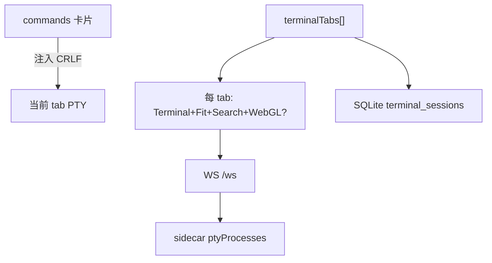

# 快捷命令 / 终端页面迁移评估

> 状态：Phase 7-2 **PG5 已完成 / 页面关闭**（2026-08-11）；用户 Tauri 手测通过（含新开 tab 执行），legacy 已删
> 关联计划：[vue3_architecture_migration_execution_plan.md](../../../vue3_architecture_migration_execution_plan.md)
> 产出日期：2026-08-11

本文只做运行态取证与代码研究。不开始 Vue 实现；不替用户选定 L0～L3。

## 1. 页面规模

| 项 | 数量 |
| --- | ---: |
| `src/js/terminal.js` | 733 行 |
| `src/css/pages/terminal.css` | 610 行（`!important` ≈ 34；无 `@media`） |
| `#page-terminal` HTML | ~67 行 |
| 顶层函数 | 25 |
| 内联 / 静态 `onclick` | ~13 |
| Xterm | UMD 5.x 族（`src/js/xterm.js` + Fit/Search/WebGL addon；无 npm 钉版） |
| 后端 | `sidecar/routes/terminal.js`、`commands.js`；PTY 在 `sidecar/index.js` WS |

复杂度「很高」：每 tab 一棵 Xterm+addon 树、PTY/WS 生命周期、命令卡片 + sudo、全屏搜索。

## 2. 对 legacy 全局的依赖

| 依赖 | 用途 | 迁移方向 |
| --- | --- | --- |
| `API` | `/api/commands*`、`/api/terminal/sessions*` | 类型化 service |
| `WS` | `terminal-init/input/resize/close` ↔ `output/exit` | composable；须可 `off` |
| `Terminal` / Fit / Search / WebglAddon | 全局 UMD | 继续 vendor 或 npm；adapter 统一 dispose |
| `showToast` / `showConfirm` | 反馈 / 删命令 | 通知 store + Confirm |
| `activeSysDialogClose` + `#sysDialog` | 添加命令 | BaseDialog |
| `escapeHtml` / `escapeAttr` | 卡片/tab HTML | 模板插值 |
| `body[data-theme]` Observer | xterm 主题 | watch 主题；可销毁 |

**无** 与 run/deploy/filetransfer/editor 的会话耦合。Editor 离开守卫与本页无关；本页**未注册** leave-guard。

## 3. PG0 运行态取证（2026-08-11，代码契约）

### 3.1 信息架构

1. 页头「快捷命令」+ 添加命令  
2. sudo 密码栏  
3. 命令卡片网格（点卡片 → 向**当前** PTY 注入命令行，不走 `/api/commands/exec`）  
4. 1px 分隔线（**不可拖**）  
5. 终端：多 tab + 清除 / 重置 / 全屏 + 容器  
6. 全屏搜索条  

### 3.2 窗口与主题

| 检查项 | 结论 |
| --- | --- |
| 1665×1184 | 上卡片 + 下固定高终端带（约 380px / max 50vh） |
| 900×600 | 无专用 media；终端区可能偏挤 |
| 亮/暗 | CSS token + xterm theme MutationObserver |
| 多标签 | **每 tab 独立 Terminal 实例**（非 CM 式单例 swap） |
| 关最后一 tab | 立刻再开一个新 tab |

### 3.3 隐藏页 vs PTY（关键语义）

| 事件 | 前端 xterm | Sidecar PTY |
| --- | --- | --- |
| 切走快捷命令页 | **保留**实例（`.page` 隐藏） | **保留**（同 WS 仍开） |
| 切回 | fit + focus | 不变 |
| 关单个 tab | `term.dispose()` | `terminal-close` kill + 删 DB 行 |
| WS 断开 / 刷新 | 缓冲仍在 | **该连接全部 PTY 被杀** |
| WS 重连 | 对各 tab 再 `terminal-init` | **新 shell**（旧进程已死）；旧缓冲易与真实态脱节 |
| 点「重置」 | clear + 提示 | 再 init（cwd 空） |

**结论（写死给 PG3）**：切页 ≠ 关 PTY（与现状一致，符合「隐藏 ≠ 销毁」）。真正杀进程的是关 tab / WS 断开。重连后是新 shell，不是「恢复同一进程」。

真实窗口亮暗 / 窄屏截图依赖用户 Tauri 补证（文末清单）。

## 4. PG1 代码与数据研究

### 4.1 模型

### 4.2 WS 契约

**上行**：`terminal-init` / `terminal-input` / `terminal-resize` / `terminal-close`  
**下行**：`terminal-output` / `terminal-exit`  
壳：`$SHELL` 或 bash `-l`；`TERM=xterm-256color`；cwd 无效则 `$HOME`。

### 4.3 HTTP

**终端会话**：GET/POST `/api/terminal/sessions`，DELETE `/:id`；PUT 与 `nodeVersion` 前端未用。  
**命令**：GET `/`、sudo-status、sudo-password、POST 添加、DELETE；**PUT 无 UI**；**POST `/exec` UI 未用**。

### 4.4 缺陷与风险

| ID | 级 | 描述 | 建议归属 |
| --- | --- | --- | --- |
| D1 | 高 | WS 订阅 / 主题 Observer / resize 监听无对称销毁 | 架构必修 |
| D2 | 高 | WebGL context lost 需可测降级；关 tab 未单独跟踪 WebGL addon | 架构必修 |
| D3 | 中 | resize 无防抖（PRD 要求防抖） | L1 |
| D4 | 中 | WS 重连后新 shell vs 旧缓冲认知差 | PG3 书面确认；本轮不改协议 |
| D5 | 低 | 分隔条不可拖；终端固定高度 | L2 可选 |
| D6 | 低 | 命令无编辑 UI；`/exec`、session PUT 闲置 | 本轮不接线 |
| D7 | 低 | 标题 emoji ⚡ | L1 去掉 |
| D8 | 低 | sudo 密码文件与 `/exec` 拼密码属安全债；UI 不走 `/exec`，本轮不扩大 | 不纳入除非 L3 |

### 4.5 测试缺口

无针对性 terminal E2E / PTY 单测；壳层仅点名 page id。PRD 要 5 tab × 50 次切换内存观感 + WebGL 降级手测。

## 5. legacy 待删清单（PG5，已执行 2026-08-11）

- [x] `src/js/terminal.js` + script  
- [x] `src/css/pages/terminal.css` + link  
- [x] `#page-terminal` → `#vue-terminal-host`  
- [x] `app.js` 中 `loadCommands()` 分支（PG4 已去）  
- [ ] （保留）xterm UMD + `xterm.css` 仍由 HTML 加载

## 6. 非目标

- 不把命令执行改成 HTTP `/exec`（保持注入 PTY）  
- 不在本轮做命令编辑器、可拖 splitter（除非 PG3 选 L2/L3）  
- 不实现「断线恢复同一 OS 进程」（现状做不到，也不宣称）

## 7. 用户 Tauri 补证清单（Vue PG4 页）

> legacy 行为用户已于 PG3 点检通过；以下针对 **Vue `TerminalView`** 手测，通过后进 PG5 删 `terminal.js` / `terminal.css`。

1. 进「快捷命令」：命令卡 + 至少一个终端 tab；标题无 emoji；切走再回来：输出与焦点仍在（**hide ≠ destroy PTY/xterm**）
2. 多开 tab（含 Cmd+T），切换 fit 正常；关 tab；关到只剩一个会再开新 tab
3. 点命令卡 → **新开终端 tab**（标签名≈命令名）并注入执行；不打进原终端；带参缺参有提示；sudo 保存/清除状态正确
4. 清除 / 重置；全屏 + ⌘F 搜索；Esc 先关搜索再退出全屏
5. 断网/重载后：session 名可冷恢复，但是**新 shell**（对照 D4）
6. 亮/暗主题下 xterm 颜色切换；约 900×600 冒烟
7. WebGL：新建 tab 有加速或降级 toast；若能触发 context lost，应回退 2D 并提示
8. 反复进出页面 10+ 次：不应堆积多余 PTY/tab；关应用后无残留监听（开发者工具粗看即可）

---

**下一门禁**：无（本页 PG0～PG5 已关闭）。下一步 Phase 8 应用壳与 Router。
