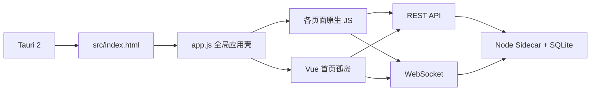

# DevTools Desktop Vue 3 架构渐进重构执行计划

> 文档版本：1.6  
> 状态：执行中（G1 已完成，Phase 0/1 已通过用户手动 E2E，下一阶段为 Phase 2 平台层）  
> 编制日期：2026-07-21  
> 适用仓库：`devtools-desktop`  
> 核心原则：保持软件持续可运行，按页面逐步替换，不进行一次性推倒重写。

---

## 1. 文档目的

本计划用于指导 DevTools Desktop 从当前的原生 `HTML + JavaScript + CSS` 单页应用，渐进迁移为以 `Vue 3 + Vite + TypeScript` 为核心的可维护前端架构。

本文档解决以下问题：

1. 明确哪些代码属于迁移范围，哪些后端能力保持不变。
2. 给出不会中断现有功能的迁移顺序。
3. 为每个阶段定义具体文件、任务、验收标准和回滚方式。
4. 为 14 个现有功能页面建立迁移优先级和风险清单。
5. 规定 Vue 组件、状态、API、WebSocket、主题、样式和第三方库的落位方式。
6. 定义什么时候可以删除旧 `index.html` 页面结构、全局函数和旧 CSS。
7. 规定每个页面迁移前必须先完成现状取证、代码研究、设计与功能优化讨论，再由用户确认本页实施范围。
8. 在首个业务页面迁移前建立项目级 Design Token、主题和公共组件，保证所有页面共享同一视觉与交互语言。

本文档是架构迁移的执行基线。迁移期间新增需求应先判断是否会与正在迁移的页面冲突，避免在旧实现和新实现中重复开发。

---

## 2. 执行结论

本项目适合迁移到 Vue，但不适合整体重写。

采用以下路线：

1. 先引入 Vite 和 TypeScript 构建能力，保持现有页面行为不变。
2. 保留 Tauri、Node Sidecar、SQLite、REST API 和 WebSocket 协议。
3. 在业务页面迁移前建立三层 Design Token、亮暗主题和第一批高频公共组件，并通过组件预览页确认统一风格。
4. 每个页面开始迁移前，先结合真实页面截图和全部相关代码评估是否需要样式、布局、交互或功能优化。
5. 用户确认本页优化范围后，优先复用公共组件，在旧应用壳内直接实现确认后的 Vue 页面，不重复实现已经决定废弃的旧设计。
6. 每迁移一个页面，就删除该页面对应的旧 HTML、旧 JS 和旧 CSS。
7. 等所有业务页面完成 Vue 化后，再将侧边栏、主题、路由和应用壳切换到 Vue Router。
8. 最后删除 `app.js`、内联事件、全局函数和旧静态前端目录。

这种方式允许每一个里程碑都生成可运行、可打包、可回滚的软件版本。

---

## 3. 当前架构基线

### 3.1 当前代码规模

截至 2026-07-21，前端主要特征如下：

| 项目 | 当前情况 |
| --- | --- |
| 功能页面 | 14 个 |
| `src/index.html` | 约 2010 行，包含全部页面和大量弹窗 |
| 内联 DOM 事件 | 约 197 处 `onclick/onchange/oninput/onkeydown` |
| 全局应用脚本 | `src/js/app.js` 约 1360 行 |
| 部署页面脚本 | `src/js/deploy.js` 约 1621 行 |
| 待办页面脚本 | `src/js/todo.js` 约 1101 行 |
| 文件传输脚本 | `src/js/filetransfer.js` 约 1092 行 |
| 本地运行脚本 | `src/js/run.js` 约 969 行 |
| 用量统计脚本 | `src/js/usage.js` 约 861 行 |
| 2FA 脚本 | `src/js/twofa.js` 约 840 行 |
| 当前 Vue 页面 | 首页，采用全局 Vue Runtime + 模板字符串挂载 |
| Tauri 前端目录 | `src-tauri/tauri.conf.json` 的 `frontendDist` 直接指向 `../src` |
| 默认窗口 | 1665 × 1184；最小窗口 900 × 600 |

### 3.2 当前运行关系



### 3.3 当前维护问题

1. 所有页面结构集中在一个 2000 行以上的 HTML 文件中。
2. 页面通过全局函数和内联事件耦合，无法明确追踪依赖。
3. 大量页面状态保存在文件级全局变量中，跨页面互相影响的风险较高。
4. 定时器、WebSocket 监听、MutationObserver、ResizeObserver 和第三方组件缺少统一生命周期。
5. 旧样式和新样式同时加载，依赖样式顺序和 `!important` 解决冲突。
6. 页面导航通过手动增删 `.active` 类完成，不具备路由、守卫和按页面懒加载能力。
7. CodeMirror、Xterm、ECharts、Sortable 等组件需要手动创建和销毁，隐藏页面时容易残留实例。
8. 当前首页虽然已经使用 Vue，但仍由旧 `app.js`、`home.js` 兼容桥和全局 Vue Runtime 托管。

---

## 4. 重构目标与非目标

### 4.1 必须实现的目标

- 使用 Vue 3 单文件组件承载全部页面。
- 使用 Vite 负责开发服务器和生产构建。
- 新代码默认使用 TypeScript；迁移期间允许旧 JavaScript 共存。
- 使用 Vue Router 管理页面导航。
- 使用 Pinia 管理真正需要跨页面共享的状态。
- REST API、WebSocket 和 Tauri IPC 都通过独立 service 层访问。
- 页面进入和离开时，定时器、监听器、Observer 和第三方实例能正确创建、暂停和销毁。
- 保留现有亮色、暗色主题和已确认的首页视觉效果。
- 保持 Sidecar API、SQLite 数据和现有配置兼容。
- 所有迁移页面同时支持浏览器开发模式和 Tauri 正式窗口。
- 最终删除内联事件、全局页面函数、旧页面 HTML 和无消费者 CSS。

### 4.2 本轮不包含的目标

- 不重写 Node Sidecar。
- 不迁移 SQLite 数据库。
- 不同时更改现有 REST API 路径和 WebSocket 消息协议。
- 不在架构迁移阶段全面重新设计所有页面 UI。
- 不同时升级 CodeMirror、Xterm、ECharts 等第三方库的大版本。
- 不将 Tauri 重写为 Electron 或其他桌面框架。
- 不顺带处理与 Vue 无关的 Sidecar 打包、硬编码路径等历史问题，除非它阻塞新的前端构建。

---

## 5. 目标技术选型

| 能力 | 选型 | 说明 |
| --- | --- | --- |
| UI 框架 | Vue 3 | 使用 Composition API 和 `<script setup>` |
| 构建工具 | Vite | 替代静态 `serve src` |
| 语言 | TypeScript | 开启 `allowJs`，允许旧 JS 渐进迁移 |
| 路由 | Vue Router | Tauri 正式包优先使用 `createWebHashHistory()` |
| 跨页状态 | Pinia | 仅保存跨页面或需要持久化的业务状态 |
| 单元测试 | Vitest | 测试 service、store、composable 和纯函数 |
| 组件测试 | Vue Test Utils | 测试页面状态和交互 |
| 浏览器回归 | Playwright | 覆盖导航、主题、常用业务路径和窗口尺寸 |
| 桌面验收 | Tauri 手动 Smoke Test | 验证 IPC、Sidecar、托盘、通知和窗口行为 |
| 样式体系 | 保留现有 CSS Variables | 页面样式逐步迁入组件或页面样式文件 |

本轮不引入新的大型 UI 组件库，避免架构迁移与设计系统替换同时进行。

---

## 6. 目标目录结构

为避免当前 `src` 静态目录与 Vite 源码目录发生冲突，迁移期间新增独立 `frontend` 目录。

```text
devtools-desktop/
├── frontend/
│   ├── index.html
│   └── src/
│       ├── main.ts
│       ├── App.vue
│       ├── env.d.ts
│       ├── legacy/                 # 迁移期专用，Phase 8 删除
│       │   ├── MigrationHost.vue
│       │   └── legacy-bridge.ts
│       ├── router/
│       │   ├── index.ts
│       │   └── routes.ts
│       ├── layouts/
│       │   └── AppLayout.vue
│       ├── views/
│       │   ├── home/
│       │   ├── run/
│       │   ├── deploy/
│       │   └── ...
│       ├── components/
│       │   ├── base/
│       │   │   ├── BaseButton.vue
│       │   │   ├── BaseInput.vue
│       │   │   ├── BaseSelect.vue
│       │   │   ├── BaseCard.vue
│       │   │   └── BaseBadge.vue
│       │   ├── layout/
│       │   │   ├── PageFrame.vue
│       │   │   ├── PageTop.vue
│       │   │   ├── PageHeader.vue
│       │   │   ├── PageActions.vue
│       │   │   ├── PageToolbar.vue
│       │   │   ├── PageBody.vue
│       │   │   └── PageSection.vue
│       │   ├── navigation/
│       │   │   └── PageSubnav.vue
│       │   ├── feedback/
│       │   └── forms/
│       ├── dev/
│       │   └── UiFoundationPreview.vue
│       ├── composables/
│       │   ├── usePageLifecycle.ts
│       │   ├── useInterval.ts
│       │   ├── useResizeObserver.ts
│       │   └── useTheme.ts
│       ├── stores/
│       │   ├── app.ts
│       │   ├── projects.ts
│       │   ├── runs.ts
│       │   ├── settings.ts
│       │   └── notifications.ts
│       ├── services/
│       │   ├── api-client.ts
│       │   ├── websocket-client.ts
│       │   ├── tauri-client.ts
│       │   └── modules/
│       ├── types/
│       ├── utils/
│       └── styles/
│           ├── index.css
│           ├── layers.css
│           ├── tokens/
│           │   ├── primitives.css
│           │   ├── semantic.css
│           │   └── components.css
│           ├── themes/
│           │   ├── light.css
│           │   └── dark.css
│           ├── base.css
│           ├── motion.css
│           └── utilities.css
├── src/                     # 迁移期间的旧静态前端，最终删除
├── dist/                    # Vite 构建产物，不手工编辑
├── sidecar/                 # 保持现状
├── src-tauri/               # 保持 Tauri 2，调整前端构建配置
├── vite.config.ts
├── tsconfig.json
└── package.json
```

完成迁移后，`src/` 旧静态目录应被删除；需要保留的图片和第三方静态资产迁入 `frontend/public` 或通过 npm 模块导入。

---

## 7. 代码职责边界

### 7.1 View

- 对应一个路由页面。
- 负责组合页面组件、页面级加载态和错误态。
- 不直接拼接 API 地址。
- 不直接操作页面外部 DOM。

### 7.2 Component

- 承担明确、可复用的 UI 职责。
- 通过类型明确的 props、emit、slot 与父组件通信。
- 不读取全局变量。
- 不直接请求业务 API，不直接依赖具体页面 Store。
- 表单和弹窗必须暴露明确的输入输出契约。
- 公共交互组件必须覆盖 default、hover、focus-visible、active、disabled、loading 和 error 等适用状态。
- 公共组件的尺寸、颜色和状态差异使用有限的 variant 与 size，不允许页面通过深层选择器修改其内部结构。

### 7.3 Composable

- 封装页面生命周期、定时器、Observer、键盘快捷键和可复用交互逻辑。
- 必须在 `onUnmounted` 或 `onDeactivated` 中清理资源。
- 不把纯 UI 状态无条件提升到 Pinia。

### 7.4 Store

只保存以下类型的数据：

- 多个页面共同使用的数据。
- WebSocket 推送形成的全局运行状态。
- 需要跨路由保留的数据。
- 应用主题、Sidecar 连接状态、通知等应用级状态。

页面筛选条件、弹窗开关和临时表单内容默认保留在组件内。

### 7.5 Service

- 负责所有网络和 IPC 副作用。
- 对组件返回稳定、类型明确的数据结构。
- 统一处理超时、取消、错误映射和重连。
- 禁止 View 直接调用 `fetch`、`window.__TAURI__` 或原始 WebSocket。

### 7.6 公共组件准入规则

满足以下任一条件时，应优先设计为公共组件：

- 属于应用级固定结构，例如页面顶部、页面工具栏、弹窗、Toast、加载和错误状态。
- 已经在两个及以上页面承担相同语义和交互。
- 虽然当前只在一个页面使用，但明确属于按钮、输入、下拉、复选框等基础交互原语。
- 需要统一处理键盘、焦点、ARIA、加载或禁用状态。

以下内容默认保留为页面私有组件：

- 只服务单一业务的数据卡片或流程组件。
- 仅外观相似，但数据结构和行为语义不同的组件。
- 为了“可能以后会复用”而提前抽象、需要大量布尔 props 才能兼容的组件。

公共组件应小而稳定，通过组合形成复杂界面。禁止创建包含页面业务判断的“万能组件”。新模式通常在第二个真实使用页面出现时再提炼；基础控件和已确认的高频结构不受此限制。

业务 View 和页面私有组件默认不得重新实现原生 `button/input/select/textarea` 的外观与状态，应组合对应 Base 组件；第三方库要求直接宿主元素时可以例外，但必须记录原因。

### 7.7 Design Token 与样式所有权

采用三层 Token：

```text
Primitive 原始值 → Semantic 语义与主题 → Component 组件契约
```

- Primitive：颜色阶、4px 间距尺度、字号、行高、圆角、阴影、动效时间和 z-index。
- Semantic：页面背景、卡片表面、主次文字、边框、主要操作、危险操作、成功、警告和焦点等用途；亮暗主题只重映射这一层。
- Component：按钮、输入框、下拉框、卡片、弹窗、页面顶部等组件的高度、内边距、背景、边框和状态值。
- 页面私有样式只能使用 Semantic 或经过批准的 Component Token，不直接使用 Primitive 色值。
- 颜色和主题不得在每个页面重复定义；主题切换只修改 `themes/light.css`、`themes/dark.css` 或相应语义映射。
- 全局 CSS 只承载 Token、主题、基础排版、层级和少量工具类；按钮、输入框等结构样式放在对应公共 Vue 组件内部，不建立新的巨型 `components.css`。
- 页面只负责自身独有布局和业务可视化，禁止重新定义公共按钮、表单、弹窗或 PageHeader 的样式。

该基础体系从当前项目已经确认的视觉方向中提炼，属于项目自身的工程规范，不恢复或依赖此前弃用的 UI/UX Pro Max 设计规范。

---

## 8. 渐进迁移策略

### 8.1 迁移期间的双架构边界

迁移期间保留旧 `app.js` 负责导航，但新页面组件本身不得新增对旧全局函数的直接依赖。

建立一个临时、可删除的兼容层：

```text
legacy app.js
    ↓ 唯一兼容入口
frontend/src/legacy/legacy-bridge.ts
    ↓
Vue page / store / service
```

兼容层允许的职责：

- 通知 Vue 当前激活页面。
- 触发已迁移页面刷新。
- 将旧通知或导航动作转发到 Vue。
- 在迁移完成前兼容 Tauri 全局对象。

兼容层禁止承载新业务逻辑。

迁移期间采用以下挂载约束：

- 从 Phase 1 起只创建一个 Vue 根实例，并只创建一个 Pinia 实例。
- Vue 根实例先挂载到旧应用壳中的 `#vue-migration-host`，由 `MigrationHost.vue` 按当前页面动态渲染已经迁移的 View。
- 旧 `switchPage()` 在 Phase 3 增加唯一桥接调用：已迁移页面交给 Migration Host 激活，未迁移页面继续使用旧 `.page.active` 逻辑。
- 每迁移一个页面，就把页面名称加入 Migration Host 的显式注册表，并删除该页面旧 DOM；不得为每个页面单独执行一次 `createApp()`。
- API client、WebSocket client、Tauri client、Pinia 和全局反馈组件在过渡期与最终架构中使用同一个实例。
- Phase 8 切换应用壳时，将现有根实例从 Migration Host 收口为正式 `App.vue`，随后删除 `legacy/` 目录。

临时注册表示例：

```ts
const migratedViews = {
  home: defineAsyncComponent(() => import('../views/home/HomeView.vue')),
  // 每完成一个页面迁移后在独立提交中加入一项
}
```

这个约束用于避免迁移后再次形成多个 Vue 孤岛，以及多份 Store、WebSocket 连接和全局通知宿主。

### 8.2 页面启动前的研究与决策门禁

Phase 0～Phase 2 的基础架构工作可以直接执行；从 Phase 3 开始，任何具体业务页面在编写 Vue 代码前，都必须先通过页面级门禁。当前不预先假设哪些页面需要重设计，而是在轮到该页面时根据真实证据共同决定。

#### 证据采集

每个页面至少收集以下材料：

- 用户提供的当前页面截图；如果没有，由执行者启动本地项目并使用内置浏览器抓取。
- 浏览器模式下 1665 × 1184 默认尺寸的亮色、暗色截图。
- 浏览器模式下 900 × 600 最小尺寸的亮色、暗色截图。
- 页面存在子 Tab、弹窗、空数据、加载、错误或运行中状态时，补充对应状态截图。
- 依赖 Tauri IPC、系统通知、文件选择器、PTY、SFTP 等桌面能力的页面，必须补充真实 Tauri 软件截图和行为记录，不能只以浏览器结果代替。
- 完整阅读该页面相关 HTML、JavaScript、CSS、API、WebSocket、数据库、本地存储、定时器和第三方库代码。
- 记录该页面与首页摘要、设置、运行状态或其他页面之间的依赖关系。
- 对照公共组件目录，标记可直接复用的组件、需要扩展的 variant 和可能新增的公共模式。

截图不是唯一依据。页面建议必须同时基于真实视觉效果、现有功能代码、数据来源和用户的实际使用需求。

#### 页面研究交付物

每个页面建立独立目录：

```text
PRD/vue-migration/pages/<page>/
├── assessment.md          # 现状、问题、代码与功能盘点
├── decision.md            # 用户确认的范围与验收标准
├── baseline/              # 明暗主题、尺寸和关键状态截图
└── prototype.html         # 需要明显重设计时创建；无需重设计时可省略
```

`assessment.md` 至少包含：

- 当前页面目的和主要使用场景。
- 完整功能清单及真实数据来源。
- 布局、视觉、信息层级、交互、可访问性和窗口适配问题。
- 冗余、低价值、缺失或难以发现的功能。
- 代码耦合、重复逻辑、资源泄漏和 CSS 污染问题。
- 当前页面与其他页面在 PageHeader、按钮、输入、下拉、卡片、弹窗和状态反馈上的不一致。
- “保留 / 优化 / 删除 / 新增”四类建议。
- 每项建议的收益、风险、实现成本和优先级。
- 是否影响 Sidecar API、WebSocket、SQLite、2FA 安全或历史数据兼容。

#### 优化等级

研究完成后，由用户为当前页面确认一个等级：

| 等级 | 含义 | 实施方式 |
| --- | --- | --- |
| L0 | 保持现有设计和功能 | 只做 Vue 架构迁移、响应式修复和 CSS 清理 |
| L1 | 轻量视觉优化 | 调整间距、排版、颜色、组件一致性和状态反馈后直接实现 |
| L2 | 布局或交互重设计 | 先制作亮暗主题 HTML 原型，确认后再实现 Vue 页面 |
| L3 | 功能与流程优化 | 除 HTML 原型外，补充功能范围、数据流和风险评审 |

L3 中纯前端且低风险的改动可以与页面 Vue 实现处于同一页面批次，但必须使用独立提交和独立测试；涉及 API、数据库、安全、后台任务或核心运行流程的改动必须拆成独立子阶段，不能混在架构迁移提交中。

#### 页面级门禁

| Page Gate | 通过条件 |
| --- | --- |
| PG0 现状取证 | 截图、关键状态和当前问题已记录 |
| PG1 代码研究 | 页面全部相关代码、接口、状态和依赖已梳理 |
| PG2 优化建议 | 已提交样式、布局、交互、功能与公共组件复用建议及风险说明 |
| PG3 用户确认 | 用户已确认 L0～L3、原型和本轮实施范围 |
| PG4 Vue 实现 | 按确认范围完成实现、测试和新旧对照 |
| PG5 验收清理 | 浏览器与 Tauri 验收通过，旧实现和污染 CSS 已删除 |

未通过 PG3 不得开始该页面 Vue 实现。用户尚未决定时，可以继续处理平台层或其他已经通过 PG3 的页面，不得自行替用户选择设计方向。

### 8.3 单页替换规则

每个页面按照以下顺序替换：

1. 完成 PG0～PG3，冻结用户确认的页面设计和功能范围。
2. 盘点旧页面 DOM、全局变量、事件、API、WebSocket、定时器和第三方实例。
3. 为接口响应建立 TypeScript 类型。
4. 把网络与 IPC 行为迁入 service。
5. 把跨页面数据迁入 store，页面内部状态保留在 View/composable。
6. 先组合已有公共组件，再按确认的原型或 L0/L1 说明建立 Vue View 和页面私有子组件。
7. 在 Migration Host 中注册并挂载新 Vue 页面。
8. 分别验证旧功能兼容和已确认的优化功能。
9. 完成浏览器、默认窗口、最小窗口和 Tauri 验收。
10. 删除该页面的旧 HTML、旧 JS 引用和无消费者 CSS。
11. 执行全量导航回归。
12. 生成可独立回滚的本地 Git commit；功能变更与架构迁移分开提交。

不允许同一个页面长期同时保留两套可执行实现。

---

## 9. 里程碑与质量门禁

| Gate | 里程碑 | 通过条件 |
| --- | --- | --- |
| G0 | 基线冻结 | 当前软件可运行、可打包，关键页面截图和手测结果已记录 |
| G1 | Vite 构建接管 | 浏览器开发模式由 Vite 提供，Tauri 正式构建从 `dist` 加载，功能与当前版本一致 |
| G2 | Vue 平台与共享 UI 基础层就绪 | API、WebSocket、Tauri、Store、三层 Token、亮暗主题和首批公共组件具备封装、预览与测试 |
| G3 | 首页正式 SFC 化 | 删除全局 Vue Runtime、`home.js` 和旧首页 CSS |
| G4 | 普通页面全部 Vue 化 | 非运行态复杂页面不再依赖旧全局脚本 |
| G5 | 高风险页面全部 Vue 化 | 运行、部署、传输、编辑器和终端通过资源泄漏测试 |
| G6 | Vue Router 切换 | 侧边栏、应用壳、路由和主题完全由 Vue 管理 |
| G7 | 旧架构移除 | `app.js`、内联事件、旧页面 DOM、`overrides.css` 和无消费者 CSS 被删除，第一方未登记 `!important` 为 0 |
| G8 | 正式发布验收 | 构建、升级、数据兼容、性能和手动回归全部通过 |

没有通过当前 Gate，不进入下一 Gate。

---

## 10. 分阶段执行计划

### Phase 0：基线冻结与迁移准备

**目标**：建立可以对比和回滚的当前版本基线。

**建议工作量**：0.5～1.5 人日。

#### 任务

- [x] 盘点当前未提交修改并记录混合所有权；不重置、不覆盖既有改动。
- [ ] 创建迁移前基线 commit；必要时增加本地 tag。
- [x] 执行 `npm run lint` 并记录当前已知问题。
- [x] 在浏览器开发模式验证全部 14 个页面可进入。
- [x] 在默认窗口 1665 × 1184 下保存亮色、暗色截图并完成真实 App 复核。
- [x] 在最小窗口 900 × 600 下记录当前降级行为。
- [x] 记录 Sidecar 正常、断开、重连和重启行为。
- [x] 记录 localStorage 使用的 key 和 SQLite 数据表版本。
- [x] 记录 CSS 总行数、各文件 `!important` 数量和当前 Stylelint 结果。
- [x] 建立 `PRD/vue-migration-test-baseline.md`，记录当前已知缺陷，避免误归因于迁移。

#### 实际执行结果（2026-07-21）

- 已建立可比较的 Phase 0 基线、14 页视觉证据和 SQLite 在线备份。
- 工作区在迁移开始前已经包含多项混合修改，因此没有通过 reset、stash 或清理伪造“干净工作区”。
- 技术基线已经冻结；独立本地 commit 仍等待用户明确授权，未执行远程 push。

#### 代码清理记录（2026-07-21）

- 删除了不再参与运行的旧首页 `src/css/pages/home.css`；当前首页容器和卡片样式由 `home-vue.css` 承担。
- 删除了历史 AI 编辑器规则、一次性 PRD、旧首页设计草稿和可再生构建产物；保留 Vue 迁移计划、测试基线、迁移证据和最新设计参考。
- 清理后重新执行类型检查、ESLint、Stylelint、Vitest、Playwright、Vite 构建和 Tauri 构建，均通过。
- CSS 审计从 24 个文件 / 12,126 行 / 2,296 处 `!important` 降至 23 个文件 / 11,956 行 / 1,848 处 `!important`；剩余旧 CSS 仍按页面迁移逐步治理。

#### 验收标准

- 当前代码可以从干净工作区启动。
- 当前版本可以构建 Tauri 安装包。
- 关键页面功能有可重复的手测步骤。
- 数据库和配置文件已备份。

#### 回滚方式

回到迁移前基线 commit；不涉及数据结构变更。

---

### Phase 1：接入 Vite、TypeScript 和测试骨架

**目标**：只替换构建方式，不改变页面行为和 UI。

**建议工作量**：1.5～3 人日。

#### 新增依赖

运行时依赖：

- `vue`
- `vue-router`
- `pinia`
- `@tauri-apps/api`

开发依赖：

- `vite`
- `@vitejs/plugin-vue`
- `typescript`
- `vue-tsc`
- `vitest`
- `@vue/test-utils`
- `jsdom`
- `@playwright/test`
- `eslint-plugin-vue`
- `typescript-eslint`
- `stylelint`
- `postcss-html`

#### 文件变更

- [x] 创建 `frontend/` 和 `frontend/src/`。
- [x] 将当前 `src/index.html` 移动为 `frontend/index.html`，保持内容和脚本顺序不变。
- [x] 在旧应用壳中加入唯一的 `#vue-migration-host` 挂载点。
- [x] 新建 `frontend/src/main.ts`，创建唯一 Pinia，并定义新 Vue 根的唯一接管入口。
- [x] 新建空载的 `frontend/src/legacy/MigrationHost.vue`；Phase 1 不接管任何业务页面。
- [x] 新建 `frontend/src/legacy/legacy-bridge.ts`，初期只定义页面激活契约，不承载业务逻辑。
- [x] 新建 `vite.config.ts`。
- [x] 新建 `tsconfig.json`、`tsconfig.node.json` 和 `frontend/src/env.d.ts`。
- [x] 扩展 Stylelint 配置，使 Vue SFC 使用 `postcss-html`，并对 `frontend/src` 启用 `declaration-no-important`。
- [x] 更新 `lint:css`，同时检查迁移期旧 CSS 与 `frontend/src/**/*.{vue,css}`。
- [x] 将 Vite 的 `publicDir` 暂时指向旧 `src` 目录，使旧 CSS、JS 和 vendor 资产继续可用。
- [x] 将 Vite `build.outDir` 设置为根目录 `dist`。
- [x] 设置 `base: './'`，保证 Tauri 打包后的相对资源路径正确。

#### Phase 1 过渡例外

当前首页在 Phase 1 之前已经由全局 Vue Runtime 创建一个活动根。为满足“只替换构建、不改变页面”的范围，本阶段检测到 `#vue-home-root` 时暂缓挂载 `MigrationHost`，从而确保全应用仍只有一个活动 Vue 根。Phase 3 首页正式 SFC 化时，新根将一次性接管，并删除全局 Runtime；详细契约与验收见 `PRD/vue-migration-test-baseline.md`。

#### 建议 Vite 配置方向

```ts
export default defineConfig({
  root: 'frontend',
  base: './',
  publicDir: '../src',
  plugins: [vue()],
  server: {
    host: '127.0.0.1',
    port: 1420,
    strictPort: true,
  },
  build: {
    outDir: '../dist',
    emptyOutDir: true,
  },
})
```

#### package.json 脚本目标

```json
{
  "dev": "vite --config vite.config.ts",
  "tauri:dev": "tauri dev",
  "build:frontend": "vue-tsc --noEmit && vite build",
  "build": "node scripts/sync-version.js && tauri build -b app",
  "typecheck": "vue-tsc --noEmit",
  "test:unit": "vitest run",
  "test:e2e": "playwright test"
}
```

#### Tauri 配置调整

`src-tauri/tauri.conf.json` 的目标配置：

- `frontendDist`：`../dist`
- `devUrl`：`http://127.0.0.1:1420`
- `beforeDevCommand`：`npm run dev`
- `beforeBuildCommand`：`npm run build:frontend`

#### 验收标准

- `npm run dev` 可以打开与当前一致的旧应用。
- `npm run build:frontend` 生成 `dist`。
- Tauri 开发模式从 Vite dev server 加载。
- Tauri 正式构建从 `dist` 加载。
- 全应用只有一个 Vue 根实例和一个 Pinia 实例。
- 新 `frontend` 目录中不存在未经登记的 `!important`。
- 14 个页面均可进入，旧功能没有行为变化。
- 正式包中不存在绝对开发服务器 URL。

#### 实际执行结果（2026-07-21）

- 以上技术验收项全部通过，G1 构建接管完成。
- `npm run typecheck`、`npm run lint`、`npm run test:unit`、`npm run test:e2e`、`npm run build:frontend` 与 `npm run build` 均通过。
- E2E 已覆盖 14 页在 1665 × 1184 与 900 × 600 下的导航、单活动页、主题切换、单 Vue 根与横向溢出门禁。
- 正式构建 App 已使用隔离 Sidecar 验证动态端口、后端重启、界面状态恢复与 WebSocket 重连；正式后端未受影响。
- Vite 对旧 classic script 和 `publicDir` CSS 的提示已登记为迁移期预期警告，产物完整性已验证。

#### 回滚方式

恢复 `frontendDist: ../src` 和旧启动脚本；该阶段不修改业务逻辑。

---

### Phase 2：建立 Vue 平台层与共享 UI 基础层

**目标**：先建立所有新页面都会依赖的平台能力、三层 Token、主题和首批公共组件，避免每个页面自行封装或重复定义视觉规则。

**建议工作量**：5～10 人日，其中平台 service 约 2～4 人日，共享 UI 基础层约 3～6 人日。

#### API Client

- [x] 创建 `frontend/src/services/api-client.ts`。
- [ ] 保留当前动态读取 Sidecar 端口和浏览器 `?apiPort=` 调试能力。
- [ ] 统一 `GET/POST/PUT/DELETE`、超时、AbortSignal 和错误映射。
- [ ] 为长连接测试、SSH、SFTP 等请求允许独立超时。
- [ ] 定义 `ApiError`，区分网络错误、超时、HTTP 错误和业务错误。
- [ ] 禁止组件直接调用 `fetch`。

#### WebSocket Client

- [x] 创建 `frontend/src/services/websocket-client.ts`。
- [ ] 保留指数退避重连策略。
- [ ] 使用类型化事件映射替代任意字符串和任意数据。
- [ ] `on()` 必须返回取消订阅函数。
- [ ] 应用销毁时关闭 socket 和重连 timer。
- [ ] 将连接状态暴露给 app store。

#### Tauri Client

- [x] 创建 `frontend/src/services/tauri-client.ts`。
- [ ] 封装 `get_sidecar_port`、`restart_sidecar`、托盘更新和退出动作。
- [ ] 浏览器模式提供明确的 fallback，不在组件中判断 `window.__TAURI__`。
- [ ] 迁移完成后关闭 `withGlobalTauri` 的可行性另行评估。

#### 基础 Stores

- [x] `useAppStore`：主题、Sidecar 状态、应用初始化状态。
- [x] `useNotificationStore`：Toast、操作通知、错误提示。
- [x] `useSettingsStore`：全局设置及连接超时。
- [ ] 暂不把每个页面的本地状态放入 Pinia。

#### 公共 Composables

- [x] `useInterval`：自动清理 timer。
- [x] `useEventListener`：自动解绑事件。
- [x] `useResizeObserver`：自动 disconnect。
- [x] `usePageVisibility`：兼容旧壳激活/隐藏状态。
- [x] `useAsyncState`：统一 loading、error、retry。

#### 公共反馈组件

- [ ] `AppToastHost.vue`
- [ ] `BaseDialog.vue`
- [ ] `ConfirmDialog.vue`
- [ ] `EmptyState.vue`
- [ ] `LoadingState.vue`
- [ ] `ErrorState.vue`

#### 共享 UI 现状盘点

当前 `index.html` 已出现至少 13 组页面标题、10 组页面工具栏、16 个主要按钮、12 个下拉框、17 个弹窗和 33 个 Chip 使用点。截图中的“本地运行”和“部署面板”顶部结构承担相同语义，却由页面分别定义，正是首批需要统一的模式。

14 个页面顶部的浏览器取证、尺寸测量和组合方案已经归档在：

- `PRD/vue-migration/page-header-audit/assessment.md`
- `PRD/vue-migration/page-header-audit/page-top-component-spec.md`

- [x] 建立 `PRD/vue-migration/shared-ui-inventory.md`。
- [ ] 盘点 14 个页面中的标题区、工具栏、按钮、表单、筛选、卡片、状态、弹窗、表格和空状态。
- [ ] 记录同一语义当前存在的尺寸、颜色、间距、图标和交互差异。
- [ ] 将候选项分为“首批基础组件 / 随页面提炼 / 页面私有”三类。
- [ ] 为每个公共组件记录使用页面、负责人、状态、props、events、slots、variants 和破坏性变更影响。

#### 三层 Design Token

- [x] 创建 `tokens/primitives.css`：颜色阶、4px 间距、字号、行高、字重、圆角、阴影、动效和 z-index。
- [x] 创建 `tokens/semantic.css`：页面背景、分层表面、文字、边框、焦点、操作色和状态色。
- [x] 创建 `tokens/components.css`：PageHeader、按钮、输入框、下拉框、卡片、Badge 和 Dialog 契约。
- [x] 创建 `themes/light.css` 和 `themes/dark.css`，只重映射 Semantic Token，不复制组件规则。
- [ ] 将现有 `base.css` 变量逐项映射到新 Token，迁移期提供别名兼容，禁止一次性改名造成全页面回归。
- [ ] 建立 Token 用途说明和弃用流程；不得创建含义重复但名称不同的变量。
- [x] 创建 `scripts/validate-design-tokens.mjs` 和 `npm run lint:tokens`，检查第一方组件中的硬编码颜色与未登记 Token。

#### 首批公共组件

以下组件在首个业务页面迁移前完成：

| 类别 | 组件 | 必备能力 |
| --- | --- | --- |
| 页面骨架 | `PageFrame`、`PageBody` | 顶部固定于正文滚动区之外；standard/immersive；默认/flush/workspace 内边距 |
| 顶部容器 | `PageTop` | 统一背景、分隔、行间距，组合 Header/Subnav/Toolbar |
| 标题操作 | `PageHeader`、`PageActions` | icon、唯一 h1、description、主次操作、窄窗口更多菜单 |
| 页面结构 | `PageToolbar`、`PageSection` | 搜索/筛选/状态/操作区组合、统一间距、最多两行响应式布局 |
| 页面导航 | `PageSubnav` | 子路由或 Tab 语义、键盘导航、窄窗口横向滚动 |
| 操作 | `BaseButton`、`BaseIconButton` | primary、secondary、outline、ghost、danger；sm/md/lg；loading/disabled |
| 表单 | `BaseInput`、`BaseTextarea`、`BaseSelect` | label 关联、placeholder、error、disabled、前后图标和键盘焦点 |
| 表单 | `BaseCheckbox`、`BaseRadio`、`BaseSwitch`、`FormField` | 统一标签、说明、错误信息和可访问状态 |
| 导航筛选 | `BaseTabs`、`BaseSegmented`、`FilterChip` | 选中状态、键盘导航、禁用和数量 Badge |
| 展示 | `BaseCard`、`BaseBadge`、`StatusIndicator` | 有限 variant、密度和状态语义 |
| 反馈 | `BaseDialog`、`ConfirmDialog`、`AppToastHost` | 焦点管理、Esc、遮罩、危险确认、堆叠策略 |
| 页面状态 | `LoadingState`、`SkeletonState`、`EmptyState`、`ErrorState` | 统一尺寸、文案插槽、重试动作 |

截图红框中的顶部区域统一使用 `PageTop` 组合 `PageHeader` 和可选 Toolbar，例如：

```vue
<PageTop>
  <PageHeader
    title="本地运行"
    description="快速启动前端开发服务，管理模块、日志和本地地址"
    :icon="PlayIcon"
  >
    <template #actions>
      <BaseButton>添加项目</BaseButton>
    </template>
  </PageHeader>
  <PageToolbar>...</PageToolbar>
</PageTop>
```

页面不得再自行复制标题字号、说明颜色、上下间距、固定逻辑和右侧操作布局。未来修改 PageTop、PageHeader 或对应 Component Token，应一次影响所有使用页面。

#### 随页面提炼的组件

以下组件暂不凭空设计，在对应页面 PG0～PG3 研究后再决定是否公共化：

- 数据表格、分页器和高级筛选栏。
- 可折叠项目分组、项目卡片和统计卡片。
- 日志查看器、代码编辑器和终端容器。
- 文件树、文件选择器和传输队列。
- 图表容器、价格表格和日期范围选择器。
- 2FA 验证码卡片及其他安全相关组件。

如果新模式只服务一个页面，先放在该 View 目录；出现第二个同语义使用点后再评审提升为公共组件，避免过早抽象。

#### 组件预览与验收页

- [ ] 创建仅开发环境可访问的 `UiFoundationPreview.vue`，不加入正式侧边栏。
- [ ] 在同一页面展示所有组件的 variant、size、hover、focus、disabled、loading、error 和空状态。
- [ ] 支持一键切换亮色、暗色以及 1665 × 1184、900 × 600 预览尺寸。
- [ ] 使用 Playwright 保存公共组件亮暗主题基线截图。
- [ ] 为交互组件添加 Vue Test Utils 测试和键盘、ARIA、焦点测试。
- [ ] 用户确认公共组件预览和 Token 方向后，才允许 Phase 3 业务页面开始实现。

#### 验收标准

- API、WebSocket 和 Tauri client 均有单元测试。
- WebSocket 重连不会重复注册 handler。
- 所有基础 composable 在组件卸载后无 timer 或 observer 残留。
- 新平台层不依赖任何具体业务页面 DOM。
- 三层 Token、亮暗主题和首批公共组件全部存在明确源码所有权。
- `PageFrame + PageTop` 组合能覆盖 13 个普通工具页；首页作为明确的 immersive 例外。
- 本地运行、部署面板、2FA 和用量统计四个压力样例无需页面 ID 样式即可通过默认与最小窗口验收。
- 组件预览页已覆盖亮暗主题、交互状态和两档关键窗口尺寸，并由用户确认。
- 第一方公共组件不存在未经登记的硬编码颜色和 `!important`。
- View 不得通过深层选择器覆盖公共组件内部样式。

---

### Phase 3：首页从 Vue 孤岛迁移为正式 SFC

**目标**：把当前首页从全局模板字符串转换为可复用、可测试的 Vue 单文件组件。

**建议工作量**：2～4 人日。

**启动条件**：G2 已通过；整理已有首页设计预览、实际软件截图和历次确认结论，补齐 `assessment.md` 与 `decision.md`，通过首页 PG3。

#### 目标组件

```text
views/home/HomeView.vue
views/home/components/HomeHeroCard.vue
views/home/components/WeatherCard.vue
views/home/components/UsageSummaryCard.vue
views/home/components/IpPurityCard.vue
views/home/components/WeeklyRhythmCard.vue
views/home/components/DailyQuoteCard.vue
views/home/components/ActivityMoodCard.vue
views/home/components/DaylightCard.vue
views/home/composables/useHomeDashboard.ts
services/modules/home-service.ts
```

#### 任务

- [ ] 重新对照实际软件中的首页效果和当前全部首页代码，给出最后一轮样式、功能和数据真实性建议。
- [ ] 将用户确认的首页优化等级和实施范围归档；如选择 L2/L3，先确认最终 HTML 原型。
- [ ] 将 `src/js/vue/home-page.js` 模板迁入 `.vue` 文件。
- [ ] 保留已确认的亮色、暗色样式和默认窗口布局。
- [ ] 把时间、昼夜、每日一言、活动节奏拆分为 composable。
- [ ] 把用量和纯净检查请求迁入 service。
- [ ] 将天气静态值明确标记为 mock，或接入真实天气数据后再移除 mock。
- [ ] 移除首页对 `window.DevToolsHomeApp` 的依赖。
- [ ] 使用临时 legacy bridge 接收旧壳的激活和运行状态刷新事件。
- [ ] 删除 `src/js/home.js`。
- [ ] 删除 `src/js/vue/home-page.js`。
- [ ] 删除 `src/js/vendor/vue.global.prod.js` 和对应 script 标签。
- [x] 删除旧 `src/css/pages/home.css`（已在 2026-07-21 清理审计中确认无当前页面消费者）。
- [ ] 将 `home-vue.css` 迁入首页组件或 `frontend/src/styles/pages/home.css`。

#### 验收标准

- 首页 DOM 只由 SFC 生成。
- 首页不创建全局业务函数。
- 页面进入和离开不会重复创建时钟或请求。
- 默认窗口 1665 × 1184 无滚动条和内容裁切。
- 最小窗口 900 × 600 可滚动但不重叠。
- 亮色、暗色主题均通过截图检查。
- 用量卡和纯净检查卡可以进入对应旧页面。
- 首页代码具备基础组件测试。

---

### Phase 4：迁移低耦合页面

**目标**：验证标准页面迁移模板，并减少旧 HTML 体积。

**建议工作量**：4～7 人日。

#### 建议顺序

1. 纯净检测 `ipcheck`
2. 工时内容 `notes`
3. 代码周报 `report`

#### 每页要求

- [ ] 开始编码前分别完成 PG0～PG3，不默认三个页面采用相同优化等级。
- [ ] 建立独立 View。
- [ ] 所有请求迁入模块 service。
- [ ] 所有弹窗迁入 Vue Dialog。
- [ ] 删除内联事件。
- [ ] 删除旧页面 HTML。
- [ ] 删除对应旧页面 JS。
- [ ] 清理无消费者 CSS。
- [ ] 添加加载、空数据、错误和重试状态。
- [ ] 添加浏览器和 Tauri 手测用例。

#### 特殊注意

- `report` 当前依赖 SortableJS，应封装 `useSortable` 并在卸载时 destroy。
- 纯净检测结果需要维持首页摘要所使用的数据结构。
- 工时内容的日期范围和本地数据格式必须保持兼容。

#### 验收标准

- 三个页面不再出现在旧 `index.html` 页面结构中。
- 三个页面不再向 `window` 暴露业务函数。
- 页面切换 20 次后无重复请求、重复监听或明显内存增长。

---

### Phase 5：迁移数据与表单密集页面

**目标**：迁移包含复杂筛选、定时器、表格和大量表单的页面。

**建议工作量**：9～15 人日。

本阶段五个页面必须分别研究、分别确认；不得用一个统一设计结论替代各页 PG0～PG3。功能优化如涉及数据结构、提醒、安全或价格同步，必须单独评审风险。

#### 建议顺序

1. 个人笔记 `notebook`
2. 系统设置 `settings`
3. 待办事项 `todo`
4. 用量统计 `usage`
5. 2FA 验证码 `twofa`

#### 个人笔记

- [ ] 拆分笔记列表、编辑器、搜索、标签和附件区域。
- [ ] 为未保存内容增加路由离开确认。
- [ ] 处理图片和本地文件路径兼容。
- [ ] 不在 `v-html` 中直接渲染未经处理的内容。

#### 系统设置

- [ ] 按设置分组拆分表单组件。
- [ ] `useSettingsStore` 作为权威前端缓存。
- [ ] 保持当前连接超时、项目目录和备份设置兼容。
- [ ] 设置保存成功后同步更新相关 store 和 service。

#### 待办事项

- [ ] 拆分列表、卡片、编辑弹窗、分组和提醒逻辑。
- [ ] 将 30 秒提醒检查封装为可暂停 composable。
- [ ] 页面离开后停止只与页面显示有关的轮询。
- [ ] 确保系统通知不会因重复挂载而多次发送。

#### 用量统计

- [ ] 拆分筛选栏、KPI、趋势图、项目表、成本构成和价格设置。
- [ ] 创建 `useECharts`，统一 init、resize、主题更新和 dispose。
- [ ] 路由离开时销毁 ResizeObserver 和 ECharts 实例。
- [ ] 保持当前日期筛选、应用筛选和价格同步能力。
- [ ] 为异常日志和极大 Token 数增加测试数据。

#### 2FA

- [ ] 拆分账号列表、添加/编辑、批量导入、导出和验证码卡片。
- [ ] 将刷新倒计时与验证码周期封装为 composable。
- [ ] 页面隐藏或锁屏时降低无意义刷新。
- [ ] Secret 不进入 localStorage、不进入日志、不通过持久化 Pinia 保存。
- [ ] 复制验证码时只复制 6 位结果，不暴露 Secret。
- [ ] 导入、导出继续由现有 Sidecar 加密能力处理。

#### 验收标准

- 所有表单具备校验和提交中状态。
- 所有图表、timer、observer 在卸载时被清理。
- 2FA 安全检查通过。
- 用量统计大数据和空数据状态通过。
- 待办提醒不会重复触发。

---

### Phase 6：迁移项目运行与运维页面

**目标**：迁移与进程、服务器、队列和 WebSocket 强耦合的核心页面。

**建议工作量**：10～17 人日。

本阶段三个页面在 PG0～PG3 中必须覆盖运行中、失败、重连和后台任务状态。任何改变任务生命周期、部署协议或 SFTP 会话语义的建议，都必须拆分为独立功能子阶段。

#### 建议顺序

1. 本地运行 `run`
2. 部署面板 `deploy`
3. 文件传输 `filetransfer`

#### 本地运行

- [ ] 创建 `useRunStore`，统一维护项目运行状态。
- [ ] WebSocket `run-status` 和 `run-log` 只注册一次。
- [ ] 页面轮询只在必要时启用，离开页面后暂停 UI 刷新 timer。
- [ ] 保留端口冲突诊断、编译错误通知和一键启动能力。
- [ ] 运行日志使用独立组件，避免直接拼接大段 HTML。
- [ ] 进程状态以 Sidecar 返回为权威，不以卡片本地状态为权威。

#### 部署面板

- [ ] 拆分项目总览、服务器管理、部署历史三个子路由或子页面。
- [ ] 创建项目、服务器和部署任务的类型定义。
- [ ] 将分组排序、筛选、构建配置和部署配置迁入组件。
- [ ] 将大量静态弹窗迁为按需 Vue Dialog。
- [ ] 部署日志和本地运行日志复用公共 Log Viewer。
- [ ] 与 `run` 共用项目 store，避免重复拉取和重复状态源。

#### 文件传输

- [ ] 为每个 SFTP 会话建立明确的 session model。
- [ ] 文件列表、路径栏、传输队列和连接标签拆分组件。
- [ ] keepalive timer 由 session composable 管理。
- [ ] 路由离开时明确区分“隐藏 UI”和“关闭连接”。
- [ ] 传输中的任务不得因组件重渲染丢失。
- [ ] 断线重连、取消、失败重试和批量任务必须有测试。
- [ ] 所有 session listener、timer 和 observer 均可追踪和销毁。

#### 验收标准

- Sidecar 重连后运行状态自动校正。
- 同一 WebSocket 消息不会被重复处理。
- 运行、构建、部署和文件传输核心路径全部通过手测。
- 页面切换不会终止不应终止的后台任务。
- 关闭应用时后台状态仍由现有 Tauri/Sidecar 流程正确清理。

---

### Phase 7：迁移第三方编辑器与终端页面

**目标**：将 CodeMirror、Xterm 和相关插件纳入 Vue 生命周期。

**建议工作量**：6～10 人日。

本阶段页面在 PG0～PG3 中必须同时评估视觉布局和编辑会话语义；设计优化不得导致未保存内容、PTY 会话或终端标签状态静默丢失。

#### 文件编辑器

- [ ] 创建 `EditorView.vue` 和 `CodeMirrorPane.vue`。
- [ ] 暂时保持现有 CodeMirror 主版本，先完成生命周期封装。
- [ ] CodeMirror 实例只在组件 mounted 后创建。
- [ ] `onUnmounted` 时清理主题 observer、事件和 document 引用。
- [ ] 通过 ResizeObserver 或激活事件调用 refresh。
- [ ] 未保存文件离开页面时显示确认。
- [ ] 打开、保存、另存为和多标签行为保持兼容。

#### 快捷命令/终端

- [ ] 创建 `TerminalView.vue`、`TerminalTabs.vue` 和 `XtermPane.vue`。
- [ ] 将 Terminal、FitAddon、SearchAddon、WebglAddon 包装在 composable 中。
- [ ] 组件卸载时依次 dispose addon、terminal、observer 和 socket listener。
- [ ] 明确页面隐藏时是否保留 PTY，会话状态以 Sidecar 为权威。
- [ ] 标签切换后调用 fit，窗口变化时防抖 resize。
- [ ] 搜索、高吞吐日志、WebGL 降级和多标签恢复全部回归。

#### 验收标准

- 反复进入退出编辑器和终端不会增加实例数量。
- 打开 5 个终端标签并切换 50 次无明显内存持续增长。
- WebGL context lost 可以正常降级。
- 未保存编辑内容不会静默丢失。

---

### Phase 8：Vue 应用壳与 Router 切换

**目标**：在所有业务页面已 Vue 化后，用 Vue 接管整个应用壳。

**建议工作量**：3～6 人日。

#### 任务

- [ ] 创建 `App.vue` 和 `AppLayout.vue`。
- [ ] 迁移侧边栏、品牌区、底部工具和收起状态。
- [ ] 用 Vue Router route records 替代 `NAV_ITEMS` 和 `switchPage()`。
- [ ] 使用 `createWebHashHistory()` 验证 Tauri 正式包直接打开和刷新。
- [ ] 使用 route meta 管理标题、图标、排序和是否显示更新标记。
- [ ] 建立路由离开守卫，处理未保存编辑内容和进行中的表单。
- [ ] 将主题切换迁入 app store 和 `useTheme`。
- [ ] 迁移全局 Toast、系统弹窗、升级弹窗和通知动作。
- [ ] 将 Tauri 拖拽区域和窗口特性放入 AppLayout。
- [ ] 删除旧 `switchPage()`、`setupNavigation()` 和 `.active` 页面切换逻辑。
- [ ] 删除 legacy bridge。

#### 验收标准

- `frontend/index.html` 只保留应用挂载点和必要 meta。
- 所有导航来自 router 配置。
- 页面可直接通过 hash route 打开。
- 前进、后退、页面刷新行为正确。
- 首页、用量统计、纯净检测和设置页之间切换无旧页面残留。
- 侧边栏折叠和导航排序保持兼容。

---

### Phase 9：旧架构清理、性能与发布验收

**目标**：删除兼容代码，完成正式架构收口。

**建议工作量**：3～5 人日。

#### 删除清单

- [ ] 删除旧 `src/index.html` 页面结构。
- [ ] 删除旧 `src/js/app.js`。
- [ ] 删除已迁移的全部页面脚本。
- [ ] 删除不再使用的旧页面 CSS。
- [ ] 删除所有内联 DOM 事件。
- [ ] 删除 `window.*` 业务函数。
- [ ] 删除全局 Vue Runtime。
- [ ] 删除无消费者 vendor 文件。
- [ ] 将仍需保留的第三方资产迁至 npm import 或 `frontend/public`。
- [ ] 删除 Vite 对旧 `src` 的 `publicDir` 配置。
- [ ] 删除旧 `src` 静态前端目录。

#### CSS 质量收口

- [ ] 删除 `overrides.css` 及全部无明确所有权的补丁样式。
- [ ] 运行 Design Token 审计，清除页面硬编码主题颜色、未知 Token 和重复 Token。
- [ ] 运行公共组件重复实现审计，清除 View 中重复的按钮、表单、PageHeader、弹窗和状态样式。
- [ ] 运行第一方 CSS `!important` 审计，未登记数量必须为 0。
- [ ] 审核已登记例外，确认每一处仍然必要且总数目标不超过 10。
- [ ] 检查 ID 选择器、超过 3 层的嵌套和跨页面选择器。
- [ ] 检查重复 token、重复组件样式和无消费者 selector。
- [ ] 确认亮色、暗色与四档窗口尺寸未因清理产生视觉回归。
- [ ] 将迁移前后 CSS 行数、`!important` 数量和删除文件写入最终架构报告。

#### 性能收口

- [ ] 路由级动态 import。
- [ ] ECharts、CodeMirror、Xterm 只在对应页面加载。
- [ ] 分析构建产物和重复依赖。
- [ ] 对大列表增加虚拟化或分页的必要性评估。
- [ ] 对 API 请求增加取消和请求去重。
- [ ] 对频繁 WebSocket 更新增加批处理或节流。

#### 发布验收

- [ ] `npm run lint`
- [ ] `npm run lint:tokens`
- [ ] CSS 污染审计通过。
- [ ] `npm run typecheck`
- [ ] `npm run test:unit`
- [ ] `npm run test:e2e`
- [ ] `npm run build:frontend`
- [ ] `npm run build`
- [ ] macOS 正式包安装与启动测试。
- [ ] Sidecar 拉起、重启和退出清理测试。
- [ ] 数据库、设置、2FA、项目和历史数据兼容测试。
- [ ] 旧版本升级到新版本测试。

---

## 11. 页面迁移矩阵

| 顺序 | 页面 | 当前主要文件 | 风险 | 关键依赖 | 目标阶段 | 页面研究与优化决策 |
| --- | --- | --- | --- | --- | --- | --- |
| 1 | 应用首页 | `home.js`、`vue/home-page.js`、`home-vue.css` | 中 | API、活动历史、主题 | Phase 3 | 待按现有设计成果完成 PG0～PG3 |
| 2 | 纯净检测 | `ipcheck.js`、`ipcheck.css` | 中低 | IP API、首页摘要 | Phase 4 | 待评估 |
| 3 | 工时内容 | `notes.js`、`notes.css` | 中低 | 日期、数据库 | Phase 4 | 待评估 |
| 4 | 代码周报 | `report.js`、`report.css` | 中 | Sortable、导入导出 | Phase 4 | 待评估 |
| 5 | 个人笔记 | `notebook.js`、`notebook.css` | 中 | 编辑、图片、持久化 | Phase 5 | 待评估 |
| 6 | 系统设置 | `settings.js`、`settings.css` | 中高 | 全局配置、Sidecar | Phase 5 | 待评估 |
| 7 | 待办事项 | `todo.js`、`todo.css` | 高 | timer、通知、分组 | Phase 5 | 待评估 |
| 8 | 用量统计 | `usage.js`、`usage.css` | 高 | ECharts、扫描、价格 | Phase 5 | 待评估 |
| 9 | 2FA 验证码 | `twofa.js`、`twofa.css` | 高 | Secret、timer、导入导出 | Phase 5 | 待评估 |
| 10 | 本地运行 | `run.js`、`run.css` | 高 | 进程、轮询、WebSocket | Phase 6 | 待评估 |
| 11 | 部署面板 | `deploy.js`、`deploy.css` | 很高 | 项目、SSH、构建、弹窗 | Phase 6 | 待评估 |
| 12 | 文件传输 | `filetransfer.js`、`filetransfer.css` | 很高 | SFTP、会话、队列、keepalive | Phase 6 | 待评估 |
| 13 | 文件编辑 | `editor.js`、`editor.css` | 高 | CodeMirror、未保存状态 | Phase 7 | 待评估 |
| 14 | 快捷命令 | `terminal.js`、`terminal.css` | 很高 | Xterm、PTY、WebSocket、WebGL | Phase 7 | 待评估 |

页面顺序可以在同一风险层级内微调，但 Phase 6 和 Phase 7 不应提前到平台层和普通页面迁移之前。

---

## 12. 单个页面的标准迁移清单

每个页面必须复制以下清单到对应任务或 PRD 中：

### 12.1 页面研究与用户决策

- [ ] 已收到用户截图，或已在内置浏览器抓取真实页面。
- [ ] 已保存默认窗口和最小窗口的亮色、暗色基线截图。
- [ ] 已覆盖页面关键子 Tab、弹窗和数据状态；Tauri 专属能力已在真实软件中补充验证。
- [ ] 已完整阅读页面 HTML、JavaScript、CSS、API、WebSocket、存储和第三方依赖代码。
- [ ] 已建立完整功能清单和数据流说明。
- [ ] 已对照 `shared-ui-inventory.md`，确认可复用组件、需要扩展的 variant 和页面私有组件。
- [ ] 已给出样式、布局、交互、响应式、可访问性和功能优化建议。
- [ ] 每项建议已标记“保留 / 优化 / 删除 / 新增”、优先级、收益、风险和成本。
- [ ] 已确认本页采用 L0、L1、L2 或 L3。
- [ ] L2/L3 已生成亮色、暗色 HTML 原型并由用户确认。
- [ ] 涉及 API、数据库、安全或核心运行流程的优化已拆分独立子阶段。
- [ ] `assessment.md` 和 `decision.md` 已归档。
- [ ] PG3 已通过，本轮范围不再在编码过程中临时扩张。

### 12.2 迁移前

- [ ] 记录旧 HTML 容器和全部 DOM id。
- [ ] 记录全局变量和跨文件引用。
- [ ] 记录 API 路径、参数和返回结构。
- [ ] 记录 WebSocket 消息类型。
- [ ] 记录 timer、observer 和事件监听。
- [ ] 记录 localStorage key。
- [ ] 记录第三方实例和销毁方式。
- [ ] 记录页面 CSS 行数、`!important` 数量、ID 选择器和跨页面覆盖关系。
- [ ] 记录正常、空数据、失败、断网和恢复状态。

### 12.3 实现

- [ ] 创建 TypeScript 类型。
- [ ] 创建 service。
- [ ] 判断是否需要 store。
- [ ] 创建 View。
- [ ] 拆分子组件。
- [ ] 页面顶部、工具栏、按钮、输入、下拉、卡片、弹窗和状态反馈优先使用已有公共组件。
- [ ] 新增公共组件或 variant 已更新组件清单、预览页、类型和测试。
- [ ] 建立 loading、error、empty 和 retry。
- [ ] 补充键盘和可访问性行为。
- [ ] 补充资源清理。
- [ ] 新组件 CSS 未新增未经登记的 `!important`。
- [ ] 公共样式差异通过组件 variant 或 CSS variables 实现。

### 12.4 验证

- [ ] 单元测试通过。
- [ ] 组件测试通过。
- [ ] 浏览器亮色通过。
- [ ] 浏览器暗色通过。
- [ ] 1665 × 1184 通过。
- [ ] 900 × 600 通过。
- [ ] Tauri 开发模式通过。
- [ ] Tauri 正式构建通过。
- [ ] 页面切换 20 次无重复监听。
- [ ] Sidecar 断开和重连通过。
- [ ] 页面迁移前后 CSS 与 `!important` 统计已记录。
- [ ] Stylelint 严格规则通过。
- [ ] Token 校验和公共组件视觉回归通过。
- [ ] 页面没有复制公共组件的结构样式或硬编码主题颜色。
- [ ] 实现结果与用户确认的原型或 L0/L1 决策一致。
- [ ] 原有功能清单与本轮优化功能清单分别验收通过。

### 12.5 清理

- [ ] 删除旧 HTML。
- [ ] 删除旧页面 script 标签。
- [ ] 删除旧 JS。
- [ ] 删除无消费者 CSS。
- [ ] 删除该页面在 `overrides.css` 中的补丁规则。
- [ ] 删除旧全局函数。
- [ ] 更新公共组件使用页面和 variant 清单。
- [ ] 更新迁移矩阵状态。
- [ ] 创建独立本地 commit。

---

## 13. API、WebSocket 与数据兼容策略

### 13.1 API

- API 路径保持不变。
- 每迁移一个页面，按该页面实际使用的接口补齐 TypeScript 类型。
- 不要求一次性为全部 Sidecar API 建模。
- 对旧接口返回的可选字段在 service 层做默认值和兼容处理。
- 组件不得依赖 Sidecar 原始字段命名变化。
- 长请求必须支持独立 timeout。
- 页面卸载时取消仍未完成、且结果已经无意义的请求。

### 13.2 WebSocket

- 保持现有 `/ws` 和消息类型不变。
- 全应用只维护一个主 WebSocket client。
- store 订阅消息，页面从 store 读取共享运行状态。
- 页面专属事件通过 composable 订阅，并在卸载时取消。
- 重连后执行一次权威状态对账，不能只依赖断线期间丢失的推送。

### 13.3 数据与持久化

- SQLite schema 默认不变。
- localStorage key 默认保持兼容。
- 需要变更 key 时先实现旧值读取和一次性迁移。
- 禁止迁移过程中进行无关数据库重构。
- 2FA Secret 不进入前端持久化状态。
- 编辑器和表单需要明确未保存状态。

---

## 14. 样式迁移与 CSS 污染治理

### 14.1 当前污染基线

截至 2026-07-21，`src/css/**/*.css` 中共有约 **2297 处** `!important`。主要分布如下：

| 文件 | `!important` 数量 | 说明 |
| --- | ---: | --- |
| `pages/todo.css` | 690 | 页面规则与公共组件规则大量互相覆盖 |
| `pages/home.css` | 448 | 旧首页规则、布局规则和新版首页并存 |
| `layout.css` | 250 | 应用壳与页面布局混合，影响范围过大 |
| `overrides.css` | 216 | 作为晚期覆盖层持续修补前序样式 |
| `pages/settings.css` | 194 | 设置页表单与公共控件样式冲突 |
| `components.css` | 191 | 公共组件职责过宽且缺少变体边界 |
| 其他 CSS | 308 | 分散在运行、部署、周报等页面 |

该数字作为 Phase 0 样式污染基线。迁移不能只把这些规则复制到 Vue SFC 中；必须通过删除旧规则、降低选择器耦合和建立组件样式所有权，使数量持续下降。

### 14.2 最终质量目标

- 新增的第一方 Vue CSS 默认 **0 处** `!important`。
- G7 通过时，第一方 CSS 中未登记的 `!important` 必须为 **0**。
- 确有必要的第一方例外目标不超过 **10 处**，且每处必须有原因注释并进入例外清单。
- `overrides.css` 必须在 G7 前删除，不得在 Vue 架构中建立新的全局补丁文件。
- 旧页面 CSS 必须随对应页面迁移一起删除，不能长期以“兼容”为由继续加载。
- 同一基础控件或页面结构只有一个公共实现，不在多个 View 中复制按钮、输入框、下拉框或 PageHeader 样式。
- 排除未经修改的第三方 vendor CSS；用于覆盖第三方库的本项目 adapter CSS 仍属于第一方代码，必须接受例外审查。

### 14.3 样式所有权与层级

目标样式层级为：

```css
@layer reset, tokens, base, components, pages, utilities;
```

- `tokens`：按 Primitive、Semantic、Component 三层保存颜色、间距、圆角、阴影、字号、动效及组件契约，不包含页面选择器。
- `base`：只负责 normalize、`body`、基础排版和应用级主题入口。
- `components`：只负责真正复用的 Vue 公共组件及其显式 variant。
- `pages`：页面和页面私有子组件的局部样式，优先使用 SFC `scoped`。
- `utilities`：数量受控的单职责工具类，不得演变成新的覆盖层。
- 页面不得直接覆盖另一个页面或公共组件的内部选择器；需要差异时通过 props、variant、CSS variables 或 slot API 表达。
- 选择器嵌套原则上不超过 3 层；业务样式不使用 ID 选择器争夺优先级。
- `:deep()` 仅用于受控的第三方组件适配，必须位于独立 adapter 中；普通业务组件禁止使用。

`scoped` 只能限制样式作用域，不能自动解决优先级问题，因此仍需遵守以上所有权和层级规则。

### 14.4 保留内容

- `base.css` 中已有的颜色和主题变量，但迁移时需重新归类为 primitive 和 semantic token。
- 当前亮色、暗色主题语义。
- 已确认的首页布局和卡片视觉。
- 公共按钮、状态、Badge 和基础间距规范。

### 14.5 逐页迁移方式

1. Phase 1 继续整体加载旧 CSS，确保零视觉变化。
2. 迁移前记录该页面 CSS 行数、`!important` 数量、全局选择器和跨文件覆盖关系。
3. 页面迁移时按视觉职责重写到对应 View、局部组件或公共组件，不整文件复制旧 CSS。
4. 优先通过正常级联、组件变体和 CSS variables 解决差异，不通过提高选择器权重解决。
5. 页面验收通过后删除旧页面 CSS，并记录迁移前后的 CSS 行数和 `!important` 数量。
6. 如果删除旧 CSS 导致其他页面变化，说明旧样式存在跨页面依赖，必须先把依赖迁到明确的公共组件，不能恢复整份旧文件。
7. 全局 Token 分别放入 `frontend/src/styles/tokens/primitives.css`、`semantic.css` 和 `components.css`。
8. 真正跨页面的结构样式放在对应公共 Vue 组件内部；全局只保留 Token、主题、基础排版和有限工具类。
9. 页面专属样式使用 scoped CSS 或页面命名空间。
10. 迁移完成后运行 CSS selector 消费检查，删除无消费者规则。

### 14.6 `!important` 例外规则

只允许以下类别申请例外：

- `prefers-reduced-motion` 中强制停止动画或过渡。
- CodeMirror、Xterm 等第三方库生成的内联样式无法通过公开 API 或正常级联调整。
- 浏览器原生控件存在经过验证的兼容问题。

例外必须紧邻声明写明原因，例如：

```css
/* stylelint-disable-next-line declaration-no-important -- 强制覆盖 Xterm 运行时注入的内联尺寸 */
height: 100% !important;
```

以下情况不得作为例外理由：

- “原来的样式就是这样”。
- “提高优先级更方便”。
- 修复页面专属样式被另一个页面污染。
- 覆盖本项目自有公共组件但不愿增加 variant。

### 14.7 自动化检查

- Phase 1 为 `frontend/src/**/*.{vue,css}` 配置 Stylelint，并启用 `declaration-no-important: true`。
- 迁移期旧 `src/css` 作为历史债务保留当前规则，新 `frontend` 目录执行严格规则；不得为了通过检查全局关闭规则。
- Vue SFC 样式使用 `postcss-html` 等适配的 custom syntax 进行检查。
- `npm run lint:tokens` 检查公共组件和页面中的硬编码颜色、未知 Token 和重复 Token。
- 每个页面迁移提交都必须附带迁移前后统计。
- G7 生成最终 CSS 审计结果，至少包含总行数、`!important`、ID 选择器、过深嵌套和无消费者选择器。

建议检查命令：

```bash
npm run lint:css
rg -n '!important' frontend/src --glob '*.vue' --glob '*.css'
```

第二条命令的输出必须为空，或者每一项都能在批准的例外清单中找到。

### 14.8 禁止项

- 新 Vue 组件不得新增未经登记的 `!important`。
- 不使用全局标签选择器修改其他页面。
- 不通过脚本写死大量样式属性解决布局问题。
- 不在组件中复制整套相同按钮、表格和弹窗样式。
- 不使用更长的选择器链、ID 或重复类名进行优先级竞赛。
- 不新增 `overrides.css`、`fix.css`、`patch.css` 等无明确所有权的补丁文件。

---

## 15. 生命周期与资源管理规则

以下资源必须有创建者、拥有者和销毁点：

| 资源 | 创建位置 | 销毁要求 |
| --- | --- | --- |
| `setInterval/setTimeout` | composable 或 store | `onUnmounted`、停止动作或 store dispose |
| DOM EventListener | composable | 自动 removeEventListener |
| ResizeObserver | composable | disconnect |
| MutationObserver | 组件适配层 | disconnect |
| ECharts | `useECharts` | `chart.dispose()` |
| Sortable | `useSortable` | `sortable.destroy()` |
| CodeMirror | Editor adapter | 清理 observer、事件和文档引用 |
| Xterm | Terminal adapter | dispose terminal 和全部 addons |
| WebSocket handler | service/composable | 调用 unsubscribe |
| SFTP keepalive | session composable | 会话关闭时 clearInterval |

代码评审时，任何新增副作用都必须能指出对应的清理位置。

---

## 16. 测试与验收矩阵

### 16.1 自动化测试层次

| 层次 | 覆盖内容 |
| --- | --- |
| Unit | 格式化、日期计算、数据适配、store action、重连退避 |
| Component | 加载、成功、空数据、错误、表单、弹窗、键盘交互 |
| UI Foundation Visual | 公共组件全部 variant/state 的亮暗主题与关键尺寸截图回归 |
| Browser E2E | 导航、主题、主要 CRUD、图表、2FA、运行状态 |
| Tauri Smoke | IPC、Sidecar、托盘、系统通知、窗口、正式包 |

### 16.2 视觉尺寸

必须至少验证：

- 1665 × 1184：Tauri 默认窗口。
- 1440 × 900：常见桌面缩放。
- 1280 × 720：小型桌面窗口。
- 900 × 600：Tauri 最小窗口。

每个尺寸同时检查亮色和暗色主题。

### 16.3 通用业务场景

- Sidecar 正常启动。
- Sidecar 启动失败。
- Sidecar 运行中重启。
- API 超时。
- WebSocket 断开并恢复。
- 空数据库。
- 大量历史数据。
- 快速切换页面。
- 应用最小化后恢复。
- 关闭窗口进入托盘后恢复。
- 旧版本数据升级后读取。

### 16.4 内存和重复监听检查

高风险页面至少执行：

1. 连续进入和离开页面 20 次。
2. 比较 timer、observer、WebSocket handler 和第三方实例数量。
3. 触发一次 WebSocket 消息，确认只执行一次业务处理。
4. 观察内存能否在 GC 后回落到稳定区间。

---

## 17. 性能目标

Phase 0 先记录基线，再执行以下约束：

- Tauri 首屏可交互时间相对当前基线退化不得超过 10%。
- 首页首次进入不应重复请求相同摘要数据。
- 路由切换的纯前端响应目标低于 100ms。
- ECharts、CodeMirror 和 Xterm 使用路由级懒加载。
- 隐藏页面不得继续进行高频 DOM 更新。
- WebSocket 高频日志必须批量写入或节流，避免每条消息触发全树更新。
- 大列表优先分页；确认真实需要后再引入虚拟列表。
- 构建产物需要生成 chunk 报告并检查重复 Vue、ECharts 和编辑器依赖。

---

## 18. 风险清单与应对措施

| 风险 | 概率 | 影响 | 应对措施 |
| --- | --- | --- | --- |
| 迁移时同时开发新功能造成双份实现 | 高 | 高 | 每次只冻结正在迁移的页面，迁移完成后再恢复功能开发 |
| Vite 与旧静态脚本路径不兼容 | 中 | 高 | Phase 1 只做构建接管并完成全页面回归 |
| WebSocket 监听重复注册 | 高 | 高 | 单例 client、unsubscribe 返回值、重复切换测试 |
| 页面隐藏后 timer 继续运行 | 高 | 中 | 统一 composable 和生命周期检查 |
| CodeMirror/Xterm/ECharts 内存泄漏 | 高 | 高 | 适配组件集中创建销毁，单独做压力测试 |
| 旧 CSS 污染 Vue 页面 | 高 | 中 | 页面命名空间、迁移一页清理一页、最终 selector 审计 |
| Tauri 正式包资源路径错误 | 中 | 高 | `base: './'`，每个 Gate 都执行正式构建 |
| 2FA Secret 泄漏到前端持久化 | 低 | 极高 | 禁止持久化 Secret、日志审计、安全专项验收 |
| 文件传输页面切换导致任务中断 | 中 | 高 | 传输状态归属 store/service，不归属临时 DOM |
| 未保存编辑内容丢失 | 中 | 高 | route guard、dirty state、关闭前确认 |
| Pinia 变成新的全局变量集合 | 中 | 中 | store 进入标准和代码评审清单 |
| 一次迁移改动过大无法回滚 | 中 | 高 | 一页一提交、Gate 制度、禁止跨阶段混合提交 |

---

## 19. Git 与提交规范

### 19.1 提交原则

- 每个提交必须只解决一个可验证目标。
- 构建骨架、平台层、单页迁移、旧代码删除分别提交。
- 页面尚未通过验收前，不删除旧实现。
- 不自动 push；远端推送由用户手动完成。

### 19.2 提交消息

遵守仓库约定：`English type: Chinese description`。

示例：

```text
chore: 建立 Vite 与 TypeScript 构建骨架
docs: 完成用量统计页面重构前评估
refactor: 将首页迁移为 Vue 单文件组件
feat: 增加统一 API 与 WebSocket 客户端
test: 补充首页和主题切换回归测试
refactor: 删除旧首页脚本与无消费者样式
```

### 19.3 推荐提交序列

1. 页面研究、截图索引、优化建议与用户决策文档。
2. 必要的 HTML 原型。
3. 构建配置或平台 service 与测试。
4. 公共组件与样式。
5. 页面 Vue 架构实现。
6. 已确认的功能优化；与架构实现分开提交。
7. 页面测试。
8. 旧页面清理。

---

## 20. 工期与迭代建议

以下为单人净工程量估算，不作为固定交付承诺。基础架构迁移与页面研究分别统计；用户确认的 L1～L3 设计和功能优化需要在对应页面 PG3 前单独估算。

| 阶段 | 建议工程量 |
| --- | --- |
| Phase 0 基线 | 0.5～1.5 人日 |
| Phase 1 构建骨架 | 1.5～3 人日 |
| Phase 2 平台层与共享 UI 基础层 | 5～10 人日 |
| Phase 3 首页 | 2～4 人日 |
| Phase 4 低耦合页面 | 4～7 人日 |
| Phase 5 数据与表单页面 | 9～15 人日 |
| Phase 6 运维核心页面 | 10～17 人日 |
| Phase 7 编辑器与终端 | 6～10 人日 |
| Phase 8 应用壳与路由 | 3～6 人日 |
| Phase 9 清理与发布 | 3～5 人日 |
| **基础架构迁移小计** | **约 44～79 人日** |
| 14 页 PG0～PG3 研究与决策 | 约 7～21 人日（每页约 0.5～1.5 人日） |
| **基础迁移 + 必做页面研究** | **约 51～100 人日** |
| L2/L3 HTML 原型 | 按实际选择的页面另行估算 |
| 已确认的功能优化 | PG3 明确范围后另行估算 |

建议以 Gate 为交付单位，不按日历一次性排完。每通过一个 Gate，软件都应保持可发布状态。

---

## 21. 第一批可立即执行的任务

第一批只执行 Phase 0 和 Phase 1，不迁移业务页面。

第一批只建立全局基线，不要求一次性决定 14 个页面的优化方向。每个页面的详细 PG0～PG3 在轮到该页迁移前按需执行。

### Batch 1A：基线

- [x] 盘点当前工作区并保留既有混合修改。
- [x] 运行现有 lint 和手测。
- [x] 记录 14 个页面状态。
- [x] 备份数据库和设置。
- [ ] 建立迁移基线 commit。

### Batch 1B：构建骨架

- [x] 安装 Vite、Vue Plugin 和 TypeScript。
- [x] 创建 `frontend` 目录。
- [x] 移动 HTML 入口。
- [x] 创建 Vite 和 TS 配置。
- [x] 调整 package scripts。
- [x] 调整 Tauri build 配置。
- [x] 验证浏览器开发模式。
- [x] 验证 Tauri 开发模式。
- [x] 验证 Tauri 正式构建。

### Batch 1C：零回归确认

- [x] 逐个进入 14 个页面。
- [x] 检查明暗主题。
- [x] 检查首页默认窗口。
- [x] 检查 API 和 WebSocket。
- [x] 以无副作用 Smoke Test 检查本地运行与部署页面的进入、布局和 API 初始化。
- [x] 以无副作用 Smoke Test 检查文件传输、终端和编辑器页面的进入、布局和 API 初始化。
- [ ] 创建独立 commit：`chore: 建立 Vue 迁移构建基础`。

只有 Batch 1 全部通过后，才开始平台层和首页 SFC 迁移。

截至 2026-07-21，Batch 1 的代码、测试、浏览器与 Tauri 技术项已经全部通过；仅两个本地 commit 项等待用户明确授权。当前没有创建 commit，也没有推送远程仓库。高风险业务页本阶段只做无副作用 Smoke Test，不启动真实构建、部署、SFTP 写入或编辑会话。

---

## 22. 最终完成定义

满足以下全部条件，才可以宣布 Vue 架构重构完成：

- [ ] `frontend/index.html` 只包含 `#app` 挂载点和必要 meta。
- [ ] 14 个页面全部是 Vue SFC。
- [ ] 14 个页面均已完成 PG0～PG5，研究、截图、决策和必要原型已归档。
- [ ] 每个页面最终实现均与用户确认的 L0～L3 范围一致。
- [ ] 原有功能清单和确认新增的优化功能均有对应验收结果。
- [ ] Vue Router 管理全部导航。
- [ ] 不再存在页面内联事件。
- [ ] 不再存在 `switchPage()` 和页面全局函数。
- [ ] `app.js` 和旧页面脚本已删除。
- [ ] 旧页面 DOM 已从 HTML 删除。
- [ ] 旧静态前端 `src` 目录已删除。
- [ ] Primitive、Semantic、Component 三层 Token 是颜色、主题、间距和组件外观的唯一来源。
- [ ] PageHeader、按钮、输入、下拉、卡片、弹窗和通用状态均使用公共组件，不存在页面级重复实现。
- [ ] 亮暗主题只通过语义 Token 切换，页面不单独定义主题颜色。
- [ ] 公共组件清单、预览页、类型、测试和视觉基线与最终代码一致。
- [ ] `overrides.css` 及其他无所有权的补丁样式已删除。
- [ ] 第一方 CSS 中未登记的 `!important` 为 0，已登记例外不超过 10 且均有原因注释。
- [ ] 不存在通过 ID、过深嵌套或跨页面选择器进行的优先级竞赛。
- [ ] 最终 CSS 污染审计与迁移前后统计已归档。
- [ ] API、WebSocket 和 Tauri IPC 只能通过 service 层访问。
- [ ] 跨页面状态均有明确 store 所有权。
- [ ] timer、observer、第三方实例均有明确销毁点。
- [ ] 明暗主题和四档窗口尺寸通过。
- [ ] 自动化测试、正式构建和 Tauri Smoke Test 通过。
- [ ] 旧版本数据和配置可以直接读取。
- [ ] 没有已知的重复监听、内存泄漏或页面覆盖问题。
- [ ] 迁移文档和最终架构文档更新完成。

---

## 23. 执行记录模板

每次开始一个阶段，在本节或独立任务文档中增加记录：

### Phase 0 + Phase 1 / G1 构建接管

- 开始日期：2026-07-21
- 完成日期：2026-07-21（技术门禁）
- 负责人：Codex + 用户验收
- 基线 commit：`f841e22e5e2386cdf93a7edbef15803feb2d1f7b`
- 完成 commit：本次本地提交（提交后以 Git 历史为准）
- Page Gate 状态：不适用，本批次未迁移业务页面
- 优化等级：L0，页面 UI 与行为保持不变
- 基线截图：本地临时生成，提交前清理；验收时按测试基线重新采集
- Phase 1 证据：本地临时生成，未纳入仓库
- 评估文档：`PRD/vue-migration-test-baseline.md`
- 用户确认范围：先执行 Phase 0/1，只建立迁移骨架和零回归基线
- 新增或修改公共组件：仅空载 `MigrationHost.vue`，未建立业务组件
- 新增或修改 Token：无
- 主要变更：Vite、TypeScript、Vue SFC、Pinia、Router、Vitest、Playwright、ESLint、Stylelint、Tauri 构建入口
- 删除旧文件：`src/index.html` 已机械移动至 `frontend/index.html`，旧业务 JS/CSS 未删除
- 新增测试：legacy bridge 单元测试；14 页双窗口导航与主题 E2E
- 自动化验证：TypeScript、ESLint、Stylelint、Vitest、Playwright、前端构建和 Tauri 构建全部通过
- Node 18 更新链路：已修复 Vite 8/Rolldown 与 Node 18.19.1 不兼容；兼容版本锁定后完整 `npm run build` 通过
- 浏览器验收：通过
- Tauri 验收：通过，含隔离 Sidecar 动态端口、重启与重连
- 手动 E2E 等级：必须
- 手动 E2E 状态：通过（用户已确认）
- 手动 E2E 范围：软件内重新打包更新、更新后启动、14 页切换、亮暗主题、默认与最小窗口、首页数据、Sidecar 状态
- 已知问题：旧 CodeMirror bundle 控制台错误；classic script / CSS 路径构建警告（均为既有兼容性问题，不影响本阶段验收）
- 回滚方式：恢复 `frontendDist: ../src` 和旧静态开发入口；本阶段无数据结构变更
- 下一阶段前置条件：已满足；进入 Phase 2 建立平台层与共享 UI 基础层，暂不迁移业务页

### Phase 2 / 平台层与共享 UI 基础层启动

- 开始日期：2026-07-21
- 完成日期：进行中
- 负责人：Codex + 用户验收
- 基线 commit：本次 Phase 0/1 提交
- 完成 commit：待阶段完成
- Page Gate 状态：不适用，本阶段不迁移业务页面
- 优化等级：L0，先建立可复用基础设施，不改变现有业务页面视觉与行为
- 用户确认范围：完成 Phase 2 的 API、WebSocket、Tauri service、Store、composable、Token、主题和首批公共组件，并在进入 Phase 3 前提供组件预览页确认
- 手动 E2E 等级：按子阶段判定；涉及运行时基础设施、主题或公共组件的子阶段必须手动 E2E
- 手动 E2E 状态：待各子阶段完成后分别验证
- 下一阶段前置条件：平台层自动化测试通过，公共组件预览页经用户确认后进入 Phase 3 页面级门禁

#### Phase 2-A / 平台服务、Store、Composable 与 Token

- 完成日期：2026-07-21
- 变更文件：`frontend/src/services/*`、`frontend/src/stores/*`、`frontend/src/composables/*`、`frontend/src/styles/*`、`scripts/validate-design-tokens.mjs`
- 新增测试：API Client HTTP/JSON/错误映射测试；WebSocket 订阅取消和消息分发测试
- 自动化验证：`lint:tokens`、TypeScript、ESLint、迁移 CSS Stylelint、Vitest、前端构建全部通过
- 运行时接入：本子阶段只建立平台模块和 Token 源码，未替换旧页面 API/WS 调用，未改变现有业务页面行为
- 手动 E2E 等级：不需要（未接管可见业务页面；接入 API、主题或公共组件时重新判定）
- 手动 E2E 状态：不适用
- 下一步：实现首批公共组件和开发环境组件预览页，完成亮暗主题与 1665 × 1184 / 900 × 600 验收

#### Phase 2-B / 首批公共组件与预览页

- 完成日期：2026-07-21（代码与浏览器验收）
- 变更文件：`frontend/src/components/layout/*`、`frontend/src/components/base/*`、`frontend/src/components/feedback/*`、`frontend/src/views/UiFoundationPreview.vue`、`frontend/src/App.vue`
- 已实现：`PageFrame`、`PageBody`、`PageTop`、`PageHeader`、`PageToolbar`、`PageSection`、`BaseButton`、`BaseIconButton`、`BaseCard`、`BaseBadge`、`StatusIndicator`、`BaseDialog`、`ConfirmDialog`、`LoadingState`、`EmptyState`、`ErrorState`、`AppToastHost`
- 预览入口：开发服务 `/?uiFoundation=1`；不加入正式侧边栏，不接管业务页面
- 新增测试：公共组件 smoke test（按钮 loading/disabled、PageFrame 顶部与正文结构）
- 自动化验证：TypeScript、ESLint、迁移 CSS Stylelint、Token 校验、7 项 Vitest 测试、前端构建全部通过
- 浏览器验收：亮色、暗色、弹窗打开/关闭、默认窗口和 900 × 600 小窗口检查通过；小窗口无横向溢出
- 手动 E2E 等级：必须
- 手动 E2E 状态：待用户确认
- 手动 E2E 范围：打开 `http://127.0.0.1:1420/?uiFoundation=1`，检查亮/暗主题、按钮状态、反馈卡片、弹窗 Esc/关闭和 900 × 600 下无横向滚动；现有业务页不受预览入口影响
- 下一步：补齐表单、导航筛选类基础组件和完整预览覆盖，用户确认后进入 Phase 3 首页页面门禁

后续阶段继续使用以下模板：

```markdown
### Phase X / 页面名称

- 开始日期：
- 完成日期：
- 负责人：
- 基线 commit：
- 完成 commit：
- Page Gate 状态：PG0 / PG1 / PG2 / PG3 / PG4 / PG5
- 优化等级：L0 / L1 / L2 / L3
- 基线截图：
- 评估文档：
- 原型文件（如有）：
- 用户确认范围：
- 新增或修改公共组件：
- 新增或修改 Token：
- 变更文件：
- 删除旧文件：
- 新增测试：
- 自动化验证：通过 / 未通过
- 浏览器验收：通过 / 未通过
- Tauri 验收：通过 / 未通过
- 手动 E2E 等级：必须 / 建议 / 不需要
- 手动 E2E 状态：待验证 / 通过 / 未通过 / 不适用
- 手动 E2E 范围与步骤：
- 手动 E2E 预期结果：
- 已知问题：
- 回滚方式：
- 下一阶段前置条件：
```

---

## 24. 计划维护规则

- 每一个 Phase、子阶段或独立实现步骤完成后，必须在交付说明中明确标注“手动 E2E：必须 / 建议 / 不需要”，不能只报告自动化测试通过。
- 标记“必须”时，必须同时给出测试入口、操作步骤、覆盖页面、关键状态和预期结果；在用户明确反馈通过前，不开始依赖该结果的下一步骤。
- 标记“建议”时，必须说明潜在影响范围；用户暂不验证时，可以继续不依赖该结果的工作，但要把状态保留为“待验证”。
- 标记“不需要”只适用于不改变运行时代码的文档、注释、测试说明或纯工具性调整，并必须简述判断依据。
- 修改应用启动、导航、页面结构、共享 CSS、Token、主题、公共组件、API、WebSocket、Tauri IPC、Store、数据持久化或核心交互时，手动 E2E 默认判定为“必须”。
- 每次交付必须分别报告自动化结果与用户手动 E2E 结果，不得用内置浏览器自动验收替代用户手动验收。
- 手动 E2E 发现问题时，立即记录复现步骤和影响范围，暂停当前 Gate，修复并重新完成自动化与手动验证。
- 页面迁移顺序发生变化时，必须同步更新第 11 节矩阵。
- 任何页面进入 Vue 编码前必须完成 PG0～PG3，并在第 11 节更新评估状态和 L0～L3 决策。
- 用户没有确认页面优化方向时，不自行推断，可继续执行平台层或其他已确认页面。
- 页面实施范围在 PG3 后发生变化时，必须更新 `decision.md` 并重新确认，不在编码中无记录扩张需求。
- 页面功能优化涉及 API、数据库、安全或核心任务语义时，必须拆为独立子阶段和独立提交。
- 新增跨页面基础能力时，必须先确定放入 component、composable、store 还是 service。
- 页面需要基础控件或通用结构时，必须先检查公共组件清单，禁止直接复制已有实现。
- 新公共组件必须满足第 7.6 节准入规则，并同步更新组件预览、测试和使用页面清单。
- 修改 Semantic 或 Component Token 前必须检查亮暗主题和全部组件预览，避免一次公共修改造成跨页回归。
- 每完成一个 Gate，更新文档状态和实际完成日期。
- 如果发现现有 API 无法支持 Vue 页面，应先记录接口差距，再单独评审 Sidecar 变更。
- 迁移期间所有临时兼容代码必须标记删除 Gate，不能无期限保留。

本计划从 Phase 0 开始执行，首个技术交付目标是 **G1：Vite 构建接管且现有功能零回归**。
